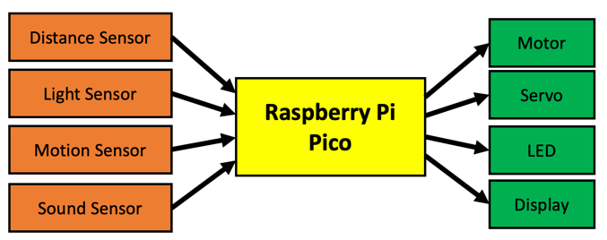

# Microcontrollers

This lesson is an overview of microcontrollers and their role in teaching [physical computing(https://en.wikipedia.org/wiki/Physical_computing).

A [microcontrollers](https://en.wikipedia.org/wiki/Microcontroller) is a small low-cost computer used to control physical devices such as LED, servos and motors.  Microcontroller boards typically cost around $4 to $6 and are an ideal way to learn about computer science because you can use them to build fun projects.  For example you can control a row of LEDs, move a robot and sense the world around us with a variety of light, sound and motion sensors.

In the past, microcontrollers were difficult for younger students to program.  They were also too expensive for every student to purchase and take home.  A typical Arduino kit could easily cost over $20 and required you to learn C to program it.

Today, microcontrollsers such as the [Raspberry Pi Pico](https://www.raspberrypi.org/products/raspberry-pi-pico/) and the [ESP32](https://en.wikipedia.org/wiki/ESP32) cost as little as two dollars.  And these devices are designed to be programmed in Python, the most popular programming language for students.

## What is Physical Computing?
Physical Computing is a field of study that can sense and respond to the world around us.  Unlike programming a cell phone or a laptop computer, our focus is reading sensor values and quickly responding to changes.  Physical Computing is widely used to teach principals of computer science because students can create their own projects and express creativity such a controlling the patterns of lights or creating complex sounds.

## How Microcontrollsers are Used
Microcontrollers do three things:

1. They read sensor values of the world around them
2. They transform this data into useful representations
3. They send outputs to devices that control the world such as LEDs and motors as well as displays

Here is a general diagram to think about when you are designing microcontroller systems:


Here is a specific example instance of what inputs and outputs might do.


## Programming a Microcontroller

In this class, we will use the MicroPython to program our Microcontrollers.  Our programs will usually have the following structure:

1. Imports: Specify the right Python libraries
2. Setup: Setup initial data structures
3. Main loop: Continuously monitor inputs and take actions

The following is a small example of this code in Micropython:

```python
# Import Section
import machine
import time

# Setup Section
led = machine.Pin(16, machine.Pin.OUT)

# Main Loop
while True:
    led.high()
    time.sleep(0.5)
    led.low()
    time.sleep(0.5)
```

Almost all our programs will start with the ```import machine``` line.  This tells the system that we need to gather all the libraries that understand our physical machine.


