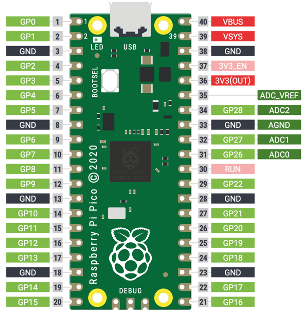

# Getting Started with the Raspberry Pi Pico
The Raspberry Pi Pico is a custom silicon microcontroller built by the [Raspberry Pi Foundation](glossary#raspberry-pi-foundation) with a retail list prices of $4.  With 264K SRAM, it has around 100 times the RAM of an Arduino Uno (2K).  It is ideal for projects that need more RAM such as project that require drawing to an OLED display.

## Specs

* RP2040 microcontroller chip designed by Raspberry Pi in the United Kingdom
* Dual-core Arm Cortex M0+ processor, flexible clock running up to 133 MHz
* 264KB of SRAM, and 2MB of on-board Flash memory
* Support for up to 16MB of off-chip Flash memory via dedicated QSPI bus
* DMA controller
* Interpolator and integer divider peripherals
* Castellated module allows soldering direct to carrier boards
* USB 1.1 and PHY with device and host support
* Low-power sleep and dormant modes
* Drag-and-drop programming using mass storage over USB
* 26 × multi-function GPIO pins
* 3 12 bit analogue inputs
* 16 controllable PWM channels
* 2 SPI, 2 I2C, and 2 UART channels
* Accurate clock and timer on-chip
* 8 Raspberry Pi Programmable I/O (PIO) state machines
* Temperature sensor
* Accelerated floating-point libraries on-chip
* 8 × Programmable I/O (PIO) state machines for custom peripheral support
* Created using the TSMC 40LP manufacturing process
* USB mass-storage boot mode with UF2 support, for drag-and-drop programming

## USB Cable
The Raspberry Pi Pico uses a USB-micro connector.
 - image from ebay

## Pico Pinout
The pinout diagram for the Raspberry Pi.

It features: 
* 26 × multi-function GPIO pins
* 2 × SPI, 2 × I2C, 2 × UART, 3 × 12-bit ADC, 16 × controllable PWM 
<!-- pi-pico-pinout.png) -->

Raspberry Pi Pico’s 40 pins with pin 1 in the upper right corner with the USB connector at the top.  The pin numbers are incremented as you go counterclockwise around the board.  You go down the left side and then continue up on the right side until you get to pin 40 in the upper right corner.



The diagram above shows the top view where pins 1, 2 and 40 are printed next to the pins.

* [Pinout PDF](https://datasheets.raspberrypi.org/pico/Pico-R3-A4-Pinout.pdf)

Next to each pin is the primary label of what the pin does.  Pins 3, 8, 13, 18, 23, 28, 33 and 38 with the black background are all GND pins.

Pins are numbered 0-29, and 26-29 have ADC capabilities
Pin IO modes are: Pin.IN, Pin.OUT, Pin.ALT
Pin pull modes are: Pin.PULL_UP, Pin.PULL_DOWN

| Label | Name | Description |
|-------|------|-------------|
|V3|3.3 volts power|A source of 3.3 V power, the same voltage your Pico runs at internally, generated from the VSYS input. This power supply can be switched on and off using the 3V3_EN pin above it, which also switches your Pico off.|
|VSYS|~2-5 volts power|A pin directly connected to your Pico’s internal power supply, which cannot be switched off without also switching Pico off.|
VBUS|5 volts power|A source of 5 V power taken from your Pico’s micro USB port, and used to power hardware which needs more than 3.3 V.|
|GND|0 volts ground|A ground connection, used to complete a circuit connected to a power source. Several of these pins are dotted around your Pico to make wiring easier.
|GPxx|General-purpose input/output pin number ‘xx|The GPIO pins available for your program, labelled ‘GP0’ through to ‘GP28’.|
|GPxx_ADCx|General-purpose input/output pin number ‘xx’, with analogue input number ‘x’|A GPIO pin which ends in ‘ADC’ and a number can be used as an analogue input as well as a digital input or output – but not both at the same time.|
|ADC_VREF|Analogue-to-digital converter (ADC) voltage reference|A special input pin which sets a reference voltage for any analogue inputs.|
|AGND|Analogue-to-digital converter (ADC) 0 volts ground|A special ground connection for use with the ADC_VREF pin.|
|RUN|Enables or disables your Pico|The RUN header is used to start and stop your Pico from another microcontroller.|

## Steps To Get Micropython Running on the Mac

1. Download the MicroPython UF2 file.
2. Push and hold the BOOTSEL button and plug your Pico into the USB port of your Raspberry Pi or other computer. Release the BOOTSEL button after your Pico is connected.
It will mount as a Mass Storage Device called RPI-RP2.
3. Drag and drop the MicroPython UF2 file onto the RPI-RP2 volume. Your  Pico will reboot. You are now running MicroPython.

## Using Thonny
Thonny is a free lightweight Python development tool.

1. Download the Thonny Application
2. Download the Thonny Pico driver
3. Configure Thonny to use the Pico interpreter
4. Test using the help() function
5. Test by running a blink application


```
Downloading 465408 bytes from https://github.com/raspberrypi/micropython/releases/download/pico-20210120/pico_micropython_20210121.uf2
Writing to /Volumes/RPI-RP2/firmware
100%
Waiting for the port...
Found 2e8a:0005 at /dev/cu.usbmodem0000000000001

Done!
```

## Using the Onboard LED

```py
from machine import Pin
import utime
led_onboard = machine.Pin(25, machine.Pin.OUT)
led_onboard.value(1)
```

```py
from machine import Pin
import utime

# right uppermost pin with USB on the left
led = Pin(16, Pin.OUT)
led.low()
while True:
   led.toggle()
   utime.sleep(1)
```
Press the Play Button

## References
### Getting Started Guide
[Raspberry Pi Getting Started](https://www.raspberrypi.org/documentation/pico/getting-started/)

### Book PDF
[](https://hackspace.raspberrypi.org/downloads/eyJfcmFpbHMiOnsibWVzc2FnZSI6IkJBaHBBaThSIiwiZXhwIjpudWxsLCJwdXIiOiJibG9iX2lkIn19--d43ee613629bddf78bc41c1479c2acb2ec6ef34e/RPi_PiPico_Digital_v10.pdf)
Commons Attribution-NonCommercial-ShareAlike 3.0 Unported
(CC BY-NC-SA 3.0)
