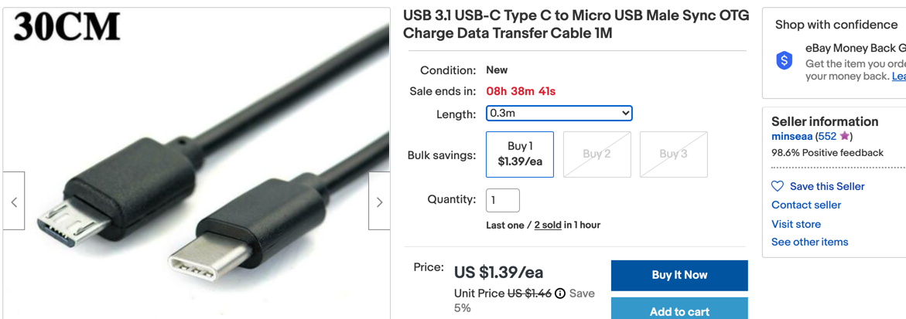

# Micropython Accessories

## USB Cable
For a Mac with USB-C connectors, you will need to get a USB micro to C cable:

## Breadboard
You can purchase 1/2 size 400 connector breadboards on eBay for under two dollars each.
[Universal Mini Solderless Breadboard White Material 400 Points](https://www.ebay.com/itm/Universal-Mini-Solderless-Breadboard-White-Material-400-Points-Available/312568434731)

## Breadboard Jumpers
Use 22 gauge wire.  Get a large spool of black and red and smaller spools of other colors.
[65X 65PCS Jumper Wire Cable Kit For Solderless Breadboard](https://www.ebay.com/itm/65X-65PCS-Jumper-Wire-Cable-Kit-For-Solderless-Breadboard-cs/264496035854)

## LEDs and 330 Ohm resistors

## LED Strips
$5 for a 1 meter strip with 60 pixels per meter.

## Ultrasonic Distance Sensors
[HC-SR04 Ultrasonic Distance Sensor](https://www.ebay.com/itm/1PS-NEW-Ultrasonic-Module-HC-SR04-Distance-Measuring-Transducer-Sensor/393125567677) - $1 on eBay

## Motor Controllers
[Mini Motor Drive Shield Expansion Board L293D Module For Arduino UNO MEGA2560 R3](https://www.ebay.com/itm/Mini-Motor-Drive-Shield-Expansion-Board-L293D-Module-For-Arduino-UNO-MEGA2560-R3/182057002265) $3

## Motion Sensors

## Servos

## Photoresistors

## Speakers

## Stepper Motors

## Displays

## OLED Displays
