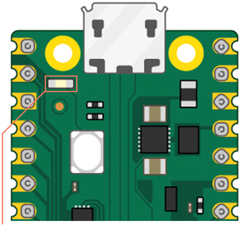

# Blink in Micropython

## Overview
In this lab, we will use Micropython to make an LED blink on and off using Python. We will assume that an LED is connected to pin GIO16 and is connected via a 330 ohm resistor to ground.

## Virual Lab

[Unicorn Emulator](http://micropython.org/unicorn/)

## Sample Program

This program has two parts.  The first part is often called the preamble - this code gets executed once and loads the right libraries and initializes global variables.

The second part is the main event loop.  This program continues to run until the device is powered down or reset.

The ```import machine``` statement is required to define the characteristics of our physical machine.  The ```import time``` library is required for the python sleep function.

## Blinking the Builtin LED
This lab is the perfect place to start since you only need the Pico and a micro USB cable.

The pico has a single built in LED wired to GPIO 25.



This program will blink the built-in LED on and off every 1/4 of a second.
```py
import machine
import utime
led_onboard = machine.Pin(25, machine.Pin.OUT)
while True:
    led_onboard.toggle()
    utime.sleep(.25)
```
If you save the file as main.py, this program will run when the pico starts up without the BOOTSEL being pressed.


Here is the code that will blink an LED that is connected to PIN GIO16, which is in the upper right corner of the Pico.

```py
import machine
import time
# upper right corner pin with USB on the left
led = machine.Pin(16, machine.Pin.OUT)

# loop forever
while True:
    led.high()
    time.sleep(0.5)
    led.low()
    time.sleep(0.5)
```


```py
import machine
import utime
led_onboard = machine.Pin(25, machine.Pin.OUT)
while True:
    led_onboard.toggle()
    utime.sleep(5)
```