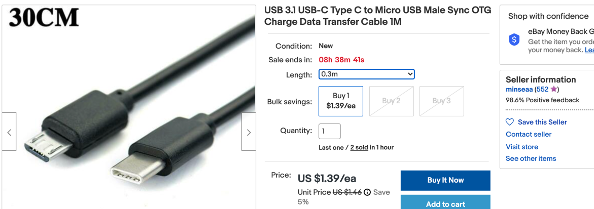

# Suggested Parts and Accessories

As of March 2021, the Raspberry Pi Pico did not come integrated into development kits.  You frequently had to purchase the independent parts yourself.  Here are some of the parts we recommend.

## USB Cable
For a Mac with USB-C connectors, you will need to get a USB micro to C cable:

* [Ebay USB 3.1 USB C Type C to Micro USB Male Sync OTG Charge Data Transfers Adapters](https://www.ebay.com/itm/USB-3-1-USB-C-Type-C-to-Micro-USB-Male-Sync-OTG-Charge-Data-Transfers-Adapters/303826979844) Sample 1 meter USB cable on eBay for $2.40.

## Headers
We need male breakaway headers with standard 1/10th inch spacing.  The Raspberry Pi Pico will need 20 pins on each side.  If you get 40-pin versions they can easily be broken in half.

* EBay: [Ebay 40-Pin Male Header 0.1" 2.54mm Breadboard PCB Strip Connectors 5pc](https://www.ebay.com/itm/40-Pin-Male-Header-0-1-2-54mm-Breadboard-PCB-Strip-Connectors-5pc/193920261898) - these ship from China in a few weeks and you can get five of them for $1 (including shipping).

* Amazon: [Amazon MCIGICM 10pcs Male Header Pin, 40 Pin Header Strip (2.54 mm) for Arduino Connector](https://www.amazon.com/MCIGICM-Header-2-45mm-Arduino-Connector/dp/B07PKKY8BX/ref=sr_1_11)

## Solderless Breadboards
We like the 1/2 size boards that have 400 connection points.  We like to mount them with the USB connector at the top with the numbers running down the left side to align with the pin numbers.

* EBay: [Solderless Breadboard 400 Point Tie Prototype Test Bread Board PCB For Arduino](https://www.ebay.com/itm/Solderless-Breadboard-400-Point-Tie-Prototype-Test-Bread-Board-PCB-For-Arduino/312519250320)

* Amazon: [Amazon 4 Pieces for $6](https://www.amazon.com/Pcs-MCIGICM-Points-Solderless-Breadboard/dp/B07PCJP9DY/ref=sr_1_3)

## Hookup Wire
Use 22 gauge wire.  Get a large spool of black and red and smaller spools of other colors.

## Male-to-Male Breadboard Jumper Wires
You can use 22 gauge wire to build your projects, however kids that don't have fine motor skills sometimes get frustrated with raw wires.  You can purchase a Jumper Wire Kit with 65 jumpers on EBay for under $2 that has nice plastic ends that are easier to use.

* Ebay: [65pcs Jumper Wire cable kit for Solderless Breadboard New](https://www.ebay.com/itm/65pcs-Jumper-Wire-cable-kit-for-Solderless-Breadboard-New/191674144210) - 65 of various lengths for $1.50

* Ebay: [65X 65PCS Jumper Wire Cable Kit For Solderless Breadboard](https://www.ebay.com/itm/65X-65PCS-Jumper-Wire-Cable-Kit-For-Solderless-Breadboard-cs/264496035854)

* Amazon: [ZYAMY 195pcs Breadboard Jumper Wire 12cm 16cm 20cm 24cm Solderless Flexible Breadboard Connecting Line Cables Male to Male Breadboard Jumpers (65pcs/Set x 3)](https://www.amazon.com/ZYAMY-Breadboard-Solderless-Flexible-Connecting/dp/B075F37HXW/ref=sr_1_9) - three packs of 65 for about $8
 
## Sensor Kit

Although not all of these items are really "sensors" (some are displays), these kits provide high value at a low price-per item cost.  Note that some of these kits contain tilt switches that contain Mercery.  I remove these from the kits.

* EBay 16 Sensor Kit [Raspberry Pi / Arduino Sensor Kit 16 Modules Package 16 kinds of sensor](https://www.ebay.com/itm/Raspberry-Pi-Arduino-Sensor-Kit-16-Modules-Package-16-kinds-of-sensor/274696315019)
* EBay 45 Sensor Kit for $18 US [45 In 1 Sensor Module Starter Kit Updated Set For Arduino Raspberry Pi Education](https://www.ebay.com/itm/45-In-1-Sensor-Module-Starter-Kit-Updated-Set-For-Arduino-Raspberry-Pi-Education/265001016990)
* [HiLetgo 37 Sensors Assortment Kit 37 Sensors Kit Sensor Starter Kit for Arduino Raspberry pi Sensor kit 37 in 1 Robot Projects Starter Kits for Arduino Raspberry pi](https://www.amazon.com/HiLetgo-Sensors-Assortment-Raspberry-Projects/dp/B01N5910XS/ref=sr_1_4)

## Linear 10K Potentiometers
We use linear 10K potentiometers in many labs and kits.  The pre-wired options are very handy but you will need some male-to-male jumpers.

* EBay: [Pre-wired Potentiometer with Knob](https://www.ebay.com/itm/10K-OHM-Linear-Taper-Rotary-Potentiometer-10KB-B10K-Pot-With-Wire-Portable-cb/124480518885)
* EBay: [10 10K Pots for $2.29](https://www.ebay.com/itm/10pcs-B10K-10KB-Ohm-Linear-Taper-Rotary-Potentiometer-Panel-Pot-15mm-Shaft/273966791619)
* Amazon: [10K Pot Kit with 8 pots and knobs for $8](https://www.amazon.com/Ted-Lele-Knurled-Potentiometer-Screwdriver/dp/B07MF234W8/ref=sr_1_5)

## Momentary Press Buttons
We like these small momentary press buttons because they are easy to mount directly on the breadboard.  They provide ideal "Mode Programming" buttons to put the microcontroller into a programming mode.

## Switches
These are ideal for turning your project boxes on and off.

## Small 0.96" OLED displays
We love these low-cost 128X64 OLED displays.  They are bright and draw very little power. There are two different connectors: 4-wire I2C and 7-wire SPI.  I would suggest the simpler I2C for most starter projects.

* EBay: [0.96" OLED LCD Display Module IIC I2C Interface 128x64 For SSD1306](https://www.ebay.com/itm/0-96-OLED-LCD-Display-Module-IIC-I2C-Interface-128x64-For-SSD1306/233702086908)
* Amazon: [Five OLED displays for ](https://www.amazon.com/gp/product/B08LYQHFJV?pf_rd_r=8CT0205PZ9NXJEKJ0PCK)

### Larger 2.42" OLEDs
For our robot projects our students like to view the values from a distance.  For them we use these $17 OLED displays that are about twice the size.

[2.42" OLED Display wired with SPI](https://www.ebay.com/itm/2-42-OLED-Display-SSD1309-Blue-Green-Yellow-White-SPI-Port-For-Arduino-128-64/164240863927)

## Non-rechargeable AA and AAA Battery Packs

## Rechargeable Battery Packs
If you are work on project that need long-lasting portable power such as LED strip costumes, there are a wide variety of long-lasting rechargeable battery packs available from prices around $9 to $15.  My favorites are ones that have percentage of power remaining displayed.

## Ultrasonic Distance Sensors
These inexpensive "ping" sensors are used in many robot projects.

* [HC-SR04 Ultrasonic Distance Sensor](https://www.ebay.com/itm/1PS-NEW-Ultrasonic-Module-HC-SR04-Distance-Measuring-Transducer-Sensor/393125567677) - $1 on eBay

## Motor Controllers
* [Mini Motor Drive Shield Expansion Board L293D Module For Arduino UNO MEGA2560 R3](https://www.ebay.com/itm/Mini-Motor-Drive-Shield-Expansion-Board-L293D-Module-For-Arduino-UNO-MEGA2560-R3/182057002265) $3