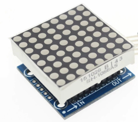
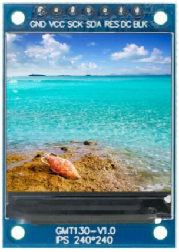

# Adding A Display to Your Project

In the past, the memory available in an standard Arduino Uno (2K bytes) was too small to add high quality displays.  With the arrival of the ESP32 and the Raspberry Pi Pico this has all changed.  These microcontrollers have around 100 times that RAM - typically around 200K bytes.  So we are integrating low-cost OLED displays into many of our CoderDojo projects!

## Display Types
There are four main types of display technology that use for small microcontrollers.

1. **LED** - Light Emitting Diode - these are often low-resolution but have larger area.  The start with single color displays but there are also multi-color LED strips and LED matrix displays.
2. **OLED** - Organic Light Emitting Diode - small low-cost and high-contrast monochrome displays used in watches.
3. **LCD** - Liquid Crystal Display - many of these are monochrome displays that must have precise power to get consistent contrast.
4. **TFT** - Thin Film Transistor - a type of LCD that are used for larger color screens.




240X240 TFT Display

[Full Color LCD TFT Display SPI HD 65K Module ST7735](https://www.ebay.com/itm/Full-Color-LCD-TFT-Display-IPS-7P-SPI-HD-65K-Module-ST7735-Not-OLED-For-Arduino/265047107918)

## Concepts
Before you begin to use these displays, there are a few things to understand to use them effectively.  Based on your project needs, you can use this knowledge to find the right solution for you.

### Framebuffers
A framebuffer is a copy of the display information that is resident within the RAM of the microcontroller.  It must be as large as the display.  For a 128X64 monochrome display this would be 128 * 64 = 8192 bits or 1,024 bytes (1K). A full color 240X240 TFT which uses 8 bits for red, green and blue would require 3 X 8 X 240 X 240 = 1,382,400 bits or 172K bytes.

Not all all displays need framebuffers.  Some displays can take a series of vector drawing commands such as "draw line" and "draw text".  These displays can be useful if you don't have a large amount of RAM.

## Display Chip Types

There are two common versions:

1. **SSD1306** - This is the most popular and versatile chip.  It can be used to drive many different types and sizes of OLEDs.  The SSD1306 can be used with both the simple 4 wire I2C interface as well as the slightly faster 7 wire SPI interface.  These devices have only four wires labeled VCC, GND, SDA and SCL.  SDA is for data and SCL is for the clock.
2. **SH1106** - This is less popular version and supports the 4-wire I2C interface.
3. **ST7735** - This chip is used on larger color TFT displays.
4. **ILI9341** - This chip is used on larger TDF displays.

You can usually look on the back of the display device and see what type of check controls your OLED display.

## Communication Protocols

In addition to the multiple types of displays and types of chips driving the displays, there are also two options on how you want to communicate between your microcontroller and the display.

1. **I2C** - This is the most common type and only requires two wires beside power and ground.  Us this as your default unless you display does not support it.  The original specification of I2C had a communication speed of 100K bits per second.  Many systems can be run at 400K per second.
2. **SPI** - This is a more complex interface and requires up to seven wires.  Some devices only support SPI interfaces.  SPI typically runs around 1M bits/second although it can go up to 10M bits/second in some applications.  SPI is ideal when you want to transfer a large amount of display data to a screen quickly.

### Basic Draw Functions

For our beginning labs we will just do some basic drawing. We will start out with just four functions: 

1. Initialize the display framebuffer memory with the right object class initialization
2. Fill the framebuffer will zeros which are black pixels with the oled.fill(0)
3. Draw white text in the framebuffer memory with the oled.text("Hello World!", 40, 10)
4. Send the entire framebuffer to the display over the bus with the oled.show() function.

### Initializing the Framebuffer

Let's assume that we have a four wire OLED that uses the popular SSD1306 chip with 128X64 pixels.  We call our oled "oled" using the following line:

```py
from ssd1306 import SSD1306_I2C
oled = SSD1306_I2C(128, 64, i2c)
```

|Function|Description|Parameters|
|--------|-----------|----------|
|oled.fill(0)|Fill the display with white or black|0=black and 1=white|
|oled.text("Hello",|Draw text|String, x (horizontal from left edge) and y (vertical from the top)Example: Draw "Hello World" 40 over and 10 down.  oled.text("Hello World!", 40, 10)|
|show|Show the display|Send the current frame buffer to the display.  You must do this after you make and changes to the Framebuffer.|

The full program would look like this:

```py
from ssd1306 import SSD1306_I2C
oled = SSD1306_I2C(128, 64, i2c)
oled.fill(0)
oled.text("Hello World!", 0, 0)
oled.show()
```

This would display the following:


### Full list of Drawing Functions

Every drawing library might have slightly different functions.  But we can quickly see the functions that we want by using the dir() function on the SSD1306_I2C class.

```py
from ssd1306 import SSD1306_I2C
print(dir(SSD1306_I2C))
```
This returns the following list:

```py
['__class__', '__init__', '__module__', '__name__', '__qualname__',
'__bases__', '__dict__', 'blit', 'fill', 'fill_rect', 'hline',
'invert', 'line', 'pixel', 'rect', 'scroll', 'text', 'vline',
'init_display', 'write_cmd', 'show', 'poweroff', 'poweron',
'contrast', 'write_data']
```
Technically, these are called methods of the SSD1306_I2C class.  The ones that begin and end with double underscores are class methods for creating new object instances.  The rest of the items on the list are the drawing functions.

The following are relevant for the SSD1306_I2C display.

The display has (0,0) in the upper left corner.  X is horizontal (width) and Y is vertical (height).  The state is 0=off (black) and 1=on (white).

|Function|Description|Example|
|--------|-----------|-------|
|blit|
|fill(state)|Fill|Fill with black (0) or white(1)|
|fill_rect|Fill a rectangle||
|hline(x1, x2, y, state)|Draw a horizontal line|Draw a horizontal line at the top of the display: oled.hline(0, 0, 127, 1)|
|invert|invert the display||
|line(x1,y1,x2,y2)|draw a line at any angle|Horizontal oled.line(0,0, 127, 63, 1)|
|pixel|Draw a single point on the screen||
|rect|Draw an empty rectangle||
|scroll|Scroll the display||
|text|Write text at a point||
|vline|Draw a Vertical Line|oled.vline(width - 1, 0, height - 1, 1) # right edge|
|init_display|Initialize the display||
|write_cmd|Write a command to the display||
|show|Update the display from the frame buffer||
|poweroff|||
|poweron|||
|contrast|||
|write_data|||


### Interfaces

### I2C

Pros: Simple four wire interface

|Pin|Purpose|Description|
|---|-------|-----------|

### SPI

Example: 128X64 pixel monochrome displays

## Types of Displays

### Summary Table

|Display Type|Cost|Links|Notes|
|------------|----|-----|-----|

### LCD

### OLED

### TFT Displays

## References

[ST7735 Micropython Driver by Anthony Norman](https://github.com/AnthonyKNorman/MicroPython_ST7735)