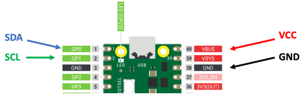

# LCD IIC Display


## connections



## Address Scanner

### Scanner Code
```py
import machine
sda=machine.Pin(0)
scl=machine.Pin(1)
i2c=machine.I2C(0,sda=sda, scl=scl, freq=400000)
print(i2c.scan())
```
### Scanner Result

```sh
>>> %Run -c $EDITOR_CONTENT
[39]
>>> 
```

## ssd1306 module

[SSD1306 Library](https://github.com/micropython/micropython/blob/master/drivers/display/ssd1306.py) - click the RAW button and then right click to do a "Save As"

## References

https://www.mfitzp.com/article/oled-displays-i2c-micropython/

https://github.com/adafruit/Adafruit_CircuitPython_SSD1306/blob/master/examples/ssd1306_stats.py