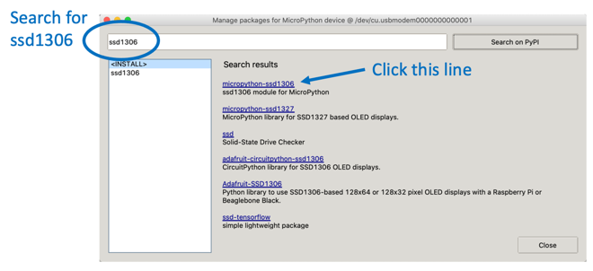
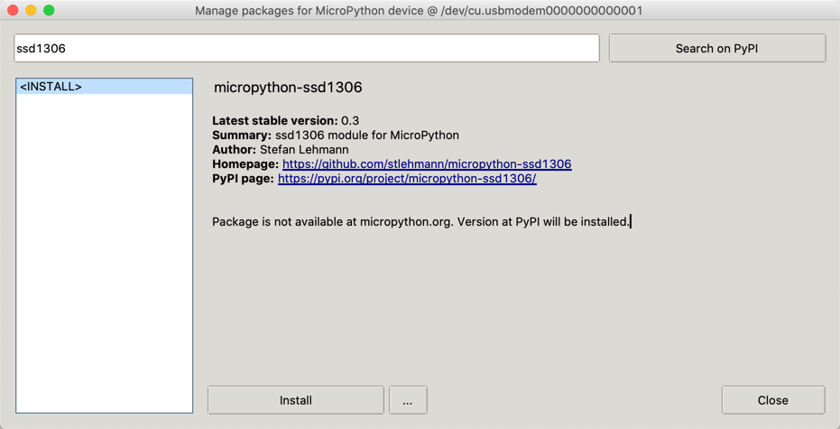

# OLED Display

The first step is to find out what type of display graphics chip is used in your OLED.

There are two common versions:

1. SSD1306 - this is the most popular and versatile.  It can be used to drive many different types and sizes of OLEDs.  The SSD1306 can be used with both the simple 4 wire I2C interface as well as the slightly faster 7 wire SPI interface.  These devices have only four wires labeled VCC, GND, SDA and SCL.  SDA is for data and SCL is for the clock.
2, SH1106 - this is less popular version and supports the 4-wire I2C interface.


## I2C Scanner
Because your microcontroller might have multiple displays on it, their must be some way to address the devices using an address.  Most of the devices come with a default address of decimal value 60 (hex value X3C).  To test this the i3c module has a i2c scan function.

```py
import machine
sda=machine.Pin(0)
scl=machine.Pin(1)
i2c=machine.I2C(0, sda=sda, scl=scl, freq=400000)
print("Device found at decimal", i2c.scan())
```

returns: [60]

## Using the SSD1306 with I2C Interfaces

### Add the ssd1306 Python Module
You can now use the Thonny "Tools -> Manage Packages..." menu to add the Python driver for the SSD1306 device.  You will need to do this for every new device you use.



## Hello World

```py
import machine
from ssd1306 import SSD1306_I2C

sda=machine.Pin(0)
scl=machine.Pin(1)
i2c=machine.I2C(0,sda=sda, scl=scl, freq=400000)
oled = SSD1306_I2C(128, 64, i2c)
oled.fill(0)
oled.text("Hello World!", 0, 0)
oled.show()
print('Done')
```

After this program runs you should see the text on your OLED display.


## SH1106 Example

```py
from machine import Pin, I2C
import sh1106

sda=machine.Pin(0)
scl=machine.Pin(1)
i2c = I2C(0, scl=scl, sda=sda, freq=400000)

display = sh1106.SH1106_I2C(128, 64, i2c, Pin(4), 0x3c)
display.sleep(False)

display.fill(0)
display.text('CoderDojo', 0, 0, 1)
display.show()

print('done')
```

## Counter Example
In this example we will updated the display 50 times with a 1/10th of a second pause between each refresh.  A counter will cycle from 1 to 50.

```py
import machine
import utime
from ssd1306 import SSD1306_I2C

sda=machine.Pin(0)
scl=machine.Pin(1)
i2c=machine.I2C(0,sda=sda, scl=scl, freq=400000)
oled = SSD1306_I2C(128, 64, i2c)

for i in range(1, 51): # count 1 to 50
    oled.fill(0) # clear to black
    oled.text('CoderDojo Rocks!', 0, 0, 1) # at x=0, y=0, white on black
    oled.text(str(i), 40, 20, 1) # move 30 pixels horizontal and 20 down from the top
    oled.show() # update display
    utime.sleep(0.1) #wait 1/10th of a second

print('done')
```


## Animated Box
This draws a title and four lines around a drawing area.  It then draws boxes that move to the right.

```py
from machine import Pin, I2C
import sh1106
import utime

sda=machine.Pin(0)
scl=machine.Pin(1)
i2c = I2C(0, scl=scl, sda=sda, freq=400000)

display = sh1106.SH1106_I2C(128, 64, i2c, Pin(4), 0x3c)
display.sleep(False)

display.fill(0) # clear to black
display.text('CoderDojo Rocks', 0, 0, 1) # at x=0, y=0, white on black
# line under title
display.hline(0, 9, 127, 1)
# bottom of display
display.hline(0, 30, 127, 1)
# left edge
display.vline(0, 10, 32, 1)
# right edge
display.vline(127, 10, 32, 1)

for i in range(0, 118):
    # box x0, y0, width, height, on
    display.fill_rect(i,10, 10, 10, 1)
    # draw black behind number
    display.fill_rect(10, 21, 30, 8, 0)
    display.text(str(i), 10, 21, 1)
    display.show() # update display
    # utime.sleep(0.001)

print('done')
```

## Install SSD1306 Module



## ssd1306 module

[SSD1306 Library](https://github.com/micropython/micropython/blob/master/drivers/display/ssd1306.py) - click the RAW button and then right click to do a "Save As"

## SSD1306 vs. SH1106
There is only one small difference between SSD1306 and SH1106: The SH1106 controller has an internal RAM of 132x64 pixel. The SSD1306 only has 128x64 pixel.

## Using the 7-wire SPI interface
The four wire I2C interface is great for kids that don't want to hook up more than four wires.  But there are times when we want a higher performance screen with faster refresh times.  This is when the SPI interface comes in handy.

The seven wires on the back of the SPI OLED screens are the following as read from the top to bottom looking at the back of the display:

1. CS - Chip Select - pin 4
2. DC - Data/Command - pin 5
3. RES - Reset - pin 6
4. SDA - Data - pin 1
5. SCL - Clock - pin 2
6. VCC - Connect to the 3.3V Out pin 36
7. GND - pin 38 or 3 any other GND pin

### SPI Terms
Master Out Slave In (MOSI)


We send the data to the SPI RX (Receive) port on the Pico.  These are pin 1 (GP0) or pin 6 (GP4)

## Sample Nonworking SPI Code

From the documentation:

!!! From Raspberry Pi Pico Documentation
    **spi** is an SPI object, which has to be created beforehand and tells the ports for SCLJ and MOSI. MISO is not used.
    **dc** is the GPIO Pin object for the Data/Command selection. It will be initialized by the driver.
    **res** is the GPIO Pin object for the reset connection. It will be initialized by the driver. If it is not needed, it can be set to None or omitted. In this case the default value of None applies.
    **cs** is the GPIO Pin object for the CS connection. It will be initialized by the driver. If it is not needed, it can be set to None or omitted. In this case the default value of None applies.

```py
import machine
import ssd1306
spi = machine.SPI(0, baudrate=400000, sck=Pin(2), mosi=Pin(1))

# pin 0 - SCL
# pin 1 - SDA
# From: https://github.com/robert-hh/SH1106
# display = sh1106.SH1106_SPI(width, height, spi, dc, res, cs)
DC = machine.Pin(5)
RES = machine.Pin(6)
CS = machine.Pin(4)
oled = ssd1306.SSD1306_SPI(128, 64, spi, DC, RES, CS)
oled.fill(0)
oled.text('CoderDojo Rocks!', 0, 0, 1)
oled.show()

print('Done')
```

## References

[robert-hh's SH1106 Driver](https://github.com/robert-hh/SH1106)

https://www.mfitzp.com/article/oled-displays-i2c-micropython/

https://github.com/adafruit/Adafruit_CircuitPython_SSD1306/blob/master/examples/ssd1306_stats.py

https://github.com/robert-hh/SH1106/blob/master/sh1106.py