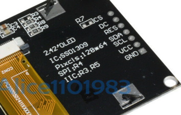

# OLED SSD1306 Examples

We use small OLED displays in many of our labs because:

1. They are **inexpensive** (around $4).
2. They are **easy to connect** via SPI.  Just four wires: GND, VCC, Clock and Data.
3. They have a **large area** to display feedback.  Most of them are 128X64 pixels.
4. Once you get the drivers installed (not always easy) they are **easy to program**.  You only need to initialize the device and run the oled.fill(), oled.text() and oled.show() functions.
5. OLEDs, unlike LCDs, have **high contrast over a large range of input voltages**.  This means that as your batteries slowly discharge, your OLEDs will keep their high-quality contrast.
6. There is plenty of **sample code and tutorials** available.


The first step is to find out what type of display graphics chip is used in your OLED.


## I2C Scanner
Because your microcontroller might have multiple displays on it, their must be some way to address the devices using an address.  Most of the devices come with a default address of decimal value 60 (hex value X3C).  To test this the i3c module has a i2c scan function.

```py
import machine
sda=machine.Pin(0)
scl=machine.Pin(1)
i2c=machine.I2C(0, sda=sda, scl=scl, freq=400000)
print("Device found at decimal", i2c.scan())
```

returns: [60]

## Using the SSD1306 with I2C Interfaces

### Add the ssd1306 Python Module

You can now use the Thonny "Tools -> Manage Packages..." menu to add the Python driver for the SSD1306 device.  You will need to do this for every new device you use.  


If the Manage Packages menu is disabled, then you will need to go into the shell and add it with the pip command.

## I2C Hello World

```py
import machine
from ssd1306 import SSD1306_I2C

sda=machine.Pin(0)
scl=machine.Pin(1)
i2c=machine.I2C(0,sda=sda, scl=scl, freq=400000)
oled = SSD1306_I2C(128, 64, i2c)
oled.fill(0)
oled.text("Hello World!", 0, 0)
oled.show()
print('Done')
```

After this program runs you should see the text on your OLED display.


## SH1106 Example

```py
from machine import Pin, I2C
import sh1106

sda=machine.Pin(0)
scl=machine.Pin(1)
i2c = I2C(0, scl=scl, sda=sda, freq=400000)

display = sh1106.SH1106_I2C(128, 64, i2c, Pin(4), 0x3c)
display.sleep(False)

display.fill(0)
display.text('CoderDojo', 0, 0, 1)
display.show()

print('done')
```

## Counter Example
In this example we will updated the display 50 times with a 1/10th of a second pause between each refresh.  A counter will cycle from 1 to 50.

```py
import machine
import utime
from ssd1306 import SSD1306_I2C

sda=machine.Pin(0)
scl=machine.Pin(1)
i2c=machine.I2C(0,sda=sda, scl=scl, freq=400000)
oled = SSD1306_I2C(128, 64, i2c)

for i in range(1, 51): # count 1 to 50
    oled.fill(0) # clear to black
    oled.text('CoderDojo Rocks!', 0, 0, 1) # at x=0, y=0, white on black
    oled.text(str(i), 40, 20, 1) # move 30 pixels horizontal and 20 down from the top
    oled.show() # update display
    utime.sleep(0.1) #wait 1/10th of a second

print('done')
```

## Animated Box
This draws a title and four lines around a drawing area.  It then draws boxes that move to the right.

```py
from machine import Pin, I2C
import sh1106
import utime

sda=machine.Pin(0)
scl=machine.Pin(1)
i2c = I2C(0, scl=scl, sda=sda, freq=400000)

display = sh1106.SH1106_I2C(128, 64, i2c, Pin(4), 0x3c)
display.sleep(False)

display.fill(0) # clear to black
display.text('CoderDojo Rocks', 0, 0, 1) # at x=0, y=0, white on black
# line under title
display.hline(0, 9, 127, 1)
# bottom of display
display.hline(0, 30, 127, 1)
# left edge
display.vline(0, 10, 32, 1)
# right edge
display.vline(127, 10, 32, 1)

for i in range(0, 118):
    # box x0, y0, width, height, on
    display.fill_rect(i,10, 10, 10, 1)
    # draw black behind number
    display.fill_rect(10, 21, 30, 8, 0)
    display.text(str(i), 10, 21, 1)
    display.show() # update display
    # utime.sleep(0.001)

print('done')
```

## Install SSD1306 Module


## ssd1306 module

[SSD1306 Library](https://github.com/micropython/micropython/blob/master/drivers/display/ssd1306.py) - click the RAW button and then right click to do a "Save As"

## SSD1306 vs. SH1106
There is only one small difference between SSD1306 and SH1106: The SH1106 controller has an internal RAM of 132x64 pixel. The SSD1306 only has 128x64 pixel.

## The SPI interface
The four wire I2C interface is great for kids that don't want to hook up more than four wires.  But there are times when we want a higher performance screen with faster refresh times.  This is when the SPI interface comes in handy.

### SPI Baudrate
https://raspberrypi.github.io/pico-sdk-doxygen/group__hardware__spi.html#ga37f4c04ce4165ac8c129226336a0b66c

The seven wires on the back of the SPI OLED screens are the following as read from the top to bottom looking at the back of the display:



1. CS - Chip Select - pin 4
2. DC - Data/Command - pin 5
3. RES - Reset - pin 6
4. SDA - Data - SPIO TX GP7 pin 10
5. SCL - Clock - Connect to SPIO SCK GP6 pin 9
6. VCC - Connect to the 3.3V Out pin 36
7. GND - pin 38 or 3 any other GND pin


### Pico Pins

```
# Sample code sections
 28 # ------------ SPI ------------------
 29 # Pin Map SPI
 30 # - 3v - xxxxxx - Vcc
 31 # - G - xxxxxx - Gnd
 32 # - D7 - GPIO 13 - Din / MOSI fixed
 33 # - D5 - GPIO 14 - Clk / Sck fixed
 34 # - D8 - GPIO 4 - CS (optional, if the only connected device)
 35 # - D2 - GPIO 5 - D/C
 36 # - D1 - GPIO 2 - Res
```

SCK is the clock - hook this to the oled SCL
MOSI is the line taking data from your Pico to the peripheral device.  Hook this to SDA

From the SDK:
https://datasheets.raspberrypi.org/pico/raspberry-pi-pico-python-sdk.pdf
Section 3.7

1. SPI0_SCK - pin 6
2. SPI0_MOSI - pin 7
3. SPI0_MISO - pin 8

This contradicts p122 in GET STARTED WITH MICROPYTHON ON RASPBERRY PI PICO

```
spi_sck=machine.Pin(2)
spi_tx=machine.Pin(3)
spi_rx=machine.Pin(4)
```


### SPI Terms
Master Out Slave In (MOSI)


We send the data to the SPI RX (Receive) port on the Pico.  These are pin 1 (GP0) or pin 6 (GP4)

## Sample Nonworking SPI Code

From the documentation:

!!! From Raspberry Pi Pico Documentation
    **spi** is an SPI object, which has to be created beforehand and tells the ports for SCLJ and MOSI. MISO is not used.

    **dc** is the GPIO Pin object for the Data/Command selection. It will be initialized by the driver.

    **res** is the GPIO Pin object for the reset connection. It will be initialized by the driver. If it is not needed, it can be set to None or omitted. In this case the default value of None applies.

    **cs** is the GPIO Pin object for the CS connection. It will be initialized by the driver. If it is not needed, it can be set to None or omitted. In this case the default value of None applies.

```py
import machine
import machine
import utime
import ssd1306
led = machine.Pin(25, machine.Pin.OUT)

# From: https://github.com/robert-hh/SH1106
# display = sh1106.SH1106_SPI(width, height, spi, dc, res, cs)
#MOSI=machine.Pin(7)
#SCK=machine.Pin(6)
#spi = machine.SPI(0, baudrate=400000, sck=SCK, mosi=MOSI)
spi_sck=machine.Pin(6)
spi_tx=machine.Pin(7)
# spi_rx=machine.Pin(4)
spi=machine.SPI(0,baudrate=100000,sck=spi_sck, mosi=spi_tx)

CS = machine.Pin(8)
DC = machine.Pin(9)
RES = machine.Pin(10)

oled = ssd1306.SSD1306_SPI(128, 64, spi, DC, RES, CS)

# flash all pixels on
oled.fill(1)
oled.show()
utime.sleep(0.5)

oled.fill(0)
oled.text('CoderDojo Rocks!', 0, 0, 1)
oled.show()

# flash the LED to show end
led.high()
utime.sleep(0.5)
led.low()

print('Done')
```

## References

[robert-hh's SH1106 Driver](https://github.com/robert-hh/SH1106)

https://www.mfitzp.com/article/oled-displays-i2c-micropython/

https://github.com/adafruit/Adafruit_CircuitPython_SSD1306/blob/master/examples/ssd1306_stats.py

https://github.com/robert-hh/SH1106/blob/master/sh1106.py

[DIY More OLED Product Description](https://www.diymore.cc/collections/all-about-arduino/products/2-42-inch-12864-oled-display-module-iic-i2c-spi-serial-for-arduino-c51-stm32-green-white-blue-yellow?variant=17060396597306)