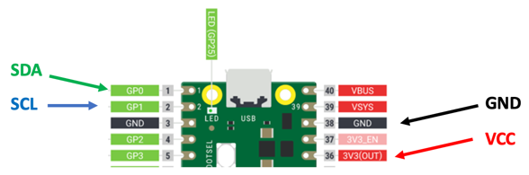
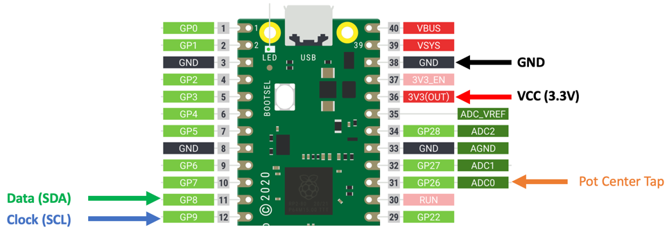

# OLED Potentiometer Example

In this lesson, we will use a potentiometer to change the value of an OLED display.  We will use a small SSD1306 OLED with an I2C interface.

A potentiometer has three wires.  The two outside wires connect to GND and the 3.3 volt output.  The center wire, called the "tap" wire will connect to the pin that converts an continuous analog voltage value into a digital number.

[Wikipedia Page on Potentiometer](https://en.wikipedia.org/wiki/Potentiometer)

## Circuit Diagram




## Sample Code

## Testing the POT

Our first task is to find what pin to use for our first Analog to Digital concerter. GP26 is the same as ADC0.  This is pin number 31 on the Pico.

```py
import machine
import utime
pot = machine.ADC(26)
while True:
    print(pot.read_u16())
    utime.sleep(.2)
```
### Sample 16 bit output
A 16-bit integer can store 216 (or 65,536) distinct values. In an unsigned representation, these values are the integers between 0 and 65,535.  So we are expecting numbers from 0 to 65,535.

Sample results as we move the potentiometer from the minimum to the maximum values.
```data
65535
52844
31047
7745
256
352
19140
41114
62239
65535
57277
33384
10114
352
288
19940
28086
```

## Testing the OLED

### Getting the defaults

```py
from machine import Pin, I2C
# i2c=machine.I2C(0)
i2c=machine.I2C(0)
print("Device found at decimal", i2c.scan())
print(i2c)
```

Results:
This tells you the default pins and frequency that the I2C bus is running at.

```data
Device found at decimal [60]
I2C(0, freq=399361, scl=9, sda=8)
```

```data
Device found at decimal [60]
I2C(0, freq=399361, scl=1, sda=0)
```

This tells us that the default pins are GP9 (row 12) for clock and GP8 (row 11) for data.

```py
from machine import Pin, I2C
from ssd1306 import SSD1306_I2C
WIDTH  = 128
HEIGHT = 32
i2c = I2C(0) # Init I2C using I2C0 defaults SCL on GP9 (12) and SDA on GP8 (11) 
oled = SSD1306_I2C(WIDTH, HEIGHT, i2c)
oled.fill(0)
oled.text("CoderDojo Rocks",0,0)
oled.show()
```

## Continuous Text Display on OLED

```py
from machine import Pin, I2C
from ssd1306 import SSD1306_I2C
WIDTH  = 128
HEIGHT = 32
i2c = I2C(0) # Init I2C using I2C0 defaults SCL on GP9 (12) and SDA on GP8 (11) 
oled = SSD1306_I2C(WIDTH, HEIGHT, i2c)

POT_PIN = machine.ADC(26)
 
while True:
    oled.fill(0)
    oled.text(POT_PIN.read_u16())
    oled.show()
    utime.sleep(.2)
```

## Barchart and Text Display of Pot Value

```py
import machine
import utime
import sh1106

sda=machine.Pin(0)
scl=machine.Pin(1)
pot_pin = machine.ADC(26)

i2c=machine.I2C(0,sda=sda, scl=scl)
# Screen size
width=128
height=64
half_height = int(height / 2)
# oled = SSD1306_I2C(width, height, i2c)
oled = sh1106.SH1106_I2C(width, height, i2c, machine.Pin(4), 0x3c)

oled.fill(0) # clear to black

# note that OLEDs have problems with screen burn it - don't leave this on too long!
def border(width, height):
    oled.hline(0, 0, width - 1, 1) # top edge
    oled.hline(0, height - 2, width - 1, 1) # bottom edge
    oled.vline(0, 0, height - 1, 1) # left edge
    oled.vline(width - 1, 0, height - 1, 1) # right edge

# Takes an input number vale and a range between high-and-low and returns it scaled to the new range
# This is similar to the Arduino map() function
def valmap(value, istart, istop, ostart, ostop):
  return int(ostart + (ostop - ostart) * ((value - istart) / (istop - istart)))

# draw a horizontal bar
def draw_hbar(inval, height, state):
    oled.fill(0) # clear screen
    border(width, height) # draw a border
    oled.fill_rect(0, 1, inval, height, 1) # fill with 1
    utime.sleep(.1) # wait a bit
    
# continuous update
while True:
    pot_val = int(pot_pin.read_u16())
    # the max value of the input is a 2^16 or 65536
    pot_scaled = valmap(pot_val, 0, 65536, 0, 127)
    print(pot_val, pot_scaled)
    draw_hbar(pot_scaled, half_height, 1)
    
    oled.text('raw:', 0, half_height + 5, 1)
    oled.text(str(pot_val), 30, half_height + 5, 1)
    
    oled.text('scaled:', 0, half_height + 15, 1)
    oled.text(str(pot_scaled), 60, half_height + 15, 1)
    oled.show()  
```
## Gif of OLED


