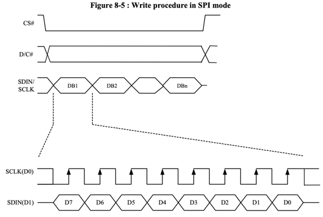
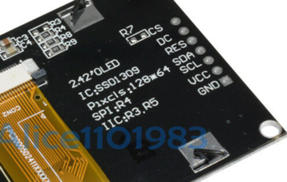
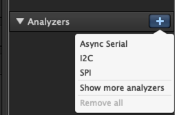
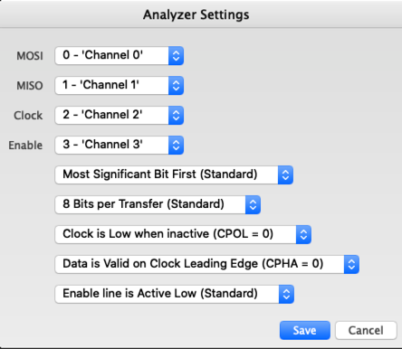
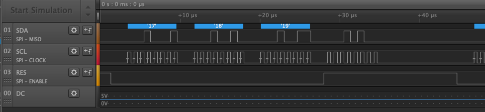
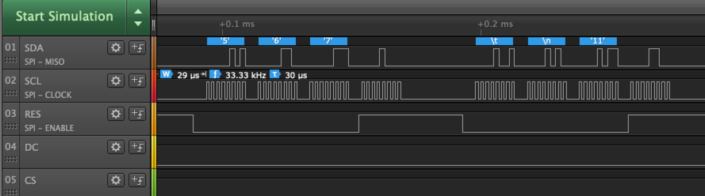
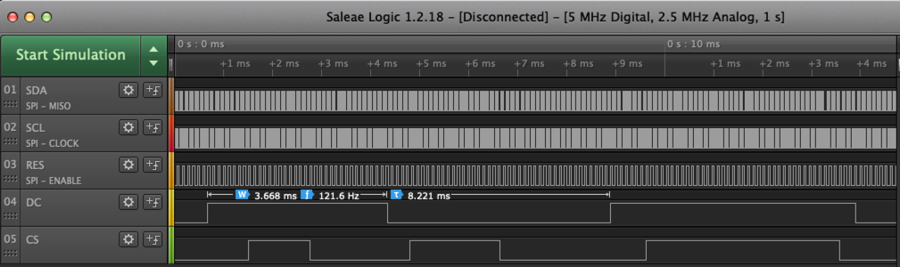
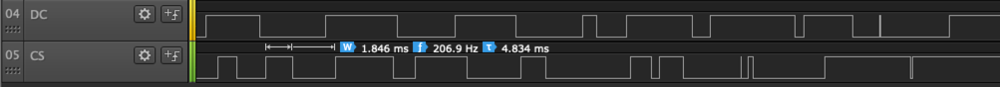
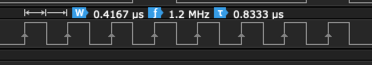

# Debugging SPI

In this lab we use a logic analyzer to debug the [SPI](https://en.wikipedia.org/wiki/Serial_Peripheral_Interface) protocol being used to drive a sample OLED device. We will be using the the [8 port Saleae Logic Analyser](https://www.saleae.com/).  The retail cost is about $399.00 although there are lower cost logic analyzer available.

## The SSD1306 SPI OLED Timing Diagram
The OLED display is a read-only interface.  It does not send any data back to the microcontroller, so there is no MOSI connection.  The data is transmitted on the SDK line when the SCL line goes high.  The CS line must be low for the OLED to be active.

For details, see section 8.1.3 MCU Serial Interface on page 21 of the [SSD1305 132 x 64 Dot Matrix OLED/PLED Segment/Common Driver with Controller](https://cdn-shop.adafruit.com/product-files/2719/2719+DATA.pdf).

## OLED SPI settings
Our OLED device has seven wires.  In addition to power and ground there a five data connections we will be observing on our logic analyzer.

1. CS - Chip Select pin 4
2. DC - Data/Command - pin 5
3. RES - Reset - pin 6
4. SDA - Data - SPIO TX GP7 pin 10 (Data from the )
5. SCL - Clock - Connect to SPIO SCK GP6 pin 9
6. VCC - Connect to the 3.3V Out pin 36
7. GND - pin 38 or 3 any other GND pin

## Setting up a Logic Analyzer
### Setup SPI Analyser

### Configure SPI Channel Settings
 
Saleae Logic Analyser SPI Logic Analyser Settings

## Check a Working Device
The first thing we want to see is what the signals to a working SPI OLED should be.  There are plenty of working drivers for the Arduino, so I hooked one up to the Logic analizer to see what they were.

## Viewing Data Clock and RES

 
All five signals

 
DC and CS signals have a larger period.

1. DC on was 3.668 milliseconds

### Clock Period
Our Clock (SCL) has 8 positive pulses with a width of .4167 microseconds.  This means that the positve/negative combined width has a period of 2 * .4167 = .8333 microseconds.  This can be converted into a frequency of 1.2 megahertz.

## References

[Video on how to use the Saleae Logic Analizer](https://www.youtube.com/watch?v=WMV04hzPKuM)

https://www.youtube.com/watch?v=Ak9R4yxQPhs
