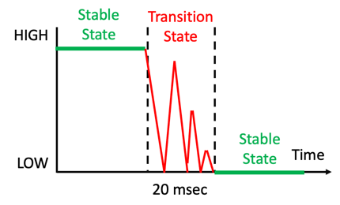

# Interrupt Handlers in MicroPython

## What is an Interrupt Handler?
An Interrupt Handler (also called an ISR for Interrupt Service Request) is a special Python function that is called when specific events occur such as a button being pressed.  ISRs are the preferred way to detect external events, as opposed to polling methods that are inconsistent and inefficient.  However, they are a bit tricky to setup and debug.  So a good design should be as simple as possible and avoid using complex features unless you really know you need them.

## Polling vs. Interrupt Handlers

So why are ISRs so important?  Let's illustrate this is a story.

Imagine you have 10 friends each with a button at their home.  In the polling method you would need to drive to each of their houses and ask them "Is the button get pressed"?  You would have to do this frequently in case the button was pressed and released too quickly.  This is a slow and painful process and takes a lot of CPU cycles.

An interrupt handler on the other hand has each friend tell you directly if their button has been pressed.  The messages are quick and efficient.  They don't use a lot of extra CPU power and the results get handled quickly.

However, there are specific rules about what we can and can't do within an ISR function.  They need to be quick and efficient.  We can't wonder off and do crazy things like printing debugging lines within a good ISR.  Our job is typically update a global value and finish ASAP.  A good ISR should be as efficient as possible.

## Simple Button Press ISR Example

This is our first ISR example.  It has several parts:

1. **import statements** - (pretty standard but we have to add the import micropython)
2. **global variables** - we will update these to communicate the result of our ISR
3. **the callback function** - this is the function will be automatically called on a pin event
4. **the button defintion** - this is where we indicate what pin and the PULL_DOWN value
5. **the irq handler** - this is where we associate the event with the callback function
6. **the main loop** - here we only print the button press count if it has changed

```py
# Use an interrupt function count the number of times a button has been pressed
from machine import Pin
import micropython
import time

# global value
button_pressed_count = 0

# Interrupt Service Routine for Button Pressed Events - with no debounce
def button1_pressed(change):
    global button_pressed_count
    button_pressed_count += 1

# we define button1 as being connected to GP14 and to use the internal Pico PULL_DOWN resistor
button1 = Pin(14, Pin.IN, Pin.PULL_DOWN)

# here is how we associate the falling value on the input pin with the callback function
button1.irq(handler=button1_pressed, trigger=Pin.IRQ_FALLING)

button_pressed_count_old = 0
while True:
    if button_pressed_count_old != button_pressed_count:
       print('Button 1 value:', button_pressed_count)
       button_pressed_count_old = button_pressed_count
```

Now if you run this program, you will see that it prints to the Terminal each time the button is pressed and it also tells us how many times the button has been pressed. 

example output:

```
Button 1 value: 1
Button 1 value: 2
Button 1 value: 3
Button 1 value: 4
Button 1 value: 5
Button 1 value: 6
Button 1 value: 8
Button 1 value: 9
Button 1 value: 10
Button 1 value: 11
Button 1 value: 12
Button 1 value: 13
Button 1 value: 14
Button 1 value: 15
Button 1 value: 16
Button 1 value: 17
Button 1 value: 18
Button 1 value: 19
Button 1 value: 20
Button 1 value: 21
```

But if you are careful, you will note something slightly unexpected might happen.  I the example above, I actually only pressed the button about 10 times.  But the button value is 21!  What could be going on here? Could there be a bug in the code?

The answer is that buttons are not perfect on/off switches.  They are essentially noisy on/off devices that may go through a transition of off/on/off/on each time we press the button.

As a switch goes from open to closed, it moves from a stable state, through an unstable transition state and then it finally arrives at a new stable state.  This is illustrated in the drawing below.



We can reduce this "noise" with a small capacitor next to the button.  The capacitor will quickly absorb the energy of the button transition and it will "smooth" out the spikes.  This will give us a more consistent readout of the number of button presses and avoid accidental "double presses" that were not intended.

However, we can also get a clean signal by using software.  The key is when we first detect that a transition may be happening we "stop listening" for a short period of time until we are confident that the unstable transition state is over.  This is typically around 20 milliseconds, but there may be a few stray signals left.  Since we may not have to detect changes more frequently than 5 presses per second, we can go to sleep in our ISR for up to 200 milliseconds.  This will give us a nice stable reading from the button.

These are general rules but for our breadboard mounted momentary switches, the values are appropriate.

## Debounced Version of a Button Press Detection

Now let's show you the code that does the hard work of debouncing a signal from a button or switch.

In this example, our ISR is called ```button_pressed_handler(pin)```.  As soon as it is called, it checks the number of milliseconds since it was last called.  If the time difference is under 200 milliseconds we are good to go and we update the button_presses global variable.  If we are under the 200 millisecond window, we might be in that transition state and we don't do anything.

```py
new_time = utime.ticks_ms()
# if it has been more that 1/5 of a second since the last event, we have a new event
    if (new_time - last_time) > 200: 
        button_presses +=1
        last_time = new_time
```

The net effect is that the presses variable will ONLY be incremented once, and not multiple times during the transition.  Here is the full code:

```python
import utime
from machine import Pin

# Sample Raspberry Pi Pico MicroPython button press example with a debounce delay value of 200ms in the interrupt handler

button_presses = 0 # the count of times the button has been pressed
last_time = 0 # the last time we pressed the button

builtin_led = machine.Pin(25, Pin.OUT)
# the lower left corner of the Pico has a wire that goes through the buttons upper left and the lower right goes to the 3.3 rail
button_pin = machine.Pin(14, machine.Pin.IN, machine.Pin.PULL_DOWN)

# this function gets called every time the button is pressed
def button_pressed_handler(pin):
    global button_presses, last_time
    new_time = utime.ticks_ms()
    # if it has been more that 1/5 of a second since the last event, we have a new event
    if (new_time - last_time) > 200: 
        button_presses +=1
        last_time = new_time

# now we register the handler function when the button is pressed
button_pin.irq(trigger=machine.Pin.IRQ_FALLING, handler = button_pressed_handler)

# This is for only printing when a new button press count value happens
old_presses = 0
while True:
    # only print on change in the button_presses value
    if button_presses != old_presses:
        print(button_presses)
        builtin_led.toggle()
        old_presses = button_presses
```

## ISR with Deactivation

The key lines we add are a deactivate of the IRQ, a sleep for 200 milliseconds and a reenable of the IRQ after the sleep.

```py
import machine, utime

# the lower right coner has a wire that goes throuh
count_input = machine.Pin(14, machine.Pin.IN, machine.Pin.PULL_DOWN)
presses = 0

def count_handler(pin):
    global presses
    # disable the IRQ during our debounce check
    count_input.irq(handler=None)
    presses +=1
    # debounce time - we ignore any activity diring this period 
    utime.sleep_ms(200)
    # reenable the IRQ
    count_input.irq(trigger=machine.Pin.IRQ_FALLING, handler = count_handler)

count_input.irq(trigger=machine.Pin.IRQ_FALLING, handler = count_handler)

old_presses = 0
while True:
    # only print on change
    if presses != old_presses:
        if presses > old_presses + 1:
            print('double counting in irq.  Fixing...')
            presses = old_presses + 1
        print(presses)
        old_presses = presses
```

## Debounce Without Disabling the IRQ


## References

1. [MicroPython Documentation on Interrupt Handlers](https://docs.micropython.org/en/latest/reference/isr_rules.html)
