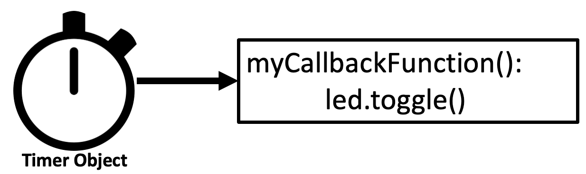

# Timers in MicroPython


When clocks are used to trigger future events, they are called timers.  Timers are used to efficiently use CPU resources.  In microcontrollers, the work of keeping track of timers is frequently delegated to hardware outside of the main CPU loop.  This makes your microcontroller more efficient, more reliable, and makes your code easier to read.

Timers work independently of the main CPU's clock.  As a result, they are called *asynchronous* objects.  Using timers can be both efficient and reliable, but they can be complex to debug.  Errors within Timers and interrupts can be difficult to get information on.

## Types of Timers

Timers are used to schedule events in the future.  There are two types:

1. A **PERIODIC** Timer will continually fire events in the future at periodic intervals.
2. A **ONE_SHOT** Timer will fire an event once and then stop.

Both of these Timer objects need a callback function to be specified when they are initialized.  This is the function that will be executed when the timer gets triggered.  So we must define a function before Timers are properly initialized.

Periodic Timers are usually initialized with a `period` parameter.  This is the amount of time in milliseconds between each event.  They are useful for doing like checking if new data is available on a network connection or checking if a sensor is still working.

One-shot Timers are also initialized with a `period` parameter often called a "timeout" period.  This is the amount of time in milliseconds before the timer will fire.  One-shot timers are used if you want to do something in the future but don't want to deal with it now.  You can think of this as a reminder service.

Here is how both Periodic and one-shot timers are setup:

```python
myOneShotTimer = Timer()
# call once in 10 seconds from now
myOneShotTimer.init(mode=Timer.ONE_SHOT, callback=myCallbackFunction, period=10000)

# call every two seconds
myPeriodicTimer = Timer()
myPeriodicTimer.init(mode=Timer.PERIODIC, callback=myCallbackFunction, period=2000) 
```

## Using Frequency on Periodic Timers

A Periodic Timer can be configured to use either a period or a frequency as a parameter.  The frequency is the number of times the timer will fire per second.  The period is the amount of time in milliseconds between each event.  The frequency is used to calculate the period. The following are equivalent:

```python
# 50ms between events
myTimer.init(period=50, mode=Timer.PERIODIC, callback=move_pixel) 
# 20 events per second
myTimer.init(freq=20, mode=Timer.PERIODIC, callback=move_pixel) 
```

You can always convert between the two by taking the inverse and multiplying by 1000.

```python
frequency = 1 / period * 1000
period = 1 / frequency * 1000
```

## Sample Timer Program

In the following program we will create timer that will toggle the built-in LED on the Raspberry Pi Pico every second.  We will create a new function called ```toggle_led()``` that will toggle the builtin LED on and off each time it is called.  There are three key lines in this program.  

1. line 1 imports the Timer library
2. line 7 creates the uninitialized timer object
3. line 17 initialize the timer object to indicate how often to trigger the timer, the mode (periodic) and the callback function (toggle_led)

## Sample Code to Toggle the Builtin LED

Here is a sample code to toggle the builtin LED on the Raspberry Pi Pico and off.

```python
from machine import Pin, Timer
from utime import sleep

# create an LED object using the onboard LED
myLED = machine.Pin("LED", machine.Pin.OUT)

# create an uninitialized timer object
myTimer = Timer()

# create a function to be called when the timer goes off
# this function just toggles the onboard LED
def toggle_led(timer):
    myLED.toggle()

# initialize the timer object to tick every second (1,000 milliseconds)
myTimer.init(period=1000, mode=Timer.PERIODIC, callback=toggle_led)

while True:
    sleep(10)
    print('just sleeping here')
````

## Sample Code to Animate an LED Strip With a Timer

Many times you want to animate an LED strip but not complicate up your main event loop with this code.  For example, you might want to light up the entire strip with a pattern of motion on the LED strip.  You can do this by creating a new function that will conditionally turn one pixel to a color and increment a global variable that keeps track of which pixel to turn.  This function will be called every time the timer goes off.

```python
from machine import Pin, Timer
from utime import sleep
from neopixel import NeoPixel

NEOPIXEL_PIN = 0
NUMBER_PIXELS = 8
strip = NeoPixel(machine.Pin(NEOPIXEL_PIN), NUMBER_PIXELS)

# create an uninitialized timer object
myTimer = Timer()

counter = 0
# a callback function.  Use this with a timer that triggers 20 times a second
def move_pixel(myTimer):
    global counter
    for i in range(0, NUMBER_PIXELS):
        if i == counter:
            strip[i] = (10,0,0)
        else:
            strip[i] = (0,0,10)
        strip.write()
    counter += 1
    if counter > NUMBER_PIXELS:
        counter = 0

# initialize the timer object to tick 20 times per second (50 milliseconds)
myTimer.init(period=50, mode=Timer.PERIODIC, callback=move_pixel)

while True:
    print('Just sleeping here.  The timer is doing all the work flashing the LED...', counter)
    sleep(5) # sleep for five seconds
```

## Removing a Timer

The ```Timer.deinit()``` can be used to remove a timer from the system.  This is useful if you want to stop a timer that is currently running.  If you have many timers that are each using memory, it is a good practice to remove them when you are done with them.

## Limits on the Number of Timers

In MicroPython on the RP2040, there are no limits placed on the number of timers other than you must have enough memory available.  Because there are no specific hardware limits, these are often referred to as "virtual" timers.  The number of virtual timers is limited by the amount of memory available to the microcontroller.

Other implementations of MicroPython on different hardware have stricter limits placed on the number of timers.  The ESP32 MicroPython port currently only has four hardware timers and a numeric ID of 0 to 3 must be used when you setup these timers. For the [pyboard](https://docs.pyboard.org/en/latest/timers.html) has a limit of 14 timers.  Be aware of these limits if you are interested in creating portable MicroPython code.

## Drawbacks of Timers

Unfortunately, different hardware implementations of MicroPython have different ways to setup and use timers.  Some hardware requires timers to each have an ID tied to a specific resource.  Because of this, be cautious about using timers in your code if you require portability between hardware.

Timers also can call interrupts, but in multi-core systems these interrupts can only be called from the core that executed the timer.  This means that if you are using a timer to trigger an interrupt, you must make sure that the interrupt is only called from the core that is executing the timer.

Timers are often use to call interrupts, and there are special limitations on what can and can't be done within an interrupts in most systems.  For example you are not allowed to allocate dynamic memory within an interrupt.  Your interrupt handler should be a short function that performs the minimum work to change external variables.  This is because the interrupt handler is called in a separate thread and can't allocate memory.

In general, doing complex logic within Timers and interrupts is not a good idea.  If you are interested in doing complex logic, you should use a different method.  This will make your code easier to understand and maintain.

## References

1. [MicroPython Timers](https://docs.micropython.org/en/latest/library/machine.Timer.html)
1. [MicroPython Documentation on Timers on the RP2040](https://docs.micropython.org/en/latest/rp2/quickref.html)

## Exercises

1. Can you change the frequency of the times in the sample code above?
2. How much memory do you think a timer will use?  How many timers can be used on a RP2040 with 264K of memory?
3. What if you wanted a timer to check in on the health of your program?  Could it reboot the Raspberry Pi using ```machine.reset()``` if it gets stuck?  Hint: See [Watchdog Timers](https://docs.micropython.org/en/latest/library/machine.WDT.html)