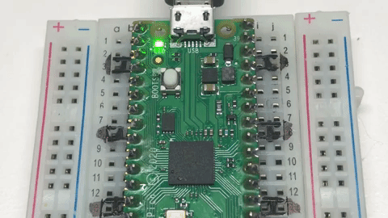

# Blink in MicroPython



## Overview
In this lab, we will use MicroPython to make the green on-board LED on the Raspberry Pi Pico blink on and off every half second.  The only things you need to run this program are

1. a working IDE like [Thonny](../glossary#thonny)
2. a USB cable
3. a $4 Raspberry Pi Pico microcontroller

## Blinking the Builtin LED

The pico has a single built in green LED wired to logical pin 25.  We call this GPIO 25.  GPIO means General Purpose Input and Output pin. Here is a sample program that you can use.  Don't worry about understanding each line yet.  We will cover the various parts of the file in later sections.

```py
# Setup - run once
from machine import Pin # Get the Pin function from the machine module.
from time import sleep # Get the sleep library from the time module.

# This is the built-in green LED on the Pico.
BUILT_IN_LED_PIN = 25
# change this to the following named pin on the "W"
# BUILT_IN_LED_PIN = Pin("LED", Pin.OUT)

# The line below indicates we are configuring this as an output (not input)
led = machine.Pin(BUILT_IN_LED_PIN, machine.Pin.OUT)

# Main loop: Repeat the forever...
while True:
    led.high() # turn on the LED
    sleep(0.5) # leave it on for 1/2 second
    led.low()  # Turn off the LED
    sleep(0.5) # leave it off for 1/2 second
```

This program has two main parts.  The first part is often called the preamble or the setup code. This code gets executed only once when the program is run. In this example, the setup loads the right libraries and initializes global variables.

The second part is the main event loop.  This program continues to run until the device is powered down or the program is reset.

The ```from machine import Pin``` statement is required to define the characteristics of our physical machine.  In this case, we are loading the Pin python library.

 The ```from time import sleep``` library is required for the python sleep function.  Note that some programs use ```utime``` for MicroPython time.  These both work the same.  They are really just synonyms or alias of each other.  Although the use of ```utime``` is technically a little bit more precise - the reader knows that the code is using the actual MicroPython time library, the use of the ```time``` alias makes our code on character smaller and can make our code more portable to other systems.

Note that the text after the hash or pound characters are comments.  Comments are ignored by the Python interpreter but it is a good practice to put in comments in your code to help others understand your program.

## Changing the Blink Speed

Next, lets create a Python global variable for the delay that the LED is on and off.

```py
from machine import Pin
from time import sleep
BUILT_IN_LED_PIN = 25
# this is the builtin LED on the Pico
led = Pin(BUILT_IN_LED_PIN, machine.Pin.OUT)

# global variables
delay = .25

# repeat forever
while True:
    led.high() # turn on the LED
    sleep(delay) # leave it on for 1/2 second
    led.low() # Turn off the LED
    sleep(delay) # leave it off for 1/2 second
```

This program will blink the built-in LED on and off every 1/4 of a second.  By changing the delay variable you can make the LED blink faster and slower.

!!! Challenge
    What is the fastest you can make the LED blink and still see it changing?  What does this tell you about the human eye?

## Using Toggle

Instead of using the ```on()``` and ```off()``` methods, we can also just use the ```toggle()``` function.

```py
from machine import Pin
from time import sleep
led_onboard = machine.Pin(25, machine.Pin.OUT)
while True:
    led_onboard.toggle()
    sleep(.25)
```

The ```toggle()``` function looks at the state of the output pin.  If it is high, it sets the value low.  If it is low, it sets it high.  Whatever the value currently is, it will set it to the opposite value.

If you save the file as main.py, this program will run when the microcontroller starts up without the BOOTSEL being pressed.

### Blinking an External LED
Although the builtin LED is convenient, you can use the almost the code to blink any external LED that is connected through a 330 ohm resister in series to the LED.

We will assume that an LED is connected to pin GIO16 and is connected via a 330 ohm resistor to ground.

Here is the code that will blink an LED that is connected to PIN GIO16, which is in the upper right corner of the Pico.

```py
from machine import Pin
from time import sleep
# this is the lower right corner pin on the Pico with USB on the bottom
EXTERNAL_LED_PIN = 16
led = machine.Pin(EXTERNAL_LED_PIN, machine.Pin.OUT)

# repeat forever
while True:
    led.high() # turn on the LED
    time.sleep(0.5) # leave it on for 1/2 second
    led.low() # Turn off the LED
    sleep(0.5) # leave it off for 1/2 second
```

Here is that same program using the ```toggle()``` function:

```py
from machine import Pin
from time import sleep
EXTERNAL_LED_PIN = 16
external_led = machine.Pin(EXTERNAL_LED_PIN, machine.Pin.OUT)

while True:
    external_led.toggle()
    sleep(5)
```


### Solution to LED Row Lab

```py
from machine import Pin
from time import sleep
EXTERNAL_LED_PIN1 = 16
EXTERNAL_LED_PIN2 = 17
EXTERNAL_LED_PIN3 = 18
EXTERNAL_LED_PIN4 = 19
led1 = machine.Pin(EXTERNAL_LED_PIN1, machine.Pin.OUT)
led2 = machine.Pin(EXTERNAL_LED_PIN2, machine.Pin.OUT)
led3 = machine.Pin(EXTERNAL_LED_PIN3, machine.Pin.OUT)
led4 = machine.Pin(EXTERNAL_LED_PIN4, machine.Pin.OUT)

while True:
    # blink the first LED
    led1.high()
    sleep(.5)
    led1.low()

    # blink the 2nd LED
    led2.high()
    sleep(.5)
    led2.low()


    # blink the 3rd LED
    led3.high()
    sleep(.5)
    led3.low()


    # blink the 4th LED
    led4.high()
    sleep(.5)
    led4.low()
```

### Extra credit lab

Can you rewrite the program above using an array of pin values like this:

```py
LED_PINS = [16,17,28,19]
```

## More to Explore

1. Can you blink both the internal on board LED and an external LED?
2. How many external LEDs can you blink?  What is the maximum number of output pins on the Raspberry Pi Pico?
3. What if you wanted to control more LEDs then you have available output pins?  What do you think your options might be? (answer - use a NeoPixel or a shift register like a SN74HC595).  See the [peppe8o Shift Register Tutorial on the RP2040](https://peppe8o.com/how-to-use-74hc595-shift-register-with-raspberry-pi-pico-and-micropython/s) for an example of this.