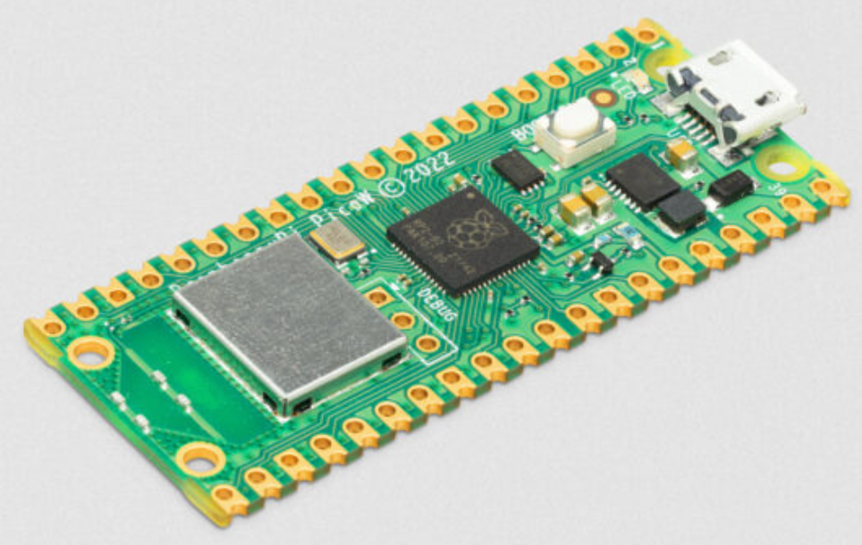
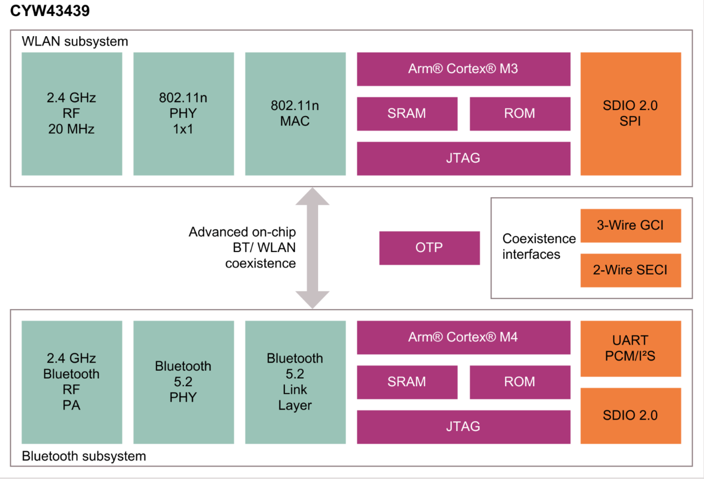

# MicroPython Pico W Wireless Examples



One June 30th, 2022 the [Raspberry Pi Foundation announced](https://www.raspberrypi.com/news/raspberry-pi-pico-w-your-6-iot-platform/) the availability of the Raspberry Pi Pico W.  This $6 microprocessor now supports WiFi and with a software upgrade it may soon support Bluetooth.

The Pico W supports 2.4 Ghz 802.11n wireless networking.  For MicroPython, we can use a MicroPython library built around the [lwip](https://savannah.nongnu.org/projects/lwip/) TCP/IP stack.  This stack is accessible using the MicroPython [network](https://docs.micropython.org/en/latest/library/network.html#) functions.

The WiFi chip used is the [Infineon CYW43439](https://www.infineon.com/cms/en/product/wireless-connectivity/airoc-wi-fi-plus-bluetooth-combos/cyw43439/) chip.  This chip also uses an ARM architecture and has extensive support for Bluetooth wireless communication.



You can read more about the capabilities of the WiFi/Bluetooth chip by reading the [Infineon CYW43439 Datasheet](https://www.infineon.com/dgdl/Infineon-CYW43439-Single-Chip-IEEE-802.11-b-g-n-MAC-PHY-Radio-with-Integrated-Bluetooth-5.0-Compliance-AdditionalTechnicalInformation-v03_00-EN.pdf?fileId=8ac78c8c7ddc01d7017ddd033d78594d).  I found it interesting that the CYW43439 chip has 512KB of SRAM - almost double what the RP2040 chip contains!

## Compatibility with Prior Code

The Pico W code is very similar to prior versions of the Pico with a few small exceptions.  One of these is the fact that we must now use a symbolic label called an **alias* such as ```Pin("LED")``` instead of ```Pin(25)``` to access the LED pin, not a hardwired PIN number.  This allows us to keep our code more portable as the underlying hardware changes.

```python title="blink.py"
from machine import Pin, Timer

led = Pin("LED", Pin.OUT)
tim = Timer()
def tick(timer):
    global led
    led.toggle()

tim.init(freq=2.5, mode=Timer.PERIODIC, callback=tick)
```

See the new [Sample Blink]
(https://github.com/raspberrypi/pico-micropython-examples/blob/master/blink/blink.py) code on the Raspberry Pi Examples site.

## Getting the New Pico W Image

I had to download a brand new image for the Pico W runtime from [the Raspberry Pi Foundation Software Site](https://githubdatasheets.raspberrypi.com/soft/micropython-firmware-pico-w-290622.uf2)

After I downloaded the new image and ran a **Stop/Reset** on Thonny I got the following prompt:

```sh
MicroPython v1.19.1-88-g74e33e714 on 2022-06-30; Raspberry Pi Pico W with RP2040
Type "help()" for more information.
>>> 
```

Note that the "Pico W" is listed in the prompt.  If you do not see the "W" then the network code will not work.

## Sample Code

We will store the name of our local WiFi network we wish to connect to and the password for that name in a file called secrets.py.  This is called you WiFi "access point" and the variable name to store the name is called the ```SSID``.  We will need to make sure we never save this file into a public GitHub repo by adding this file to our .gitignore file.

### Setting Up Your WIFI secrets.py
By convention, we put both our SSID and password in a python file called "secrets.py".  This file should never be checked into a public source code repository.  We can add secrets to the .gitignore file to make sure it is never checked into GitHub.

```python
SSID = "MY_WIFI_NETWORK_NAME"
PASSWORD = "MYWIFIPASSWORD"
```

By importing the secrets.py file you can then reference your network name like this:

```py
print('Connecting to WiFi Network Name:', secrets.SSID)
```

## Testing Your Connection

```python
import network
import secrets
from utime import sleep

print('Connecting to WiFi Network Name:', secrets.SSID)
wlan = network.WLAN(network.STA_IF)
sleep(1) # wait a second to wait for a connection
wlan.active(True)
wlan.connect(secrets.SSID, secrets.PASSWORD)
print(wlan.isconnected())
```

Returns:

```
Connecting to WiFi Network Name: MY_WIFI_NETWORK_NAME
True
```

If the value is ```False``` you should check the name of the network and the password and that you are getting a strong WiFi signal where you are testing.

## Waiting for a Valid Access Point Connection
Sometimes we want to keep checking if our access point is connected before we begin using our connection.  To do this we can create a while loop and continue in the loop while we are not connected.

```python
import network
import secrets
from utime import sleep, ticks_ms, ticks_diff

print('Connecting to WiFi Network Name:', secrets.SSID)
wlan = network.WLAN(network.STA_IF)
wlan.active(True)

start = ticks_ms() # start a millisecond counter

if not wlan.isconnected():
    wlan.connect(secrets.SSID, secrets.PASSWORD)
    print("Waiting for connection...")
    counter = 0
    while not wlan.isconnected():
        sleep(1)
        print(counter, '.', sep='', end='', )
        counter += 1

delta = ticks_diff(ticks_ms(), start)
print("Connect Time:", delta, 'milliseconds')
print(wlan.ifconfig())
```

This code also supports a timer that will display the number of milliseconds for the access point to become valid.  The first time after you power on, this may take several seconds.  After you are connected the connection will be cached and the time will be 0 milliseconds.

First run upon power on might take several seconds:
```
>>> %Run -c $EDITOR_CONTENT
Connecting to WiFi Network Name: anndan-2.4
Waiting for connection...
0.1.2.3.Connect Time: 4640
('10.0.0.70', '255.255.255.0', '10.0.0.1', '75.75.75.75')
```

The second and consecutive runs will use a cached connection.
```
>>> %Run -c $EDITOR_CONTENT
Connecting to WiFi Network Name: anndan-2.4
Connect Time: 0 milliseconds
('10.0.0.70', '255.255.255.0', '10.0.0.1', '75.75.75.75')
>>>
```

## Error Handling

```python

lan = network.WLAN(network.STA_IF)
wlan.active(True)
wlan.connect(ssid, password)
 
# Wait for connect or fail
max_wait = 10
while max_wait > 0:
  if wlan.status() < 0 or wlan.status() >= 3:
    break
  max_wait -= 1
  print('waiting for connection...')
  time.sleep(1)

# Handle connection error
if wlan.status() != 3:
   raise RuntimeError('network connection failed')
else:
  print('connected')
  status = wlan.ifconfig()
  print( 'ip = ' + status[0] )
```

The full TCP/IP stack is running on your Pico W.  You should be able to ping the pico using the IP address returned by the status[0] of the wlan.ifconfig() function above.

## Testing HTTP GET

The following example was taken from [Tom's Hardware](https://www.tomshardware.com/how-to/connect-raspberry-pi-pico-w-to-the-internet)

```python
import network
import secrets
from utime import sleep, ticks_ms, ticks_diff
import urequests

wlan = network.WLAN(network.STA_IF)
wlan.active(True)
wlan.connect(secrets.SSID, secrets.PASSWORD)

start = ticks_ms() # start a millisecond counter

astronauts = urequests.get("http://api.open-notify.org/astros.json").json()

delta = ticks_diff(ticks_ms(), start)

number = astronauts['number']
print('There are', number, 'astronauts in space.')
for i in range(number):
    print(i+1, astronauts['people'][i]['name'])
    
print("HTTP GET Time in milliseconds:", delta)
```

Returns:

```
There are 10 astronauts in space.
1 Oleg Artemyev
2 Denis Matveev
3 Sergey Korsakov
4 Kjell Lindgren
5 Bob Hines
6 Samantha Cristoforetti
7 Jessica Watkins
8 Cai Xuzhe
9 Chen Dong
10 Liu Yang
HTTP GET Time in milliseconds: 786
```


## Listing the Functions in Your Network Library
The network library provided by the Raspberry Pi Foundation for the Pico W is new an may change as new functions are added.  To get the list of functions in your network library you can use the Python help(network) at the prompt or use the ```dir()``` function.

### Network Help
You can also get a list of the network functions by typing ```help(network)``` at the Python REPL prompt.

```
help(network)
object <module 'network'> is of type module
  __name__ -- network
  route -- <function>
  WLAN -- <class 'CYW43'>
  STAT_IDLE -- 0
  STAT_CONNECTING -- 1
  STAT_WRONG_PASSWORD -- -3
  STAT_NO_AP_FOUND -- -2
  STAT_CONNECT_FAIL -- -1
  STAT_GOT_IP -- 3
  STA_IF -- 0
  AP_IF -- 1
```

### Network dir() Function
```python
import network
function_list = dir(network)

for function in function_list:
    print(function)
```

Returns:

```
__class__
__name__
AP_IF
STAT_CONNECTING
STAT_CONNECT_FAIL
STAT_GOT_IP
STAT_IDLE
STAT_NO_AP_FOUND
STAT_WRONG_PASSWORD
STA_IF
WLAN
route
```

## Urequest
It is easy to communicate with non-SSL protected HTTP protocols sites using the urequest function.  It supports the standard GET, POST, PUT and DELETE functions.

```
help(urequests)
object <module 'urequests' from 'urequests.py'> is of type module
  head -- <function head at 0x2000b740>
  post -- <function post at 0x2000ba80>
  delete -- <function delete at 0x2000bbb0>
  get -- <function get at 0x2000b750>
  __file__ -- urequests.py
  Response -- <class 'Response'>
  patch -- <function patch at 0x2000baf0>
  put -- <function put at 0x2000ba90>
  usocket -- <module 'lwip'>
  __name__ -- urequests
  request -- <function request at 0x2000bb80>
  ```

## Testing the MAC/Ethernet Access
You can get the device MAC/Ethernet address and test the roundtrip time between the RP2040 and the WiFi chip using the MAC address function.

  ```py
import network
from utime import sleep, ticks_us, ticks_diff

print('Getting MAC/Ethernet Address for this device.')

start = ticks_us() # start a millisecond counter
wlan = network.WLAN(network.STA_IF)
wlan.active(True) # this line powers up the chip - it takes about 2.5 seconds

# This returns a byte array of hex numbers
mac_addess = wlan.config('mac')
print('Time in microseconds:', ticks_diff(ticks_us(), start))
# each MAC address is 6 bytes or 48 bits
print("Hex byte array:", mac_addess, 'length:', len(mac_addess))

# This should be in hex per the Notational Conventions
# https://en.wikipedia.org/wiki/MAC_address#Notational_conventions
# b'(\xcd\xc1\x015X'
# 28:cd:c1:1:35:58
# format in MAC Notational Convention
for digit in range(0,5):
    print(str(hex(mac_addess[digit]))[2:4], ':', sep='', end = '')
print(str(hex(mac_addess[5]))[2:4] )
  ```

First Time After Power On Results:
```
Getting MAC/Ethernet Address for this device.
Time in microseconds: 2584424
Hex byte array: b'(\xcd\xc1\x015X' length: 6
28:cd:c1:1:35:58
```

Note that it takes about 2.5 seconds just to power on the chip before we get the MAC address.

Subsequent Times
```
Getting MAC/Ethernet Address for this device.
Time in microseconds: 211
Hex byte array: b'(\xcd\xc1\x015X' length: 6
28:cd:c1:1:35:58
```

!!! Note
    We must add the ```wlan.active(True)``` line to this code.  If we don't do this, the wifi device will not be powered up and we can't get the MAC address.  The function will return all zeros.

The MAC address is six bytes or "octets".  The first three octets are assigned to the organization that created the device.  The second three octets are assigned by the organization that created the device.  See the [Wikipedia Page on MAC Address](https://en.wikipedia.org/wiki/MAC_address) for more information.  If you run this on your Pico W the first octets should be similar.

I ran this program on my Pico W and I got times of between 214 and 222 microseconds.  This shows you that it takes about 100 microseconds to send a request from the RP2040 to the CYW43439 WiFi chip and about 100 milliseconds to return the results.  This time lag represents some of the key performance limitations in using the Pico W for high-performance networking.

  ## Using the Pico W as a Web Server

  ```py
  # Code taken from https://www.cnx-software.com/2022/07/03/getting-started-with-wifi-on-raspberry-pi-pico-w-board/
import network
import socket
import time
import secrets

from machine import Pin

# Select the onboard LED
led = machine.Pin("LED", machine.Pin.OUT)

wlan = network.WLAN(network.STA_IF)
wlan.active(True)
wlan.connect(secrets.SSID, secrets.PASSWORD)
stateis = "LED is OFF"

html = """<!DOCTYPE html>
<html>
   <head>
     <title>Web Server On Pico W </title>
   </head>
  <body>
      <h1>Pico Wireless Web Server</h1>
      <p>%s</p>
      <a href="/light/on">Turn On</a>
      <a href="/light/off">Turn Off</a>
  </body>
</html>
"""

# Wait for connect or fail
max_wait = 10
while max_wait > 0:
  if wlan.status() < 0 or wlan.status() >= 3:
    break
  max_wait -= 1
  print('waiting for connection...')
  time.sleep(1)

# Handle connection error
if wlan.status() != 3:
  raise RuntimeError('network connection failed')
else:
  print('We are connected to WiFI access point:', secrets.SSID)
  status = wlan.ifconfig()
  print( 'The IP address of the pico W is:', status[0] )

# Open socket
addr = socket.getaddrinfo('0.0.0.0', 80)[0][-1]
print('addr:', addr)
s = socket.socket()
#if not addr:
s.bind(addr)
s.listen(1)

print('listening on', addr)

# Listen for connections
while True:
  try:
    cl, addr = s.accept()
    print('client connected from', addr)
    request = cl.recv(1024)
    print(request)
    request = str(request)
    led_on = request.find('/light/on')
    led_off = request.find('/light/off')
    print( 'led on = ' + str(led_on))
    print( 'led off = ' + str(led_off))

    if led_on == 6:
      print("led on")
      led.value(1)
      stateis = "LED is ON"

    if led_off == 6:
      print("led off")
      led.value(0)
      stateis = "LED is OFF"
    # generate the we page with the stateis as a parameter
    response = html % stateis
    cl.send('HTTP/1.0 200 OK\r\nContent-type: text/html\r\n\r\n')
    cl.send(response)
    cl.close()

  except OSError as e:
    cl.close()
    print('connection closed')
```

## Getting a JSON Document with SHTTP GET
!!! Warning
    This code is not working.  I believe we need to get a SSL certificate for SSL to work.  To do this I think we need to use a command line tool to generate a certificate for the device and store it in RAM.

```python
import network
import secrets
import time
import urequests
wlan = network.WLAN(network.STA_IF)
wlan.active(True)
wlan.connect(secrets.SSID, secrets.PASSWORD)
print(wlan.isconnected())
my_ip = urequests.get("https://api.myip.com/").json()
print(im_pi)
```