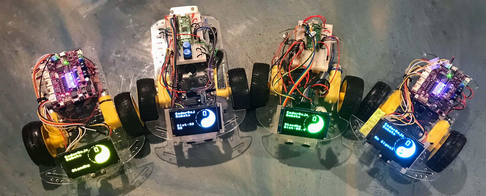

# Introduction to OLED displays

<br/>
Four colors of 2.44" OLED displays from DIY More.  We can purchase them on EBay for around $18 each.

We use small OLED displays in many of our labs because:

1. They are **inexpensive** (around $4).
2. They are **easy** to connect** via I2C and SPI.  Just four wires for I2C and seven wires for SPI.
3. They have a **large area** to display feedback.  Most of them are 128X64 pixels.
4. Once you get the drivers installed (not always easy) they are **easy to program**.  You only need to initialize the device and run the oled.fill(), oled.text() and oled.show() functions.
5. OLEDs, unlike LCDs, have **high contrast over a large range of input voltages**.  This means that as your batteries slowly discharge, your OLEDs will keep their high-quality contrast.
6. There is plenty of **sample code and tutorials** available.
7. You can program them with Python (our student's favorite language)
8. They are crazy fun!

The first step is to find out what type of display graphics chip is used in your OLED.


In these lessons we will assume you have a 128X64 or similar OLED display.  Many of these displays can be purchased for around $4 on eBay.  Many of these displays use the popular SSD1306 chip to drive the displays.  There are also to communication options:

1. I2C - simple 2 wire connection (not including power and ground)
2. SPI - five wires but also faster screen refresh rates

Updating a 128X64 display using I2C takes around 37ms.  When using the SPI interface, updating the display can be reduced to around 2.79ms.

These labs will assume these parameters, but you can modify the labs to use different sizes and display driver chips by only modifying a few lines of code.

## I2C Scanner
Because your microcontroller might have multiple displays on it, their must be some way to address the devices using an address.  Most of the devices come with a default address of decimal value 60 (hex value X3C).  To test this the i3c module has a i2c scan function.

```py
import machine
sda=machine.Pin(0) # row one on our standard Pico breadboard
scl=machine.Pin(1) # row two on our standard Pico breadboard
i2c=machine.I2C(0, sda=sda, scl=scl, freq=400000)
print("Device found at decimal", i2c.scan())
```

If you don't see a return value of "60" or similar, then you need to check your wiring and make sure that you have an I2C (not an SPI) device.
