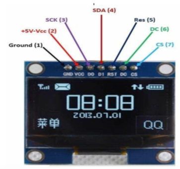
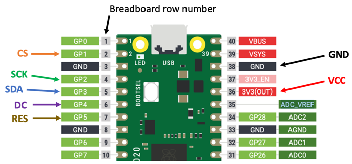

# OLED Setup

At the beginning of of your Python programs there is usually a few lines of setup instruction to tell the system which libraries to use, what pins to assign and what devices to initialize.

We will first look at the simple I2C setup.  Then we will look at the SPI setup.

## I2C Scanner
Because your microcontroller might have multiple I2C devices and displays on it, there must be some way to address the devices using an address.  Most of the devices come with a default address of decimal value 60 (hex value X3C).  To test this the i3c module has a i2c scan function.

```py
import machine
sda=machine.Pin(0)
scl=machine.Pin(1)
i2c=machine.I2C(0, sda=sda, scl=scl, freq=400000)
print("Device found at decimal", i2c.scan())
```

returns: [60]

returns: [60]

## SSD1306 Examples

### SSD1306 I2C Setup

```py
from ssd1306 import SSD1306_I2C
oled = SSD1306_I2C(128, 64, i2c)
oled.text('Hello World!', 0, 0, 1)
oled.show()
```

### SSD1306 SPI Setup

Back connections:


Front labels on OLED with SPI:


Here is the connection diagram:



Here is the code:

```python
import machine import ssd1306
spi_sck=machine.Pin(2)
spi_tx=machine.Pin(3)
spi=machine.SPI(0, baudrate=100000, sck=spi_sck, mosi=spi_tx)
CS = machine.Pin(1)
DC = machine.Pin(4)
RES = machine.Pin(5)
oled = ssd1306.SSD1306_SPI(128, 64, spi, DC, RES, CS)
oled.text('Hello World!', 0, 0, 1)
oled.show()
```

## SSH1106 I2C Setup

```py
from machine import Pin, I2C
import sh1106

sda=machine.Pin(0)
scl=machine.Pin(1)
i2c = I2C(0, scl=scl, sda=sda, freq=400000)
oled = SH1106_I2C(128, 64, i2c)
oled.text('Hello World!', 0, 0, 1)
oled.show()
```

## References

[Micropython SSD1306 Driver on GitHub](https://github.com/micropython/micropython/blob/master/drivers/display/ssd1306.py)