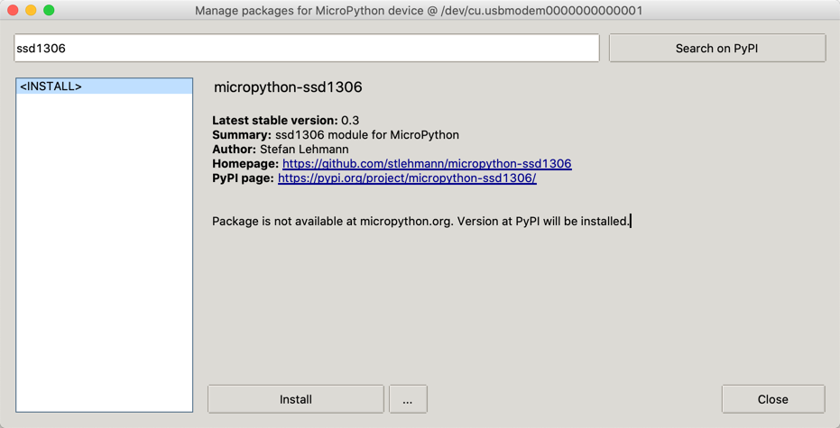

# OLED SSD1306 SPI Examples

## Using the SSD1306 with SPI Interfaces

### Add the ssd1306 Python Module

You can now use the Thonny "Tools -> Manage Packages..." menu to add the Python driver for the SSD1306 device.  You will need to do this for every new device you use.  


If the Manage Packages menu is disabled, then you will need to go into the shell and add it with the pip command.


## Install SSD1306 Module



## ssd1306 module

[SSD1306 Library](https://github.com/micropython/micropython/blob/master/drivers/display/ssd1306.py) - click the RAW button and then right click to do a "Save As"

[SSD1306 Library Searchable](https://github.com/stlehmann/micropython-ssd1306/blob/master/ssd1306.py)

## The SPI interface
The four wire I2C interface is great for kids that don't want to hook up more than four wires.  But there are times when we want a higher performance screen with faster refresh times.  This is when the SPI interface comes in handy.

## Displaying SPI Defaults

```py
from machine import Pin
from ssd1306 import SSD1306_SPI
# default is data (MOSI) on GP7 and clock (sck) on GP6
spi=machine.SPI(0)
print(spi)
SPI(0, baudrate=992063, polarity=0, phase=0, bits=8, sck=6, mosi=7, miso=4)
### SPI Baudrate
https://raspberrypi.github.io/pico-sdk-doxygen/group__hardware__spi.html#ga37f4c04ce4165ac8c129226336a0b66c

The seven wires on the back of the SPI OLED screens are the following as read from the top to bottom looking at the back of the display:


1. CS - Chip Select - pin 4
2. DC - Data/Command - pin 5
3. RES - Reset - pin 6
4. SDA - Data - SPIO TX GP7 pin 10
5. SCL - Clock - Connect to SPIO SCK GP6 pin 9
6. VCC - Connect to the 3.3V Out pin 36
7. GND - pin 38 or 3 any other GND pin

### Pico Pins

```
# Sample code sections
 28 # ------------ SPI ------------------
 29 # Pin Map SPI
 30 # - 3v - xxxxxx - Vcc
 31 # - G - xxxxxx - Gnd
 32 # - D7 - GPIO 13 - Din / MOSI fixed
 33 # - D5 - GPIO 14 - Clk / Sck fixed
 34 # - D8 - GPIO 4 - CS (optional, if the only connected device)
 35 # - D2 - GPIO 5 - D/C
 36 # - D1 - GPIO 2 - Res
```

* SCK is the clock - hook this to the oled SCL
* MOSI is the line taking data from your Pico to the peripheral device.  Hook this to SDA

From the SDK:
https://datasheets.raspberrypi.org/pico/raspberry-pi-pico-python-sdk.pdf
Section 3.7

1. SPI0_SCK - pin 6
2. SPI0_MOSI - pin 7
3. SPI0_MISO - pin 8

This contradicts p122 in GET STARTED WITH MICROPYTHON ON RASPBERRY PI PICO

```
spi_sck=machine.Pin(2)
spi_tx=machine.Pin(3)
spi_rx=machine.Pin(4)
```

We send the data to the SPI RX (Receive) port on the Pico.  These are pin 1 (GP0) or pin 6 (GP4)

## Sample Nonworking SPI Code

From the documentation:

!!! From Raspberry Pi Pico Documentation
    **spi** is an SPI object, which has to be created beforehand and tells the ports for SCLJ and MOSI. MISO is not used.

    **dc** is the GPIO Pin object for the Data/Command selection. It will be initialized by the driver.

    **res** is the GPIO Pin object for the reset connection. It will be initialized by the driver. If it is not needed, it can be set to None or omitted. In this case the default value of None applies.

    **cs** is the GPIO Pin object for the CS connection. It will be initialized by the driver. If it is not needed, it can be set to None or omitted. In this case the default value of None applies.

```py
import machine
import utime
import ssd1306
led = machine.Pin(25, machine.Pin.OUT)

spi_sck=machine.Pin(6)
spi_tx=machine.Pin(7)
# spi_rx=machine.Pin(4)
spi=machine.SPI(0,baudrate=100000,sck=spi_sck, mosi=spi_tx)

CS = machine.Pin(8)
DC = machine.Pin(9)
RES = machine.Pin(10)

oled = ssd1306.SSD1306_SPI(128, 64, spi, DC, RES, CS)

# flash all pixels on
oled.fill(1)
oled.show()
utime.sleep(0.5)

oled.fill(0)
oled.text('CoderDojo Rocks!', 0, 0, 1)
oled.show()

# flash the LED to show end
led.high()
utime.sleep(0.5)
led.low()

print('Done')
```

## References

[robert-hh's SH1106 Driver](https://github.com/robert-hh/SH1106)

[MicroPython SSD1306 Class](https://github.com/stlehmann/micropython-ssd1306/blob/master/ssd1306.py)

https://www.mfitzp.com/article/oled-displays-i2c-micropython/

https://github.com/adafruit/Adafruit_CircuitPython_SSD1306/blob/master/examples/ssd1306_stats.py

https://github.com/robert-hh/SH1106/blob/master/sh1106.py

[DIY More OLED Product Description](https://www.diymore.cc/collections/all-about-arduino/products/2-42-inch-12864-oled-display-module-iic-i2c-spi-serial-for-arduino-c51-stm32-green-white-blue-yellow?variant=17060396597306)

## SSD1306
https://www.solomon-systech.com/en/product/advanced-display/oled-display-driver-ic/ssd1306/

## SSD1307
https://www.solomon-systech.com/en/product/advanced-display/oled-display-driver-ic/ssd1307/