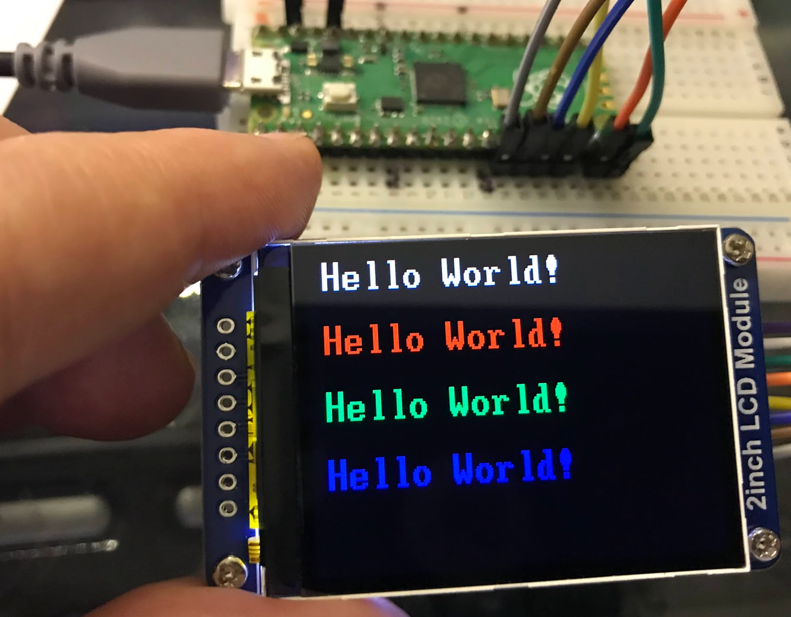
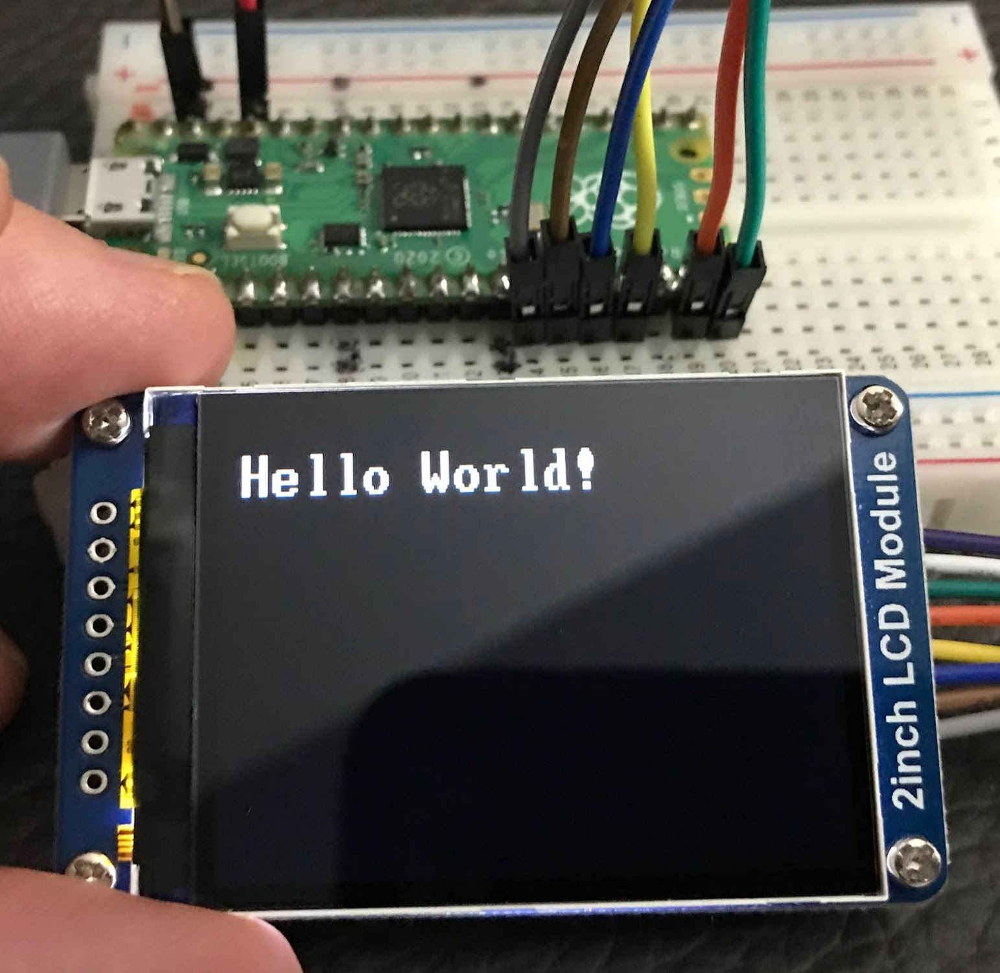

# MicroPython ST7789V LCD Display



The Sitronix ST7789 is a driver chip for small color IPS LCD displays that supports SPI interfaces.  This example uses a 2-inch color LDC display manufactured by [Waveshare](https://www.waveshare.com/2inch-lcd-module.htm) with a retail price of approximately $13 or $14.75 on [Amazon Prime](https://www.amazon.com/Waveshare-Resolution-Interface-Examples-Raspberry/dp/B081Q79X2F).

## Specifications

* Resolution: 240(V) x 320(H) RGB
* 18 bit color (6 bits for R, G and B)
* 1,382,400 bits of display memory
* Interface: 4-wire SPI (kind of)
* Operating voltage: 3.3V

Note: The ST7789 uses a SPI interfaces but not a true standard SPI protocol. The device only uses MOSI (DIN) to send data from master to slave for LCD display.  Only four wires are needed to connect from the Pico to the device.

## Device Interface


## Interface

1. VCC	Power (3.3V input)
1. GND	Ground
1. DIN	SPI data input
1. CLK	SPI clock input
1. CS	Chip selection, low active
1. DC	Data/Command selection (high for data, low for command)
1. RST	Reset, low active
1. BL	Backlight - tie to GND to turn the backlight on


Although the device has eight wires, your Pico only needs a few of them to be controlled by the GIPO ports.

## Uploading the ST7789V Python Firmware

The firmware contains pre-compiled objects for various devices with the st7789 C driver and frozen python font files.

The library for the driver is delivered as a single firmware.uf2 file available here:

[https://github.com/russhughes/st7789_mpy/tree/master/firmware/RP2](https://github.com/russhughes/st7789_mpy/tree/master/firmware/RP2)

To load this file you will need to hold down the BOTSEL button on the Pico and drag this file into the RP2 folder that is mounted.

## MicroPython Initialization

I used the following SPI Device ID 1 pinout on the lower left corner of the Pico:

| Pin | GP Number | Label on LCD |
| --- | --------- | ------------ |
|14 |(GP10) | BL  |
|15 |(GP11) | RST |
|16 |(GP12) | DC  |
|17 |(GP13) | CS  |
|18 |(GND)  | GND |
|19 |(GP14) | CLK |
|20 |(GP15) | DIN |

## Sample Device Initialize

```py
from machine import Pin, SPI
import st7789

BACKLIGHT_PIN = 10
RESET_PIN = 11
DC_PIN = 12
CS_PIN = 13
CLK_PIN = 14
DIN_PIN = 15 # lower left corner

import vga1_bold_16x32 as font

spi = SPI(1, baudrate=31250000, sck=Pin(CLK_PIN), mosi=Pin(DIN_PIN))
tft = st7789.ST7789(spi, 240, 320,
    reset=Pin(RESET_PIN, Pin.OUT),
    cs=Pin(CS_PIN, Pin.OUT),
    dc=Pin(DC_PIN, Pin.OUT),
    backlight=Pin(BACKLIGHT_PIN, Pin.OUT),
    rotation=3)
tft.init()
# draw white letters on a back background at 10 over and 20 down
tft.text(font, "Hello World!", 10, 20, st7789.color565(255,255,255), st7789.color565(0,0,0))
```



## Sample Hello World In Four Colors

```py
from machine import Pin, SPI
import st7789

BACKLIGHT_PIN = 10
RESET_PIN = 11
DC_PIN = 12
CS_PIN = 13
CLK_PIN = 14
DIN_PIN = 15 # lower left corner

import vga1_bold_16x32 as font

spi = SPI(1, baudrate=31250000, sck=Pin(CLK_PIN), mosi=Pin(DIN_PIN))
tft = st7789.ST7789(spi, 240, 320,
    reset=Pin(RESET_PIN, Pin.OUT),
    cs=Pin(CS_PIN, Pin.OUT),
    dc=Pin(DC_PIN, Pin.OUT),
    backlight=Pin(BACKLIGHT_PIN, Pin.OUT),
    rotation=3)
tft.init()

tft.text(font, "Hello World!",10, 0, st7789.color565(255,255,255), st7789.color565(0,0,0))
tft.text(font, "Hello World!",10, 50, st7789.color565(255,0,0), st7789.color565(0,0,0))
tft.text(font, "Hello World!",10, 100, st7789.color565(0,255,0), st7789.color565(0,0,0))
tft.text(font, "Hello World!",10, 150, st7789.color565(0,0,255), st7789.color565(0,0,0))

```

## Driver Implementation Notes

The ST7789V supports RGB444, RGB565 and RGB666 three formats. The Waveshare LCD uses RGB565.
For most LCD controllers, the communication method of the controller can be configured, they are usually using 8080 parallel interface, 3-line SPI, 4-line SPI, and other communication methods. This LCD uses a 4-line SPI interface for reducing GPIO and fast speed.LCD


1. RESX: Reset, should be pull-down when power on, set to 1 other time.
1. CSX: Slave chip select. The chip is enabled only CS is set Low
1. D/CX: Data/Command selection; DC=0, write command; DC=1, write data
1. SDA: Data transmitted. (RGB data)
1. SCL: SPI clock

## Timing Diagram

You can see what data needs to be changing from the timing diagram below:


2. The SPI communication protocol of the data transmission uses control bits: clock phase (CPHA) and clock polarity (CPOL)
3. CPOL defines the level while the synchronization clock is idle. If CPOL=0, then it is LOW.  
4. CPHA defines at whish clock’s tick the data transmission starts. CPHL=0 – at the first one, otherwise at the second one

This combination of two bits provides 4 modes of SPI data transmission. The commonly used is SPI0 mode, i.e. GPHL=0 and CPOL=0.

According to the figure above, data transmitting begins at the first falling edge, 8bit data are transmitted at one clock cycle. It is SPI0. MSB.

## References

1. [ST7789C Datasheet (PDF)](https://www.newhavendisplay.com/appnotes/datasheets/LCDs/ST7789V.pdf)
2. [Waveshare Wiki](https://www.waveshare.com/wiki/2inch_LCD_Module)
3. [Waveshare Pico Dispaly](https://www.waveshare.com/pico-lcd-2.htm)