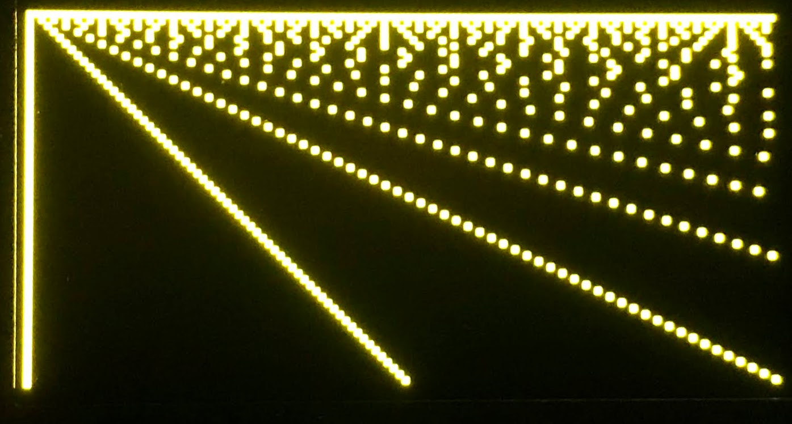
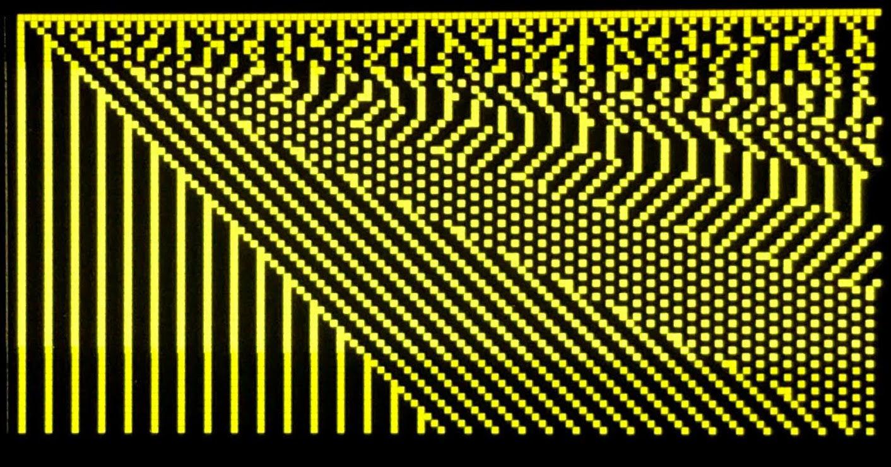
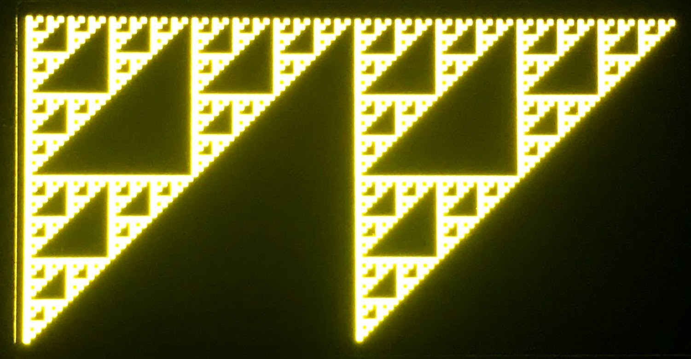
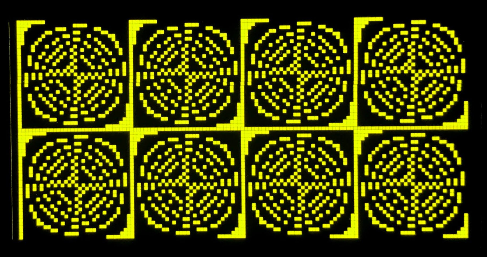
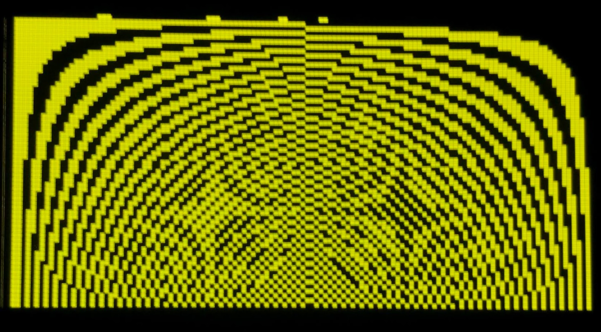
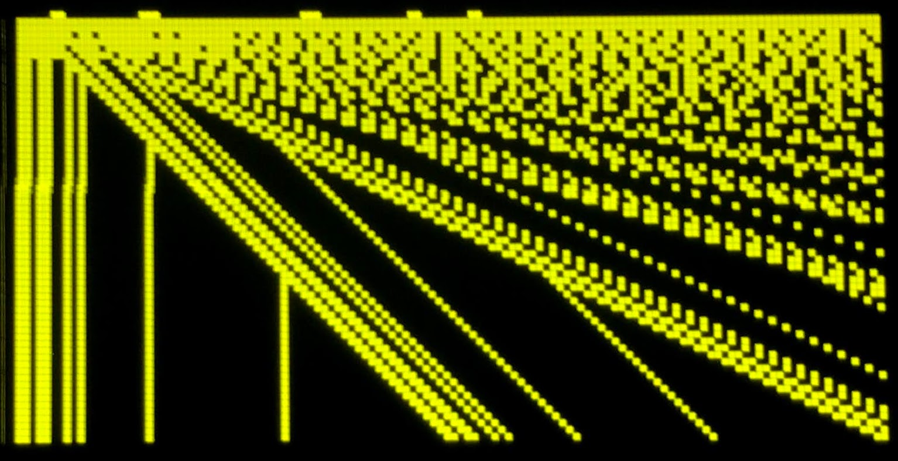

# OLED Patterns

In this lesson, we will show how you can display interesting repeating patterns on your OLED screen.  Our program will write a pattern into the framebuffer using a simple math equation.  The oled.show() will then update the pattern on the display.

This lesson was suggested by Parker Erickson.

## Math Functions
We will use a few unusual functions to create repeating patterns:

1. Modulo (%)
2. Bitwise AND (&)

The modulo function is written ```%```.  It returns the integer remainder after a division.  So ```7 % 3``` is 1 and ```7 % 4``` is 3.
The Power function of X to the Y power is written in python as ```pow(x,y)```.  For example pow(7, 2) is seven squared = 49.

The bitwise and is written as ```x & y```

```py
for i in range(8):
    13 & i
```

|Function|Returns|
|---|---|
|13 & 0 | 0 |
|13 & 1 | 1 |
|13 & 2 | 0 |
|13 & 3 | 1 |
|13 & 4 | 4 |
|13 & 5 | 5 |
|13 & 6 | 4 |
|13 & 7 | 5 |
|13 & 8 | 8 |
|13 & 9 | 9 |
|13 & 10 | 8 |
|13 & 11 | 9 |
|13 & 12 | 12 |


## Some Sample Equations

1. x & y
1. x % y
1. (x ^ y) % 9
1. (x ^ y) % 5
1. (x ^ y) % 17
1. (x ^ y) % 33
1. (x * y) & 64
1. (x * y) & 24
1. (x * y) & 47
1. (x * 2) % y
1. (x * 64) % y
1. (x * 31) % y
1. ((x-128) * 64) % (y-128)
1. (x % y) % 4
1. (y % x) % 20
1. 40 % (x % y)

Note there are other patterns that use the power ```pow(x,y)``` or Exponentiation ```**``` function but I can't get these to work with Micropython.

## Sample Code
This program evaluates the function ```x % (y+1)``` for each of the pixels on the screen.  If the function returns a non-zero the pixel will be off.  If the pixel is zero, the pixel will be on.

draw-patterns-ssd1306-spi.py
```py
import machine
import ssd1306

WIDTH = 128
HEIGHT = 64
spi_sck=machine.Pin(2)
spi_tx=machine.Pin(3)
spi=machine.SPI(0,baudrate=100000,sck=spi_sck, mosi=spi_tx)
CS = machine.Pin(1)
DC = machine.Pin(4)
RES = machine.Pin(5)
oled = ssd1306.SSD1306_SPI(WIDTH, HEIGHT, spi, DC, RES, CS)

oled.fill(0) # clear display
for x in range(WIDTH):
    for y in range(HEIGHT):
        if x % (y+1):
           oled.pixel(x,y,0)
        else:
            oled.pixel(x,y,1)
oled.show()

```

## Adding a List of Patterns

### The Eval Function
The eval() function takes any string and passes it to the python interpreter for evaluation within the current context of variables that are in scope.  We can use eval to pass an expression that should be evaluated to any function.

```py
list = ["x+y", "x-y", "x*y", "x % (y+1)"]

for i in range(0, 4):
    print(list[i], ': ', sep='', end='')
    for x in range(5):
      for y in range(5):
         print(eval(list[i]), '', end='')
    print('')
```

Output:

```data
x+y: 0 1 2 3 4 1 2 3 4 5 2 3 4 5 6 3 4 5 6 7 4 5 6 7 8 
x-y: 0 -1 -2 -3 -4 1 0 -1 -2 -3 2 1 0 -1 -2 3 2 1 0 -1 4 3 2 1 0 
x*y: 0 0 0 0 0 0 1 2 3 4 0 2 4 6 8 0 3 6 9 12 0 4 8 12 16 
x % (y+1): 0 0 0 0 0 0 1 1 1 1 0 0 2 2 2 0 1 0 3 3 0 0 1 0 4 
```

## The Command Design Pattern
The command pattern holds a list of commands in an array.  Each command is executed in the sequence it appears in the list of commands.

In the following program we have the equations in a list.  The program steps through each item in the list and displays that equation on the OLED display.

```py
import machine
import ssd1306
from utime import sleep, time

WIDTH = 128
HEIGHT = 64
spi_sck=machine.Pin(2)
spi_tx=machine.Pin(3)
spi=machine.SPI(0,baudrate=100000,sck=spi_sck, mosi=spi_tx)
CS = machine.Pin(1)
DC = machine.Pin(4)
RES = machine.Pin(5)
oled = ssd1306.SSD1306_SPI(WIDTH, HEIGHT, spi, DC, RES, CS)

equations = ['(x * y) & 24', '(x * y) & 47', '(x * y) & 64', 'x & y', 'x % y', '(x % y) % 4', '40 % (x % y+1)']

for eqn in range(0, len(equations)):
    start = time()

    oled.fill(0) # clear display
    oled.text('calculating', 0, 0, 1)
    oled.text(equations[eqn], 0, 10, 1)
    oled.show()
    for x in range(WIDTH):
        for y in range(1, HEIGHT):
            if eval(equations[eqn]):
               oled.pixel(x,y,0)
            else:
                oled.pixel(x,y,1)
    oled.show()
    sleep(5)

    end = time()
    duration = str(end - start)
    print(equations[eqn])
    print(duration, ' seconds')

oled.text('done', 0, 0, 1)
oled.show()
print('done')
```

## Sample Screen Images

### X Modulo Y
```x % y```



### (x % y) % 4


## Sierpinsky Triangles (x & y)
[Sierpinsky Triangles](https://en.wikipedia.org/wiki/Sierpi%C5%84ski_triangle)
Bitwise and of x and y


## (x * y) & 24


## (x * y) & 64


## 40 % x % (y+1)



## Reference

[Martin Kleppe Post on Twitter](https://twitter.com/aemkei/status/1378106731386040322)
