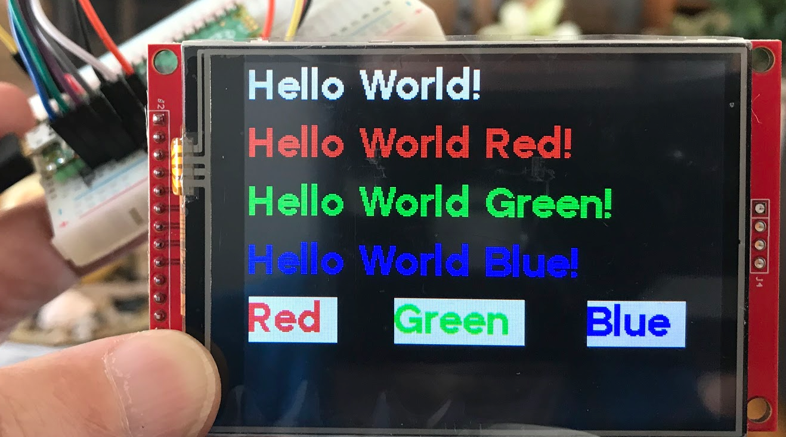
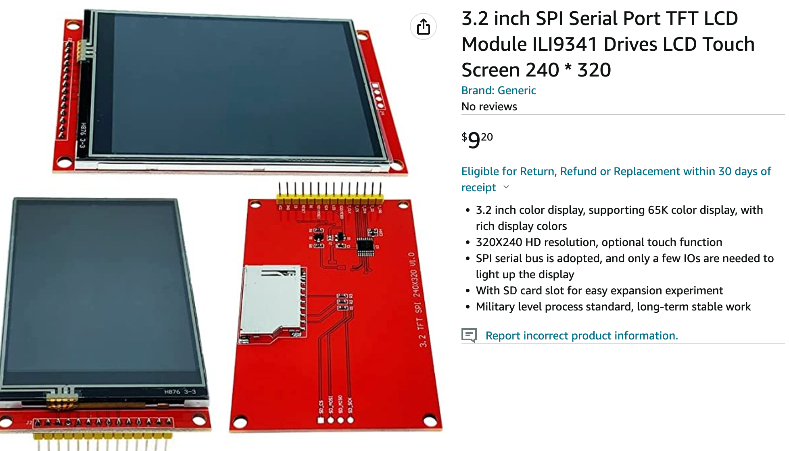

# LI9341 TDF Display



This is a 3.2" $10 240X320 color display that is easy to set up on the Raspberry Pi Pico using the SPI interface.  The hardware supports a touch screen and an SD card, but we could not locate drivers for these components.

Sample $10 part on [Amazon](https://www.amazon.com/dp/B0BMVXNQ22?psc=1&ref=ppx_yo2ov_dt_b_product_details) or [ebay](https://www.ebay.com/itm/385436352305?hash=item59bdcbff31:g:QjwAAOSwoy1j9vw7)



The TFT uses a 16-bit representation of the color of each pixel:

1. 5-bits for red
2. 6-bits for green
3. 5-bits for blue

This requires us to include the ```color565``` library for doing color operations.  So for example, to get the color yellow, you would need to do the following:

```py
yellow = color565(255, 255, 0)
```

## Sample SPI Hello World Example


```py
# print out "Hello World!" using the rotation=3 using 32-bit high font
# the default is white text on a black background
from ili934x import ILI9341
from machine import Pin, SPI
import tt32

# Use these PIN definitions.  SCK must be on 2 and data (SDL) on 3
SCK_PIN = 2
MISO_PIN = 3 # labeled SDI(MOSI) on the back of the display
DC_PIN = 4
RESET_PIN = 5
CS_PIN = 6

# mosi=Pin(23)
# miso=Pin(MISO_PIN)
spi = SPI(0, baudrate=20000000, mosi=Pin(MISO_PIN),sck=Pin(SCK_PIN))
display = ILI9341(spi, cs=Pin(CS_PIN), dc=Pin(DC_PIN), rst=Pin(RESET_PIN), w=320, h=240, r=3)
display.erase()
display.set_font(tt32)
display.set_pos(0,0)
display.print('Hello World!')
```

## Draw Random Rectangles

```py
from ili934x import ILI9341, color565
from machine import Pin, SPI
from utime import sleep
from random import randint

WIDTH = 320
HALF_WIDTH = int(WIDTH/2)
HEIGHT = 240
HALF_HEIGHT = int(HEIGHT/2)
ROTATION = 3 # landscape with 0,0 in upper left and pins on left

SCK_PIN = 2
MISO_PIN = 3
DC_PIN = 4
RST_PIN = 5
CS_PIN = 6

# mosi=Pin(23)
# miso=Pin(MISO_PIN)
spi = SPI(0, baudrate=20000000, mosi=Pin(MISO_PIN), sck=Pin(SCK_PIN))
display = ILI9341(spi, cs=Pin(CS_PIN), dc=Pin(DC_PIN), rst=Pin(RST_PIN), w=WIDTH, h=HEIGHT, r=ROTATION)
display.erase()

# color defintions converted to 565 represnetations
black = color565(0, 0, 0)
white = color565(255, 255, 255)
red = color565(255, 0, 0)
green = color565(0, 255, 0)
blue = color565(0, 0, 255)
yellow = color565(255, 255, 0)
cyan = color565(0, 255, 255)
magenta = color565(255, 0, 255)
gray = color565(128, 128, 128)
light_gray = color565(192, 192, 192)
dark_gray = color565(64, 64, 64)
brown = color565(165, 42, 42)
orange = color565(255, 60, 0)
# 150 for the green and blue wash out the colors
pink = color565(255, 130, 130)
purple = color565(128, 0, 128)
lavender = color565(150, 150, 200)
beige = color565(200, 200, 150)
# by definition, maroon is 50% of the red on, but 128 is way too bright
maroon = color565(105, 0, 0)
olive = color565(128, 128, 0)
turquoise = color565(64, 224, 208)
dark_green = color565(0,100,0)
color_list = [white, red, green, blue, yellow, cyan, magenta,
              gray, light_gray, dark_gray, brown, orange, pink, purple, lavender,
              beige, maroon, olive, turquoise, dark_green, black]
color_num = len(color_list)

# Draw forever
while True:
    # rect_fill(x, y, width, height, color)
    x = randint(0, HALF_WIDTH)
    y = randint(0, HALF_HEIGHT)
    width = randint(0, HALF_WIDTH)
    height = randint(0, HALF_HEIGHT)
    color = color_list[randint(0, color_num-1)]
    print('fill_rectangle(', x, y, width, height, color)
    display.fill_rectangle(x, y, width, height, color)
```

## Draw Color Lists

One of the best ways to study the color values is to display a rectangle
and list the color name and values under the rectangle.

Here is a sample program that will do this.

```py
from ili934x import ILI9341, color565
from machine import Pin, SPI
from utime import sleep
from random import randint
import tt32

WIDTH = 320
HALF_WIDTH = int(WIDTH/2)
HEIGHT = 240
HALF_HEIGHT = int(HEIGHT/2)
ROTATION = 3 # landscape with 0,0 in upper left and pins on left
SCK_PIN = 2
MISO_PIN = 3
DC_PIN = 4
RST_PIN = 5
CS_PIN = 6

# mosi=Pin(23)
# miso=Pin(MISO_PIN)
spi = SPI(0, baudrate=20000000, mosi=Pin(MISO_PIN),sck=Pin(SCK_PIN))
display = ILI9341(spi, cs=Pin(CS_PIN), dc=Pin(DC_PIN), rst=Pin(RST_PIN), w=WIDTH, h=HEIGHT, r=ROTATION)
display.set_font(tt32)
display.erase()

# color defintions convered to 565 represnetations
black = color565(0, 0, 0)
white = color565(255, 255, 255)
red = color565(255, 0, 0)
green = color565(0, 255, 0)
blue = color565(0, 0, 255)
yellow = color565(255, 255, 0)
cyan = color565(0, 255, 255)
magenta = color565(255, 0, 255)
gray = color565(128, 128, 128)
light_gray = color565(192, 192, 192)
dark_gray = color565(64, 64, 64)
brown = color565(165, 42, 42)
orange = color565(255, 60, 0)
# 150 for the green and blue wash out the colors
pink = color565(255, 130, 130)
purple = color565(128, 0, 128)
lavender = color565(150, 150, 200)
beige = color565(200, 200, 150)
# by definition, maroon is 50% of the red on, but 128 is way too bright
maroon = color565(105, 0, 0)
olive = color565(128, 128, 0)
turquoise = color565(64, 224, 208)
dark_green = color565(0,100,0)
color_list = [white, red, green, blue, yellow, cyan, magenta,
              gray, light_gray, dark_gray, brown, orange, pink, purple, lavender,
              beige, maroon, olive, turquoise, dark_green, black]
color_names = ['white (255,255,255)', 'red (255,0,0)', 'green (0,255,0)', 'blue (0,0,255)', 'yellow (255,255,0)',
               'cyan (0,255,255)', 'magenta (255,0,255)',
              'gray (128,128,128)', 'light gray (192,192,192)', 'dark gray (64,64,64)',
               'brown (165,42,42)', 'orange (255,60,0)', 'pink (255,130,130)', 'purple (128,0,128)',
               'lavender (150,150,200)',
              'beige (200,200,150)', 'maroon (105,0,0)', 'olive (128,128,0)', 'turquoise (64,224,208)',
               'dark green (0,100,0)', 'black (0,0,0)']
color_num = len(color_list)

display.fill_rectangle(0, 0, WIDTH, HEIGHT, black)
while True:
    for i in range(0, color_num):
        display.fill_rectangle(0, 0, WIDTH, HEIGHT-33, color_list[i])
        # black behind the white text
        display.fill_rectangle(0, HEIGHT-32, WIDTH, 32, black)
        
        display.set_pos(0,HEIGHT-32)
        display.print(color_names[i])
        print(color_names[i])
        sleep(1)
```

## Screen Update Speed

One large disadvantage of this display is the very slow refresh rate.  Transmitting the entire screen of 240X320 with two bytes per pixel takes
a long time over SPI.  This makes this setup difficult to use for animation.

## Ball Bounce Animation

Here is a very slow "ball bounce" animation that is slow and has a lot of flicker.

```py
from ili934x import ILI9341, color565
from machine import Pin, SPI
from utime import sleep

WIDTH = 320
HEIGHT = 240
ROTATION = 3 # landscape with 0,0 in upper left and pins on left
SCK_PIN = 2
MISO_PIN = 3
DC_PIN = 4
RST_PIN = 5
CS_PIN = 6

# mosi=Pin(23)
# miso=Pin(MISO_PIN)
spi = SPI(0, baudrate=20000000, mosi=Pin(MISO_PIN),sck=Pin(SCK_PIN))
display = ILI9341(spi, cs=Pin(CS_PIN), dc=Pin(DC_PIN), rst=Pin(RST_PIN), w=WIDTH, h=HEIGHT, r=ROTATION)
display.erase()

# color defintions convered to 565 represnetations
black = color565(0, 0, 0)
white = color565(255, 255, 255)
red = color565(255, 0, 0)
green = color565(0, 255, 0)
blue = color565(0, 0, 255)

# ok, not really a circle - just a square for now
def draw_ball(x,y, size, color):
    if size == 1:
        display.pixel(x, y, color) # draw a single pixel
    else:
        display.fill_rectangle(x, y, size, size, color)

ball_size = 20
# start in the middle of the screen
current_x = int(WIDTH / 2)
current_y = int(HEIGHT / 2)
# start going down to the right
direction_x = 1
direction_y = -1
# delay_time = .0001

# Bounce forever
while True:
    # draw the square ball in white
    draw_ball(current_x,current_y, ball_size, white)
    sleep(.1)
    # the erase the old ball takes too long and causes a flicker
    draw_ball(current_x,current_y,ball_size, black)
    if current_x < 0:
        direction_x = 1
    # right edge test
    if current_x > WIDTH - ball_size -2:
        direction_x = -1
    # top edge test
    if current_y < 0:
        direction_y = 1
    # bottom edge test
    if current_y > HEIGHT - ball_size - 2:
        direction_y = -1
    # update the ball
    current_x = current_x + direction_x
    current_y = current_y + direction_y
```


## References

1. [Jeffmer's GitHub library which includes four fonts](https://github.com/jeffmer/micropython-ili9341) - the sizes are 8, 14, 24 and 32 pixels.

2. [Amazon HiLetgo ILI9341 2.8" SPI TFT LCD Display Touch Panel 240X320 with PCB 5V/3.3V STM32](https://www.amazon.com/s?k=TFT+display&tag=all3dp0c-20)

3. [ebay Listing](https://www.ebay.com/itm/304736177265)
