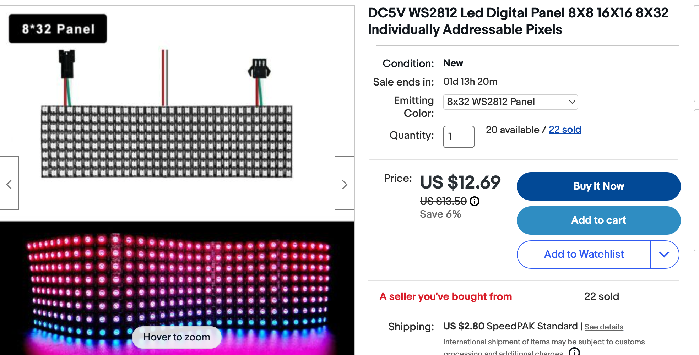
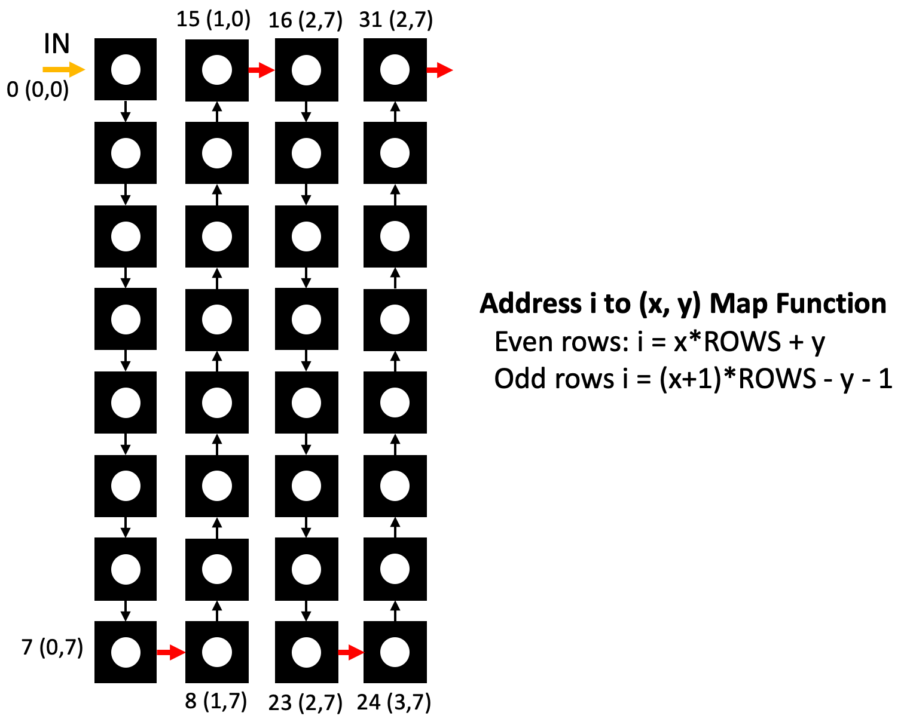

# NeoPixel Matrix Display


## Introduction

This lesson uses MicroPython to control display that uses a 8X32 matrix of WS2812 RGB LEDs to display information.  The entire display is controlled by three wires, a ground, +5V, and a serial data signal.  We will use the MicroPython builtin NeoPixel library to control the display.  You can use many of the programs in the [NeoPixel Basics](../basics/../../basics/05-neopixel.md) lesson to control the display.  The key difference is that we will need to convert matrix coordinates to NeoPixel index numbers.

## Purchasing Hardware

You can purchase a matrix of 8X32 WS2812 RGB LED on eBay for about $12 on [eBay](https://www.ebay.com/itm/255390906966) or about [$100](https://www.adafruit.com/product/2294) on Adafruit.  They are also available in 16X16 versions and the devices can be chained together to make larger displays.  On our version tested here, we have a total of 8*32 = 256 pixels.



## Basic Software Setup

We must first create a function that will draw a pixel at a given x and y position.  This is
complicated by the fact that the matrix is not a regular grid, but rather a grid that is connected
in a zig-zag serpentine pattern illustrated below.



Note that the math for doing even and odd columns is different.  The even columns are drawn from the top down and the odd columns are drawn from the bottom to the top which is the order the pixels are wired together in the matrix.

To use the functions that draw pixels, we must first create a function that will convert the x and y coordinates to a NeoPixel index.  This is done by the following function.  We will then pass this function into the library that will draw characters on the screen.

```python
from machine import Pin
from neopixel import NeoPixel

NEOPIXEL_PIN = 0
ROWS = 8
COLS = 32
NUMBER_PIXELS = ROWS * COLS
# Allocate memory for the NeoPixel matrix
matrix = NeoPixel(Pin(NEOPIXEL_PIN), NUMBER_PIXELS)

def write_pixel(x, y, value):
    if y >= 0 and y < ROWS and x >=0 and x < COLS:
        # odd count rows 1, 3, 5 the wire goes from bottup
        if x % 2: 
            strip[(x+1)*ROWS - y - 1] = value             
        else: # even count rows, 0, 2, 4 the wire goes from the top down up
            strip[x*ROWS + y] = value
```

## Testing Your Write Pixel Function

We can then test the function by calling it at four corners with different colors.

```python
# draw four colors at each corner of the matrix
write_pixel(0, 0, (255, 0, 0)) # draw a red pixel at the top left corner
write_pixel(7, 0, (0, 255, 0)) # draw a green pixel at the lower left corner
write_pixel(0, 7, (0, 0, 255)) # draw a blue pixel at the top right corner
write_pixel(7, 7, (255, 255, 255)) # draw a white pixel at the lower right corner
```

## Bounce a Ball

To test the write_pixel() function, lets write a function that will draw a ball at a given x and y position.  We will move the ball around the screen and reverse the direction when the ball hits the edge of the screen.

```python
# Bounce a ball around a NeoPixel Matrix
from neopixel import NeoPixel
from utime import sleep

NEOPIXEL_PIN = 0
ROWS = 8
COLS = 32
NUMBER_PIXELS = ROWS * COLS
strip = NeoPixel(machine.Pin(NEOPIXEL_PIN), NUMBER_PIXELS)

# matrix = [[0 for _ in range(cols)] for _ in range(rows)]
def clear():
    for i in range(0, NUMBER_PIXELS):
        strip[i] = (0,0,0)
    strip.write()

def write_pixel(x, y, value):
    if y >= 0 and y < ROWS and x >=0 and x < COLS:
        # odd count rows 1, 3, 5 the wire goes from bottup
        if x % 2: 
            strip[(x+1)*ROWS - y - 1] = value             
        else: # even count rows, 0, 2, 4 the wire goes from the top down up
            strip[x*ROWS + y] = value

def show():
    strip.write()

brightness=1
x=0
y=0
dx = 1
dy = 1
counter = 0
while True:
    if x <= 0:
        dx = 1
    if y <= 0:
        dy = 1
    if x >= COLS-1:
        dx = -1
    if y >= ROWS-1:
        dy = -1
    print(x,y)
    if counter < 100:
        write_pixel(x, y, (brightness,0,0)) # blue
    elif counter < 200:
        write_pixel(x, y, (0,brightness,0)) # blue
    elif counter < 300:
        write_pixel(x, y, (0,0,brightness)) # blue
    show()
    x += dx
    y += dy
    counter += 1
    if counter > 300:
        counter = 0
    if not counter % 150:
        x += 1
    sleep(.1)
```


## Bitmap LIbrary


```python
# MicroPython basic bitmap font renderer.
# Author: Tony DiCola
# License: MIT License (https://opensource.org/licenses/MIT)
try:
    import ustruct
except ImportError:
    import struct as ustruct


class BitmapFont:

    def __init__(self, width, height, pixel, font_name='font5x8.bin'):
        # Specify the drawing area width and height, and the pixel function to
        # call when drawing pixels (should take an x and y param at least).
        # Optionally specify font_name to override the font file to use (default
        # is font5x8.bin).  The font format is a binary file with the following
        # format:
        # - 1 unsigned byte: font character width in pixels
        # - 1 unsigned byte: font character height in pixels
        # - x bytes: font data, in ASCII order covering all 255 characters.
        #            Each character should have a byte for each pixel column of
        #            data (i.e. a 5x8 font has 5 bytes per character).
        self._width = width
        self._height = height
        self._pixel = pixel
        self._font_name = font_name

    def init(self):
        # Open the font file and grab the character width and height values.
        # Note that only fonts up to 8 pixels tall are currently supported.
        self._font = open(self._font_name, 'rb')
        self._font_width, self._font_height = ustruct.unpack('BB', self._font.read(2))

    def deinit(self):
        # Close the font file as cleanup.
        self._font.close()

    def __enter__(self):
        self.init()
        return self

    def __exit__(self, exception_type, exception_value, traceback):
        self.deinit()

    def draw_char(self, ch, x, y, *args, **kwargs):
        # Don't draw the character if it will be clipped off the visible area.
        if x < -self._font_width or x >= self._width or \
           y < -self._font_height or y >= self._height:
            return
        # Go through each column of the character.
        for char_x in range(self._font_width):
            # Grab the byte for the current column of font data.
            self._font.seek(2 + (ord(ch) * self._font_width) + char_x)
            line = ustruct.unpack('B', self._font.read(1))[0]
            # Go through each row in the column byte.
            for char_y in range(self._font_height):
                # Draw a pixel for each bit that's flipped on.
                if (line >> char_y) & 0x1:
                    self._pixel(x + char_x, y + char_y, *args, **kwargs)

    def text(self, text, x, y, *args, **kwargs):
        # Draw the specified text at the specified location.
        for i in range(len(text)):
            self.draw_char(text[i], x + (i * (self._font_width + 1)), y,
                           *args, **kwargs)

    def width(self, text):
        # Return the pixel width of the specified text message.
        return len(text) * (self._font_width + 1)

```

## Full Code

```python
# LED Matrix message scroller demo.

import bitmapfont
import machine
import utime
from neopixel import NeoPixel

NEOPIXEL_PIN = 0
ROWS = 8
COLS = 32
NUMBER_PIXELS = ROWS * COLS
matrix = NeoPixel(machine.Pin(NEOPIXEL_PIN), NUMBER_PIXELS)

def fill(val):
    for i in range(0, NUMBER_PIXELS):
        matrix[i] = val

# Configuration:
DISPLAY_WIDTH  = 32      # Display width in pixels.
DISPLAY_HEIGHT = 8       # Display height in pixels.
SPEED          = 20.0    # Scroll speed in pixels per second.

def show():
    matrix.write()

def write_pixel_value(x, y, value):
    if y >= 0 and y < ROWS and x >=0 and x < COLS:
        # odd count rows 1, 3, 5 the wire goes from bottup
        if x % 2: 
            matrix[(x+1)*ROWS - y - 1] = value             
        else: # even count rows, 0, 2, 4 the wire goes from the top down up
            matrix[x*ROWS + y] = value

def write_pixel(x, y):
    write_pixel_value(x, y, (1,1,2))

def scroll_text(message):

    with bitmapfont.BitmapFont(DISPLAY_WIDTH, DISPLAY_HEIGHT, write_pixel) as bf:
        # Global state:
        pos = DISPLAY_WIDTH                 # X position of the message start.
        message_width = bf.width(message)   # Message width in pixels.
        last = utime.ticks_ms()             # Last frame millisecond tick time.
        speed_ms = SPEED / 1000.0           # Scroll speed in pixels/ms.
        # Main loop:
        while True:
            # Compute the time delta in milliseconds since the last frame.
            current = utime.ticks_ms()
            delta_ms = utime.ticks_diff(current, last)
            last = current
            # Compute position using speed and time delta.
            pos -= speed_ms*delta_ms
            if pos < -message_width:
                pos = DISPLAY_WIDTH
            # Clear the matrix and draw the text at the current position.
            fill((0,0,0))
            bf.text(message, int(pos), 0)
            # Update the matrix LEDs.
            show()
            # Sleep a bit to give USB mass storage some processing time (quirk
            # of SAMD21 firmware right now).
            utime.sleep_ms(20)

write_pixel(0,0)
show()
#scroll_text('Dan Loves Ann!')
scroll_text('MicroPython Rocks')
```

## References

