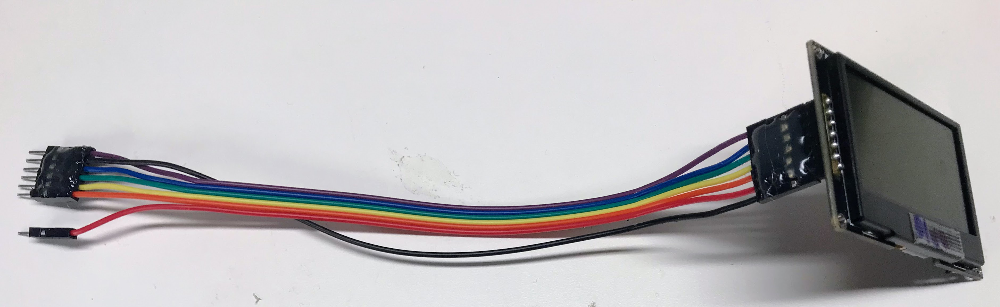
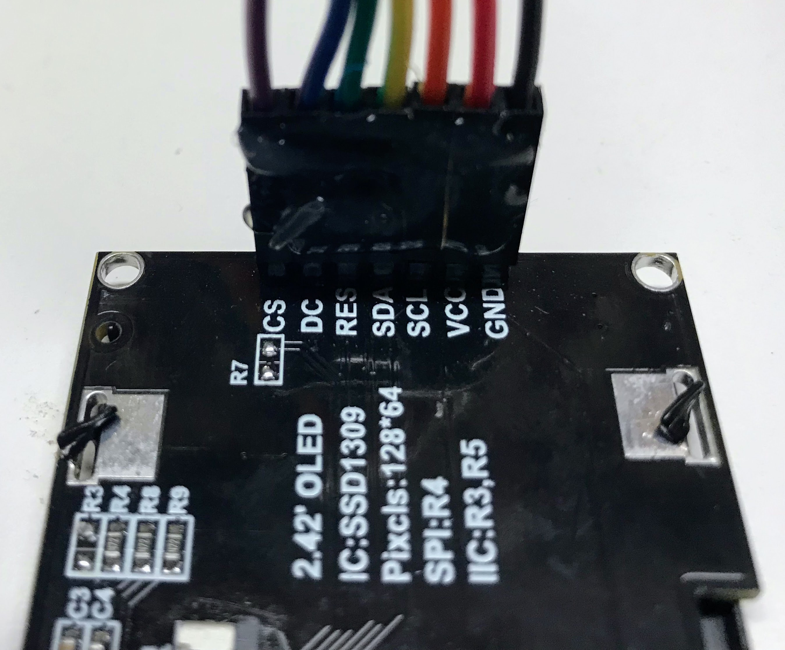
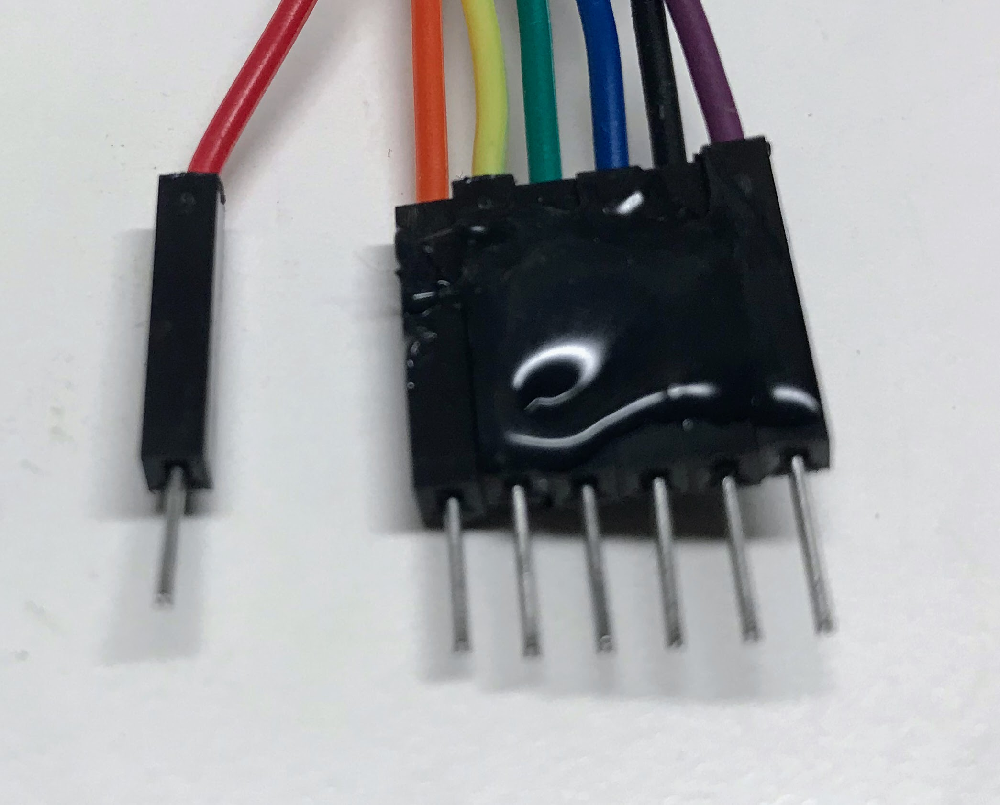
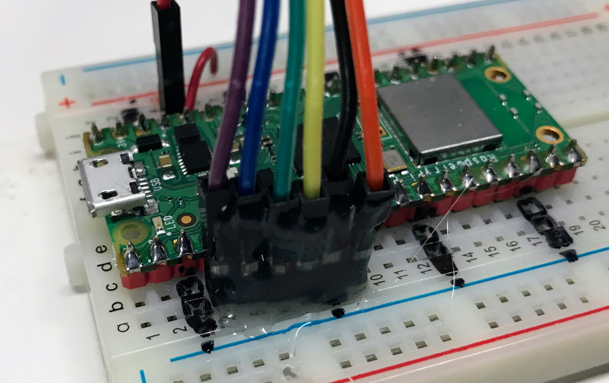

# Display Wiring Harness

Unlike simple sensors that only have a few wires, displays have up to seven wires that need to be connected.  This can be tricky when
we use breadboards where we can accidentally pull one wire out.

To keep our displays running reliably, we can use a 20 cm ribbon cable and some hot glue to make a connector that is easy to hook up.  It will be very reliable.

We start by purchasing some 20 cm long Male-Female Dupont ribbon connectors from [eBay](https://www.ebay.com/itm/294317793020?hash=item4486b51efc:g:i0UAAOSwPFhhDPYR).  The price should be about $8
for 120 connectors.  Make sure to get the Male-Female version.

We then will separate 7 of these wires making sure to put the black and red colors in the GND and VCC end.

You can see a close-up of each of the colors and their connections in the picture below.

At the other end of the cable we need to make a small change in the order of the cable.  Here are the changes:

1. We separate the red wire from the rest of the group and connect the red to the 3.3V regulated output of the Raspberry Pi Pico.
2. We move the back GND wire two be in between the blue and purple CS and DC wires.  This allows the row of all the wires to be connected in a single block of wires.
   

We can then plug this group of wires directly into the breadboard from breadboard rows 3 to 9.  This is shown below.

We designed these connections with the following rules:

1. The Clock (SCL) and Data (SDA) MUST be connected to rows 4 and 5 respectively because this is where SPI0 CLK and SPI0 TX are located.
2. The other three signals RES, DC and CS can be on pin so we will use the rows that make the cable connectors direct to rows 6, 7 and 9.  Note that GND is on breadboard row 8.

We have found that once we create these cable assemblies with hot glue to keep the pins in the right order it makes it much easier to connect the displays.

!!! Warning
    Note that we still MUST make sure that the black wire in the wiring harness is connected to the GND.  It is easy to get the cable reversed so make sure to double-check the cable orientation before you use it.