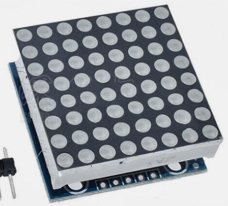
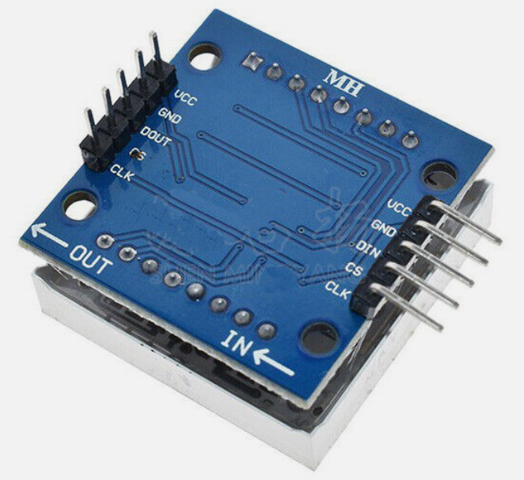

# MAX7219 8x8 LED Matrix




This is a low-cost ($3) and easy-to-program device that is perfect for small projects that don't
need a full graphical display.  You will be surprised at how creative our students are with
just an 8x8 display!

[eBay Search for "MAX7219 8x8 matrix"](https://www.ebay.com/sch/i.html?_nkw=MAX7219+8x8+matrix)

The device comes with five connectors:

1. Power (VCC)
2. Ground (GND)
3. Clock (SCK)
4. Data (MOSI)
5. Chip Select (CS)

We can communicate with the device using the standard SPI interface.  There is also
an 8x8 driver supplied by [Mike Causer](https://github.com/mcauser/micropython-max7219) Here is an excerpt of how we
configured the driver to use a single display:

```py
from machine import SPI, Pin
import max7219
from utime import sleep
CLOCK_PIN = 2
DATA_PIN = 3
CS_PIN = 4
spi0=SPI(0,baudrate=10000000, polarity=1, phase=0, sck=Pin(CLOCK_PIN), mosi=Pin(DATA_PIN))
cs = Pin(CS_PIN, Pin.OUT)
matrix = max7219.Matrix8x8(spi0, cs , 1)
# display text a x=0, y=0 and state = 1 (on)
matrix.text('1234', 0, 0, 1)
matrix.show()
```

You can change the last parameter from "1" to "4" if you have 4 displays wired together:

```py
import max7219
from machine import Pin, SPI
spi = SPI(1)
matrix = max7219.Matrix8x8(spi0, cs , 4)
display.text('1234',0,0,1)
display.show()
```

The displays can also be "cascaded"

## Basic Program

```py
from machine import SPI, Pin
import max7219
from utime import sleep
CLOCK_PIN = 2
DATA_PIN = 3
CS_PIN = 4
spi0=SPI(0,baudrate=10000000, polarity=1, phase=0, sck=Pin(CLOCK_PIN), mosi=Pin(DATA_PIN))

cs = Pin(CS_PIN, Pin.OUT)

matrix = max7219.Matrix8x8(spi0, cs , 1)

matrix.text('A', 0, 0, 1)
matrix.show()
sleep(delay_time)
```

## Full Demo
```py
from machine import SPI, Pin
import max7219
from utime import sleep
spi0=SPI(0,baudrate=10000000, polarity=1, phase=0, sck=Pin(2), mosi=Pin(3))

cs = Pin(4, Pin.OUT)

matrix = max7219.Matrix8x8(spi0, cs , 1)

delay_time = 1
while True:
    # Draw a single character

    matrix.text('A', 0, 0, 1)
    matrix.show()
    sleep(delay_time)

    # Draw an X in a box
    matrix.fill(0)
    matrix.line(0, 0, 7, 7, 1)
    matrix.show()
    sleep(delay_time)
    
    matrix.line(7, 0, 0, 7, 1)
    matrix.show()
    sleep(delay_time)
    
    matrix.rect(0, 0, 8, 8, 1)
    matrix.show()
    sleep(delay_time)
    matrix.fill(0)

    # Smile Face
    matrix.pixel(1, 1, 1)
    matrix.pixel(6, 1, 1)
    matrix.pixel(0, 4, 1)
    matrix.pixel(7, 4, 1)
    matrix.pixel(1, 5, 1)
    matrix.pixel(6, 5, 1)
    matrix.pixel(2, 6, 1)
    matrix.pixel(5, 6, 1)
    matrix.pixel(3, 7, 1)
    matrix.pixel(4, 7, 1)
    matrix.show()
    sleep(delay_time)
    matrix.fill(0)
    matrix.show()
    sleep(delay_time)
```