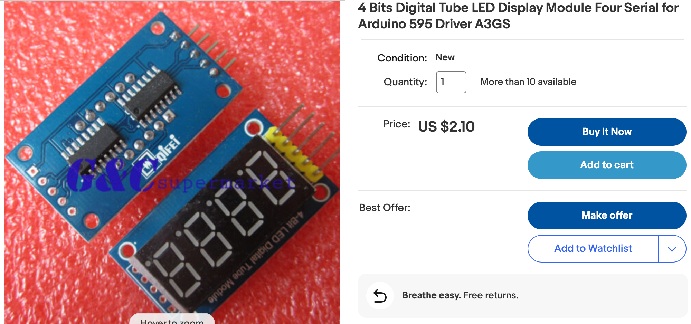
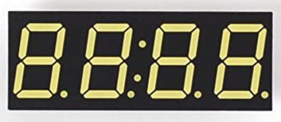
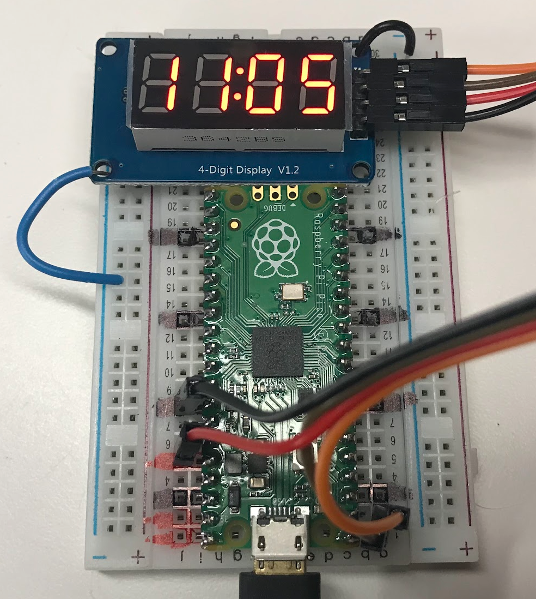

# Four Digit LED Display

In this lesson, we will use a 4-digit LED display to create a clock that displays the time of day.  
These clocks will use [Mike Causer's **tm1637**](https://github.com/mcauser/micropython-tm1637) library to communicate
with the four-digit display.  Some of these displays also have a "colon"
between the hour and minute digits that flashes every second.

You can purchase 4-digit LED displays on eBay for about $2 each.






## Connections

These displays have four pins:

1. Ground (GND)
2. Power (3.2 v or 5 v)
3. Data (DIO)
4. Clock (CLK)

In our examples, we will connect the power to our 3.3 regulated output
of the Pico.  We will connect Data to GP0 and Clock to GP1.

The following example 
```py
from machine import Pin
from time import sleep
import tm1637

# data and clock pins
DIO_PIN = 0
CLK_PIN = 1

tm = tm1637.TM1637(clk=Pin(CLK_PIN), dio=Pin(DIO_PIN))

# display "1234"
tm.write([1, 2, 3, 4])
```

The ```tm.write()``` function takes a sequence of numbers and will shifts them in from right to left.  

## Clock

We can create a simple clock by using the ```localtime()``` function when the
programs first starts up and then we just update the time after the sleep() functions run for a second. 
This also can updates the colon between the hours
and minutes.

```localtime()``` returns an array of numbers for date, hour, minute and second.  In our example here, we only need the hour and minutes.



```py
# a simple clock that only grabs the time from the server on startup
import tm1637
from machine import Pin
from utime import sleep, localtime

tm = tm1637.TM1637(clk=Pin(1), dio=Pin(0))

now = localtime()
hour = now[3]
# use AM/PM 12 hour time
if hour > 12:
    hour = hour - 12
minute = now[4]
sec = now[5]
print(hour, ':', minute, ' ', sec, sep='')

# update from the first time
while True:
    # turn the colon on
    tm.numbers(hour,minute,colon=True)
    sleep(0.5)
    # turn the colon off
    tm.numbers(hour,minute,colon=False)
    sleep(0.5)
    sec = sec + 1
    if sec == 60:
        minute = minute + 1
        sec = 0
        if minute == 60:
            hour = hour + 1
            minute = 0
            if hour == 24:
                hour = 0
```

A more accurate version will access the new time from the server every minute.

## Accurate Clock
```py
# a more accurate clock that only grabs the time from the server once per minute
import tm1637
from machine import Pin
from utime import sleep, localtime

hour = 0
minute = 0
sec = 0

def update_time():
    global hour, minute, second
    now = localtime()
    hour = now[3]
    # use AM/PM
    if hour > 12:
        hour = hour - 12
    minute = now[4]
    sec = now[5]

tm = tm1637.TM1637(clk=Pin(1), dio=Pin(0))

update_time()
# loop every second
while True:
    tm.numbers(hour,minute,colon=True)
    sleep(0.5)
    tm.numbers(hour,minute,colon=False)
    sleep(0.5)
    sec = sec + 1
    if sec == 60:
        # get the new time from the host
        update_time()
        print(hour, ':', minute, ' ', sec, sep='')
        minute = minute + 1
        sec = 0
        if minute == 60:
            hour = hour + 1
            minute = 0
            if hour == 24:
                hour = 0
```

## References

* [Nerd Cave YouTube Tutorial](https://www.youtube.com/watch?v=D68XtvZlk00)
* [Mike Causer's GitHub Repo with TM-1637 driver](https://github.com/mcauser/micropython-tm1637)