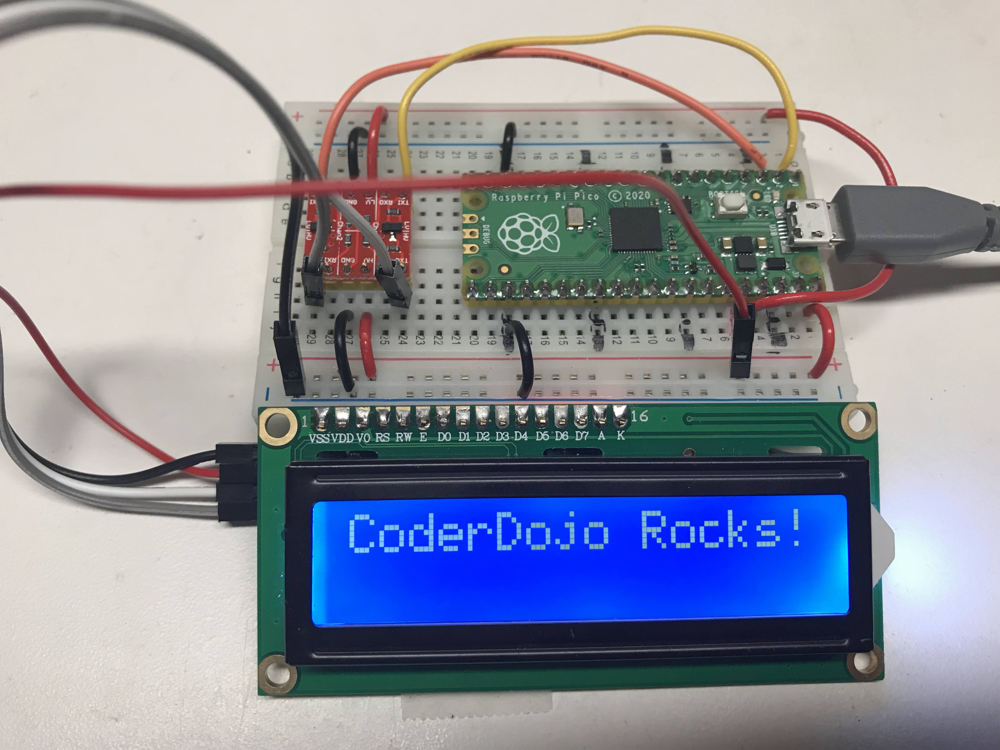

# Character LCD Display



This lesson is for using the LCM1602 I2C LCD interface.  It is a popular It has four wires:

1. GND - connect to any GND pin
2. VCC - connect to 3V3(out) pin unless you have a 3.3 to 5v voltage converter
3. SDA - connect to GP0
4. SCL - connect to GP1

The photo above shows the use of a 3.3 to 5v voltage converter.  This allows us to use the full 5v to the LCD backlight so we get bright contrast.  You can connect the VCC to the 3V3(out) pin but the display will be harder to read.

## I2C Address Scanner Test

Our first task is to make sure that the 1602 chip's I2C circuits are working.  We use the following I2C scanner code to do this.

```py
import machine
I2C_SDA_PIN = 0
I2C_SCL_PIN = 1
i2c=machine.I2C(0,sda=machine.Pin(I2C_SDA_PIN), scl=machine.Pin(I2C_SCL_PIN), freq=400000)

print('Scanning I2C bus.')
devices = i2c.scan() # this returns a list of devices
device_count = len(devices)
if device_count == 0:
    print('No i2c device found.')
else:
    print(device_count, 'devices found.')
for device in devices:
    print('Decimal address:', device, ", Hex address: ", hex(device))
```

### Scanner Result
```
Scanning I2C bus.
1 devices found.
Decimal address: 39 , Hex address:  0x27
```

## Testing the LCD 

```py
from machine import I2C
from lcd_api import LcdApi
from pico_i2c_lcd import I2cLcd

I2C_ADDR     = 0x27
I2C_NUM_ROWS = 2
I2C_NUM_COLS = 16

i2c = I2C(0, sda=machine.Pin(0), scl=machine.Pin(1), freq=400000)
lcd = I2cLcd(i2c, I2C_ADDR, I2C_NUM_ROWS, I2C_NUM_COLS)    
lcd.putstr("CoderDojo Rocks!")
```

## Putting the Device Through Display Option Tests

Now that we know how to display text on the device, we can learn how other functions work:

1. lcd.move_to(x,y)
1. lcd.display_on() and lcd.display_off()
1. lcd.show_cursor() and lcd.hide_cursor()
2. lcd.blink_cursor_on() and lcd.blink_cursor_off()
3. lcd.backlight_on() and lcd.backlight_off()
4. lcd.clear()

```py
import utime

import machine
from machine import I2C
from lcd_api import LcdApi
from pico_i2c_lcd import I2cLcd

I2C_ADDR     = 0x27
I2C_NUM_ROWS = 2
I2C_NUM_COLS = 16

def test_main():
    #Test function for verifying basic functionality
    print("Running test_main")
    i2c = I2C(0, sda=machine.Pin(0), scl=machine.Pin(1), freq=400000)
    lcd = I2cLcd(i2c, I2C_ADDR, I2C_NUM_ROWS, I2C_NUM_COLS)    
    lcd.putstr("CoderDojo Rocks!")
    utime.sleep(10)
    lcd.clear()
    count = 0
    while True:
        lcd.clear()
        time = utime.localtime()
        lcd.putstr("{year:>04d}/{month:>02d}/{day:>02d} {HH:>02d}:{MM:>02d}:{SS:>02d}".format(
            year=time[0], month=time[1], day=time[2],
            HH=time[3], MM=time[4], SS=time[5]))
        if count % 10 == 0:
            print("Turning cursor on")
            lcd.show_cursor()
        if count % 10 == 1:
            print("Turning cursor off")
            lcd.hide_cursor()
        if count % 10 == 2:
            print("Turning blink cursor on")
            lcd.blink_cursor_on()
        if count % 10 == 3:
            print("Turning blink cursor off")
            lcd.blink_cursor_off()                    
        if count % 10 == 4:
            print("Turning backlight off")
            lcd.backlight_off()
        if count % 10 == 5:
            print("Turning backlight on")
            lcd.backlight_on()
        if count % 10 == 6:
            print("Turning display off")
            lcd.display_off()
        if count % 10 == 7:
            print("Turning display on")
            lcd.display_on()
        if count % 10 == 8:
            print("Filling display")
            lcd.clear()
            string = ""
            for x in range(32, 32+I2C_NUM_ROWS*I2C_NUM_COLS):
                string += chr(x)
            lcd.putstr(string)
        count += 1
        utime.sleep(2)

#if __name__ == "__main__":
test_main()
```

## References

[MFitzp article on OLED displays](https://www.mfitzp.com/article/oled-displays-i2c-micropython/)

[Adafruit SSD1306 Driver](https://github.com/adafruit/Adafruit_CircuitPython_SSD1306/blob/master/examples/ssd1306_stats.py)

[Adafruit LCD Guide](https://learn.adafruit.com/character-lcds)