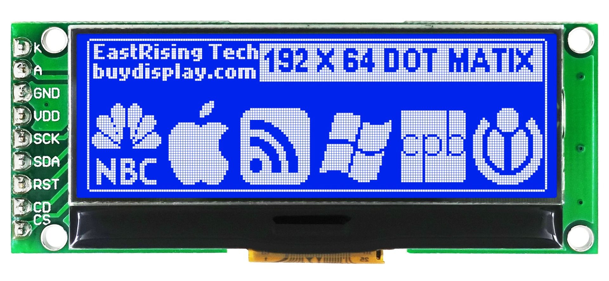

# CU1609C LED Display

Note: This is a work-in-progress.  We have not found a MicroPython driver for this display.

The UC1609 is a graphic LED driver chip with an SPI interface.  Because it is low cost ($4) and 2 inches across it is ideal for low-cost robot displays.

192X62 LCD display for $4 USB device


## Connections
| Pin Name | Description |
| -------- | ----------- |
|1 K Backlight Cathode|Connect to GND rail|
|2 A Backlight Anode| Connect via 200 ohm to 3.2v rail to limit backlight current to 3 milliamps.  The current for backlight is limited to 20 milliamps.|
|3 GND Ground|Connect to GND rail|
|4 VDD Power Supply| connect to +3.3v rail |
|5 SCK Serial clock input.|Connect to SPI CLK|
|6 SDA Serial data input.|Connect to SPI Data SCL|
|7 RST | Connect to 3.3v rail.  |
|8 CD | It determines whether the access is related to data or command. Connect to GPIO |
|9 CS | Chip select input.  Connect to GND when LCD is use. |

## Connection Notes
When RST=L, all control registers are re-initialized by their default sates. Since UC1609c has
built-in Power-on Reset, the RST pin is not required for proper chip operation.
An RC filter has been included on-chip. There is no need for external RC noise filter. When RST
is not used, connect the pin to High.

CS determines whether the access is related to data or command. When CS=“H” : Display data.  When CS=“L” : Command.

## Hello World
```py
from machine import Pin, SPI

SPI_CLK = 2 # SPI clock
SPI_SDA = 3
CD = 5 # command or data
# RST is tied to 3.3v
# CS is tied to GND

# SPI(0, baudrate=992063, polarity=0, phase=0, bits=8, sck=2, mosi=3, miso=4)
spi = SPI(0, baudrate=31250000, sck=Pin(SPI_CLK), mosi=Pin(SPI_SDA))
print(spi)

```

## Similar Drivers

There are two similar drivers.  One is for the LCD160CR

[LCD160CR Display Driver](https://github.com/micropython/micropython/blob/master/drivers/display/lcd160cr.py)

The other is the Arduino C version by Gavin Lyones that has been around for a long time.

[Gavin Lyons GitHub Repo supporting the UC1609](https://github.com/gavinlyonsrepo/ERM19264_UC1609)

Our goal is to port Gavin's C code to use the same function as the LCD160CR driver.

## References

1. [BuyDisplay Product 2 inch Blue 192x64 Graphic LCD Display Module,UC1609,SPI for $3.48](https://www.buydisplay.com/2-inch-blue-192x64-graphic-lcd-display-module-uc1609-spi-for-arduino)
2. [ERM19264-4 SeriesGraphic Display Module Datasheet](https://www.buydisplay.com/download/manual/ERM19264-4_Datasheet.pdf)
3. [Gavin Lyons GitHub Repo supporting the UC1609](https://github.com/gavinlyonsrepo/ERM19264_UC1609)
4. [EBay Product 2 inch White 192x64 Graphic LCD Display Module,UC1609,SPI](https://www.ebay.ie/itm/2-inch-White-192x64-Graphic-LCD-Display-Module-UC1609-SPI-for-Arduino/293617684779)
5. [MicroPython Pyboard LCD Class](https://docs.micropython.org/en/latest/library/pyb.LCD.html)
6. [List of LCD Graphic Displays](https://awesome-micropython.com/#lcd-graphic)