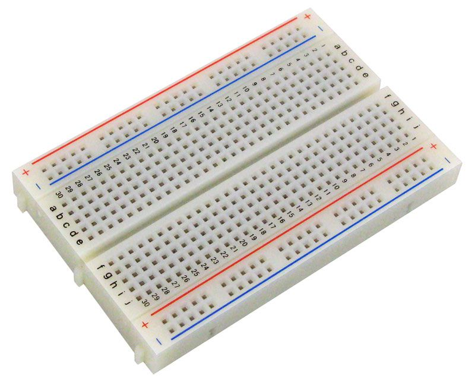
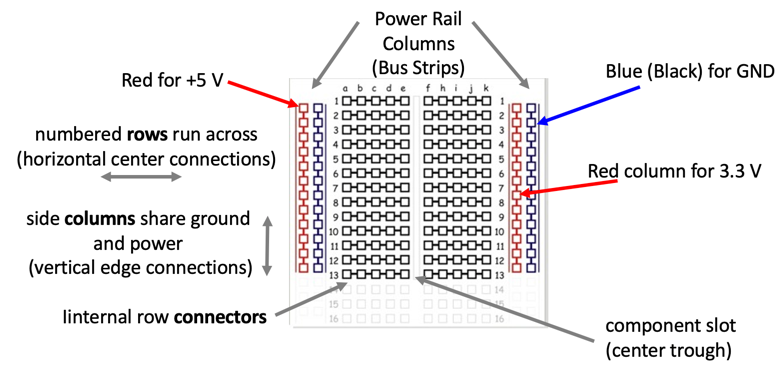

# Breadboards



We use standard solderless mini breadboards in our labs.  The breadboards have holes that are spaced 1/10th of an inch apart which is a standard for most electronics in the US.

Our breadboards are usually 1/2 size with 400-ties.  They have a central trough and power rails on the left and right edges.

## Breadboard Regions and Connections


Learning how a breadboard works is critical for building your projects.  In the figure above you will see that there are two types of regions of the breadboard

1. The side regions are called the power distribution rails.  They are similar to power lines that reach across our projects.
2. The central region is call the row connector region.  In this area the horizontal rows are all connected inside the breadboard.  Within any row, columns ```a, b, c, d and e``` are all electrically connected.  Within any row, columns ```f, h, i, j, and k``` are also electrically connected.  However, there is a gap between columns e and f called the center gap or component slot that parts are usually placed over.  Components like buttons and chips usually have their pins straddle the component slot.

## Pico Placement on Breadboard

For most of our labs we place the Pico so that pin 1 of the Pico is in row 1 of the breadboard as in the image below.


This means that the GND connections to the Pico are always in rows 3, 8, 13 and 18 on both sides of the breadboard.  One of the ground pins is usually hooked up to the vertical blue power rails on the sides of the breadboard.

## Pico Placement Annotations


1. **GND** are the ground connections.  There are 
2. **VBUS** is the 5V power from the USB and is high only when the USB is connected. This is nominally 5V (or 0V if the USB is not connected or not powered).
3. **VSYS** (also know and Voltage System Input) is the main system input voltage.  When the Pico is disconnected from the USB you apply power to the Voltage System Input. The input can vary in the allowed range 1.8V to 5.5V, and is used by the on-board  SMPS to generate the 3.3V for the RP2040 and its GPIO connections.  When the input voltage is less than 3.3 volts the Pico uses an internal DC voltage Boost converter to get the correct voltage to the processor.

3V3_EN connects to the on-board SMPS enable pin, and is pulled high (to VSYS) via a 100K resistor. To disable the 3.3V (which also de-powers the RP2040), short this pin low.  In effect by making the 3V3_EN LOW you are turning off the Pico.

## Breadboard Connections

