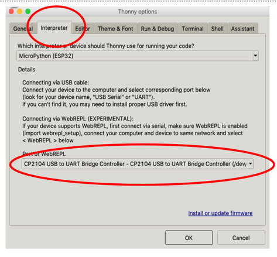
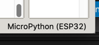
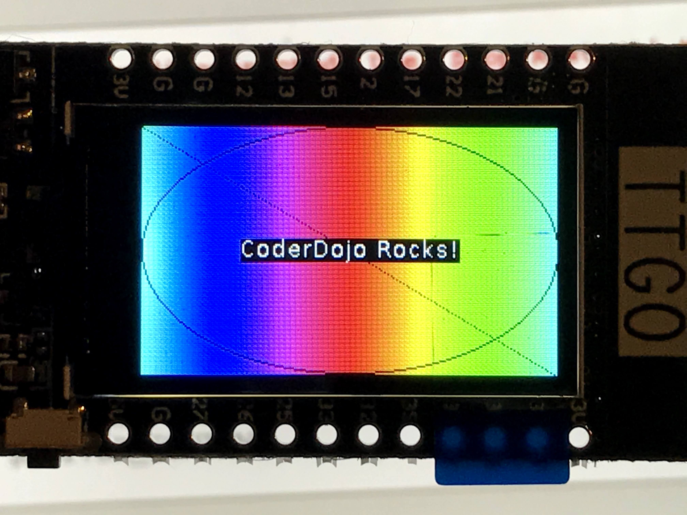

# ESP32 TTGO
The ESP32 is a low-cost (under $10) microcontroller with both built-in WiFi and Bluetooth.  This lab demonstrates using a version of the ESP32 that includes an integrated display.

## Step 1: Install the USB to UART Bridge VCP Drivers

Follow the directions here:

[https://www.silabs.com/developers/usb-to-uart-bridge-vcp-drivers](https://www.silabs.com/developers/usb-to-uart-bridge-vcp-drivers)

Test this by running the ``ls -l /dev/cu*``` and verify you see:

/dev/cu.SLAB_USBtoUART

If you don't see this try to reboot.

Mac: 
https://docs.espressif.com/projects/esp-idf/en/latest/esp32/get-started/establish-serial-connection.html
https://github.com/loboris/MicroPython_ESP32_psRAM_LoBo/raw/master/MicroPython_BUILD/firmware/MicroPython_LoBo_esp32_all.zip

## Step 2: Create a Python Conda Environment for ESP32
This is so we don't mess up other Python projects on your system.

```sh
conda create -n esp32 python=3
conda activate esp32
```

## Step #3: Install the esptool

```sh
$ pip3 install esptool
Collecting esptool
  Downloading esptool-3.0.tar.gz (149 kB)
     |████████████████████████████████| 149 kB 2.9 MB/s 
     ...
Installing collected packages: pycparser, six, cffi, reedsolo, pyserial, ecdsa, cryptography, bitstring, esptool
Successfully installed bitstring-3.1.7 cffi-1.14.5 cryptography-3.4.6 ecdsa-0.16.1 esptool-3.0 pycparser-2.20 pyserial-3.5 reedsolo-1.5.4 six-1.15.0
```

## Step 4: Erase the Old Firmware

```sh
esptool.py --port /dev/cu.SLAB_USBtoUART erase_flash
```

## Step 5: Download the New Firmware
Get the ESP32_All prebuilt binary:

[https://github.com/loboris/MicroPython_ESP32_psRAM_LoBo/wiki/firmwares
](https://github.com/loboris/MicroPython_ESP32_psRAM_LoBo/wiki/firmwares)

## Step 6: Reflash the new ESP32 Firmware

```sh
cd esp32_all/
../flash.sh -p /dev/cu.SLAB_USBtoUART
```

this will run...
```sh
$ esptool.py --port /dev/cu.SLAB_USBtoUART erase_flash
esptool.py v3.0
Serial port /dev/cu.SLAB_USBtoUART
Connecting........_
Detecting chip type... ESP32
Chip is ESP32-D0WDQ6 (revision 1)
Features: WiFi, BT, Dual Core, 240MHz, VRef calibration in efuse, Coding Scheme None
Crystal is 40MHz
MAC: 24:62:ab:ca:62:84
Uploading stub...
Running stub...
Stub running...
Erasing flash (this may take a while)...
Chip erase completed successfully in 2.5s
Hard resetting via RTS pin...
```

## Configure Thonny
You must configure Thonny to use the ESP32.

### Set the Serial Port
First, you must tell Thonny how to find the right port.



### Set the Interpreter
Next, yo must tell Thonny to use the ESP32 interpreter.



## Run a test 

```py
import machine, display, time, math, network, utime


tft = display.TFT()
tft.init(tft.ST7789,bgr=False,rot=tft.LANDSCAPE, miso=17,backl_pin=4,backl_on=1, mosi=19, clk=18, cs=5, dc=16)

tft.setwin(40,52,320,240)

for i in range(0,241):
    color=0xFFFFFF-tft.hsb2rgb(i/241*360, 1, 1)
    tft.line(i,0,i,135,color) 

tft.set_fg(0x000000) 
tft.ellipse(120,67,120,67) 
tft.line(0,0,240,135) 

text="CoderDojo Rocks!" 
tft.text(120-int(tft.textWidth(text)/2),67-int(tft.fontSize()[1]/2),text,0xFFFFFF)
```

You should see the following on the ESP32 display:


## References

https://www.instructables.com/TTGO-color-Display-With-Micropython-TTGO-T-display/