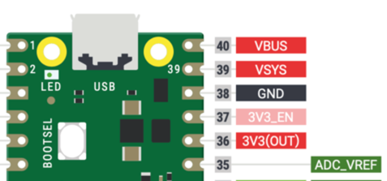

# Powering Your MicroPython Projects

If you are just using MicroPython to learn how to code you can use the USB connector from your Mac or PC to power your project.  However, if you are creating a device that can't be connected to the USB cable such as a robot, then you will need to hook up portable power supply like a battery pack to power your device.

The good news is that most microcontrollers like the Raspberry Pi Pico or ESP32 have many options and they are easy to use.  Just be careful about applying too much power since unlike the old 5V Arduino boards, these devices only use 3.3v power supplies.  Connecting the Pico to a 4 AA batteries (4 X 1.5 volts = 6 volt total) can damage the Pico microcontroller.

## Power Connectors

The Raspberry Pi Pico has three important power connectors you should learn about.



1. **VBUS** - A direct connection to the USB System bus and available in the upper right corner of the Pico.  When connected, circuits inside the Pico will disconnect the other power sources.  This is the preferred way to power the Pico when doing development and if a USB battery pack is used.
2. **VSYS** - This the main system input voltage and used when the device is not connected to the USB.  The Pico has on-board power control circuits that allow VSYS to vary anywhere in the range of 1.8V to 5.5V.  This is great since three AAA batteries which start at 4.5 volts can be used even as their voltage drops to 1.8 volts.
VSYS is used by the on-board SMPS (Switched Mode Power Supply) to generate the 3.3V for the RP2040 and its GPIO.
You can use this to power the Pico if you have any non-USB battery pack such as 3 AA batteries or an external 5 volt power supply that is generated by a motor driver circuit.
3. **3V3_EN** connects to the on-board SMPS enable pin, and is pulled high (to VSYS) via a 100K resistor.
To disable the 3.3V (which also de-powers the RP2040), short this pin low.
4.  **3.3OUT** This pin can be used to power external circuitry.  The maximum output 
current will depend on RP2040 load and VSYS voltage, it is recommended to keep the load on this pin less than 300mA.
In in other words, you don't want to drive more than about 15 LEDs that each draw up to 20 milliamps at full power.
3V3 is the main 3.3V supply to RP2040 and its I/O, generated by the on-board SMPS.
5. **ADC_VREF** - This should not be used for any purpose other than to provide a low-current voltage reference for any of the three analog-to-digital inputs.  For example if you have three potentiometers you would hook the positive rail of each of them to this pin.  This allows for reasonably high-resolution analog to digital that is mostly free of the power noise present on the 3.3OUT pin.


### USB Battery Packs


There is large and growing market for rechargeable cell-phone power packs that are ideal for applications such as robotics and powering a remote microcontroller for a long time.  They can be purchased in many power storage levels from 2500 milliamp hours up to over 1 million milliamp hours.

## Preventing USB Power Pack Autoshutdown

The one issue to be aware of with battery packs is that they automatically power down if they don't sense a minimum current being drawn such as about 10 milliamps.  In many applications the Pico draws less than that amount.  One fix is to simply add LED power indicator that draws 10 milliamps.  This will 

### Battery Power

3 AA alkaline batteries wired in series provide plenty of power for small Pico-based MicroPython projects.  Each battery is 1.5 volts which give a total of 4.5 volts which is well within the maximum power use by the VSYS input on the Pico.

As an alternative, you can also use 4 rechargeable NiCad batteries that have a [nominal rating of 1.2 volts each](https://www.teamtekin.com/manuals/nicad_bt.pdf).  This is a total of 4.8 volts, which is still under the 5.5 volt limit.

!!! WARNING
    Do not connect 4 AA batteries directly to VSYS.  6 volts is too high for the Pico's power system and could damage it.  Use a voltage regulator such as is found on motor driver boards.  Another alternative is to use a DC-to-DC voltage regulator such as a [Buck Converter](https://en.wikipedia.org/wiki/Buck_converter).

## Monitoring USB Power

On the Pico, GP24 can be used to indicate if power is being drawn from the USB cable.  You can also use this information to change the behavior such as drop into low-power mode when disconnected from a USB source.

See [here](https://www.raspberrypi.org/forums/viewtopic.php?t=300676)

Here is some sample MicroPython code that displays this value:

```py
import machine
import utime

led_onboard = machine.Pin(25, machine.Pin.OUT)
USBpower = machine.Pin(24, machine.Pin.IN) 

while True:
   led_onboard.value(1)
   utime.sleep(0.5)
   led_onboard.value(0)
   utime.sleep(0.5)
   if USBpower() != 1:
      utime.sleep(1)
```

This program prints out the value of the USB Power indicator.

```py
import machine
import utime

led_onboard = machine.Pin(25, machine.Pin.OUT)
USBpower = machine.Pin(24, machine.Pin.IN) 

if USBpower() = 1:
    print('drawing power from the USB')
else
    print('drawing power from VSYS - a battery or external power source')
```

Power consumption when running this code is approximately 0.1W (19mA at 4.99V, so 4 x AA batteries (@ 2,000mAh each) would keep the Pico running for well over 4 days.

## Running both USB and External Battery Power on the Raspberry Pi Pico

The battery should provide a voltage greater than 1.8v and less than 5.5v. Importantly if both a battery and a micro USB cable are connected at the same time a Schottky diode should be placed between the battery positive and VSYS [see section 4.4 & 4.5 of the [Raspberry Pi Pico Datasheet](https://datasheets.raspberrypi.com/pico/pico-datasheet.pdf). As long as the battery voltage is less than that coming in from the USB cable, power will be drawn from the USB supply and not the battery and, when you unplug the Pico from its USB supply, the Pico will keep on running, using power from the battery (and visa versa when you plug it back in).

## Monitoring Batter Power Level on the Raspberry Pi Pico

You can use one of the three analog to digital converters to allow the Pico to monitor the power remaining in an external battery.  For example if you have 3 AA batteries you can connect two 100K ohm resistors in series and connect the top and bottom to the power and ground.  Then connect the midpoint to one of the three ADC inputs.  This will give you a way to monitor the power remaining in an external battery.  A fully charge battery pack voltage such at 4.5 volts will generate a voltage of 1/2 the maximum level.  As the voltage drops to 1.8 volts it should display a value of 0%.  An OLED can provide an ideal way to display the power level remaining.