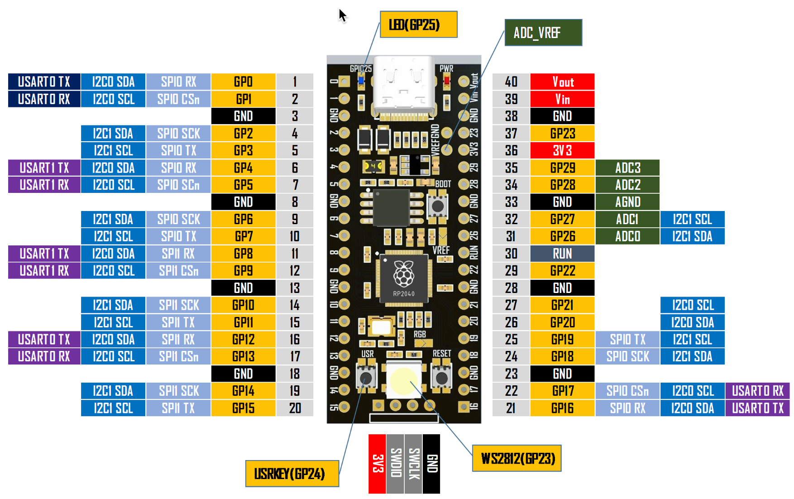

# The YD-RP2040



The [VCC-GND](http://vcc-gnd.com/) YD-RP2040 is a microcontroller that sells for $5-$10 on e-Bay.  It is rumored to come
with either 4MB or 16MB flash, but the units I have received only have 2MB.

## Additions

* Pin labels are on the top where they should be!
* There is a red LED to show that power is connected
* There is a RESET button
* There is a USER button on GP24
* There is a blue LED on GP25
* There is an RGB NeoPixel LED on GP23
* Four Analog to digital converters (the Pico only had two)
* 

## W25Q32 Flash Chip

The board has a W25Q32 (32M-bit) Serial Flash chip. 

From the [W25Q32 Datasheet](https://www.alldatasheet.com/datasheet-pdf/pdf/231258/WINBOND/W25Q32.html):

 It provides a storage solution for systems with limited space, pins and power. The 25Q series offers flexibility and performance well beyond ordinary Serial Flash devices. They are ideal for code shadowing to RAM, executing code directly from Dual/Quad SPI (XIP) and storing voice, text and data. The devices operate on a single 2.7V to 3.6V power supply with current consumption as low as 5mA active and 1µA for power-down. All devices are offered in space-saving packages.

## Demo Program

This program shows the blue LED flashing and the NeoPixel cycling through colors.
You can press the USR button to change the cycle speed.

```py
```

## References

* [Walmart](https://www.walmart.com/ip/YD-RP2040-Development-Board-16MB-Flash-Core-Board-Compatible-PICO-Dual-Core-Microcontroller-Motherboard/3989683668?wmlspartner=wlpa&selectedSellerId=101229946)