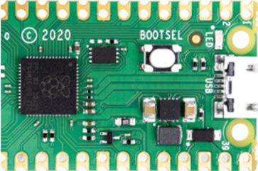
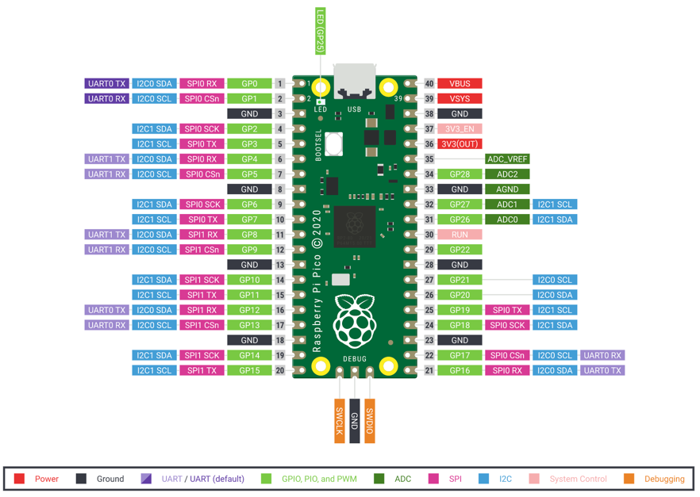

# Micropython Glossary of Terms
<!-- Link to this by using [TERM](glossary#term-id 
The format is used to generate a concept graph for this course
-->

#### Ampy
A micropython command line utility to interact with a CircuitPython or MicroPython board over a serial connection.

Ampy is meant to be a simple command line tool to manipulate files and run code on a CircuitPython or MicroPython board over its serial connection. With ampy you can send files from your computer to the board's file system, download files from a board to your computer, and even send a Python script to a board to be executed.

Note that ampy by design is meant to be simple and does not support advanced interaction like a shell or terminal to send input to a board. Check out other MicroPython tools like rshell or mpfshell for more advanced interaction with boards.

#### Analog to Digital Converter
A component that takes an analogue signal and changes it to a digital one.

Every ADC has two parameters, its [resolution](#resolution), measured in digital bits, and its [channels](#channels), or how many analogue signals it can accept and convert at once.

* Also know as: ADC

#### BOOTSEL
A button on the pico that when pressed during power up will allow you to mount the device as a USB device.



* Also known as: Boot Selection

#### Castellated Edge
Plated through holes or vias located in the edges of a printed circuit board that make it easier to solder onto another circuit board.


The word "Castellated" means having grooves or slots on an edge and is derived from the turrets of a castle.

#### ESP32
A series of low-cost, low-power system on a chip microcontrollers with integrated Wi-Fi and dual-mode Bluetooth.

Typical costs for the ESP32 is 

* [Sample on eBay](https://www.ebay.com/itm/ESP32-ESP-32S-NodeMCU-Development-Board-2-4GHz-WiFi-Bluetooth-Dual-Mode-CP2102/392899357234) $5
* [Sample on Amazon](https://www.amazon.com/HiLetgo-ESP-WROOM-32-Development-Microcontroller-Integrated/dp/B0718T232Z/ref=sr_1_1_sspa) $11
* [Sample on Sparkfun](https://www.sparkfun.com/products/13907) $21
* [ESP32 Quick Reference](http://docs.micropython.org/en/latest/esp32/quickref.html)

#### Framebuffer
A region of your microcontroller RAM that stores a bitmap image of your display.

For a 128X64 monochrome display this would be 128 * 64 = 8,192 bits or 1,024 bytes (1K).  Color displays must store up to 8 bytes per color for each color (red, green and blue).

* [Wikipedia page on Framebuffer](https://en.wikipedia.org/wiki/Framebuffer)

#### Micropython
A set of Python libraries and tools developed specifically for microcontrollers.

Micropython was originally developed by Damien George and first released in 2014.  It includes many of the features of mainstream Python, while adding a range of new ones designed to take advantage of the facilities available on Raspberry Pi Pico and other microcontroller boards like the ESP32.

#### MPG Shell
A simple micropython shell based file explorer for ESP8266 and WiPy Micropython based devices.

The shell is a helper for up/downloading files to the ESP8266 (over serial line and Websockets) and WiPy (serial line and telnet). It basically offers commands to list and upload/download files on the flash FS of the device.

[GitHub Repo for MPFShell](https://github.com/wendlers/mpfshell)

#### Raspberry Pi Foundation
The company that builds the Raspberry Pi hardware and provides some software.

#### Raspberry Pi Pico
A microcontroller designed by the Raspberry Pi foundation for doing real-time control systems.

The Pico was introduces in 2020 with a retail list price of $4.  It was a key development because it used a custom chip that had 100 times the RAM of an Arduino Nano.

#### Pico Pinout
The Pico pinout has



* [Pinout PDF](https://datasheets.raspberrypi.org/pico/Pico-R3-A4-Pinout.pdf)

#### RP2040 chip
A custom chip created by the [Raspberry Pi Foundation](raspberry-pi-foundation) to power the [Raspberry Pi Pico](#raspberry-pi-pico).

#### rshell
A simple micropython shell which runs on the host and uses MicroPython's raw-REPL to send python snippets to the pyboard in order to get filesystem information, and to copy files to and from MicroPython's filesystem.

It also has the ability to invoke the regular REPL, so rshell can be used as a terminal emulator as well.

Note: With rshell you can disable USB Mass Storage and still copy files into and out of your pyboard.

[RShell GitHub Repo](https://github.com/dhylands/rshell)

#### Thonny
A lightweight Python IDE ideal for writing simple Python programs for first time users.

Thonny runs on Mac, Windows and Linux.

* [Thonny web site](https://thonny.org/)

#### UF2 File
The file that must be uploaded into the Raspberry Pi Pico folder to allow it to be used.

The file name format looks like this:

```rp2-pico-20210205-unstable-v1.14-8-g1f800cac3.uf2```


#### Unicorn
MicroPython on Unicorn is completely open source Micropython emulator

* Github Repo: [https://github.com/micropython/micropython-unicorn](https://github.com/micropython/micropython-unicorn)