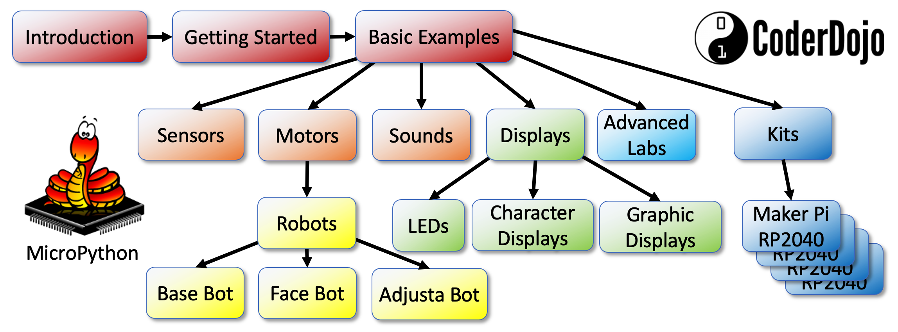

# CoderDojo Twin Cities Micropython

This website and GitHub repository is for sharing teaching resources to teach MicroPython to students in 5th to 12th grades (10-18 years old).  The course assumes that either a mentor, teacher or students have access to at least one microcontroller such as the $4 Raspberry Pi Pico or the $10 ESP32.  Students should also have access to some low-cost sensors (buttons, potentiometers, ultrasonic distance sensor) and displays such as LEDs or OLED displays.

If you are looking for a specific topic, please remember to use the search function in the upper right of the website.  The website is best displayed on a wide screen to seen the left navigation bar on the left although the website also works on the small screens of mobile phones and tablets.

## Course Outline

You can use the navigation area on the left side panel to navigate to different parts of the website.  Here is a high-level overview of the main sections of the site.

### Section 1: Introduction to Physical Computing

This part is a high-level overview of what MicroPython is and why is has become the most popular way to do physical computing, program microcontrollers and build robots.  We also discuss the different types of microcontrollers available, their price and features and how to purchase them independently or in kits.

## Section 2: Getting Started with MicroPython

This part will help you get started programming MicroPython on your microcontroller and learn how to hookup parts on a solderless breadboard.  We discuss the need for a desktop Integrated Development Environment (IDE) and how to get starting writing simple programs

## Section 3: Basic Examples

These ten lessons are the foundations for learning [MicroPython](misc/glossary#micropython).  They include learning how to blink one or more LEDs, monitor for button presses, fade LEDs in and out using PWM signals, read analog values from potentiometers, read light sensors, turn motors and servos and display rainbow patterns on a NeoPixel strip.  Many other labs are variations of these 10 labs.

[Introduction to Basic MicroPython Examples](intro/01-intro.md)

## Section 4: Sensors

Now that you have a better sense of basic examples, this section will give you more examples of how to use different types of sensors such as heat sensors, current sensors, rotary encoders, accelerometers, gesture sensors, and magnetic field sensors.

[Sensors Intro](sensors/01-intro.md)

## Section 5: Motors and Robots

This is our students favorite part of this site.  Once you can make a motor go forward and reverse, you are close to being able to make a robot move.  We walk you through the basics of using a simple transistor to control a motor to using simple motor controllers like the L293D chips.

[Introduction to Motors and Robots with MicroPython](motors/01-intro.md)

Note that we have many other advanced labs that use our $10 [Cytron Maker Pi RP2040 Kits](kits/maker-pi-rp2040-robot/01-intro.md).  These incredible boards have everything integrated to build robots with lights and sounds.

## Section 6: Displays

This section shows you how to use many different types of displays, from simple 7-segment digital displays to complex OLED graphic displays.  On the old 2K Arduino controllers these graphics labs used to be hard, but now we have 264K of RAM on the Raspberry Pi RP2040 microcontrollers.  Now these are labs are easy!

* [Simple Character Displays](displays/01-intro.md)
* [OLED Graph Displays](oled/01-intro.md)

## Section 7: Sound and Music

Having powerful microcontrollers allows us to generate complex sounds, play tones and even playback recoded sound effects.

[Introduction to Sound and Music with MicroPython](sound/01-intro.md)

### Section 8: Advanced Labs

We have now covered all the things you need to build hundreds of projects.  This section contains deeper dives into

[Advanced Topics](advanced-labs/01-intro.md)

### Section 9: Kits

This section contains detailed steps to use the popular kits that are now integrating MicroPython and the RP2040 microcontroller.  There are many kits and these lessons contain full working programs to build complex projects like a collision avoidance robot with OLED displays.

[MicroPython Kits](kits/01-intro.md)

## Reference Material

Lastly, we have a large glossary of terms, contact information and references to other web sites that might be useful in your projects.

[Glossary of MicroPython Terms](misc/glossary.md)

[Contact](misc/contact.md)

[Micropython References](misc/references.md) - links to other useful sites.

If you have suggestions for additional projects, please [let us know](mailto:info@codesavvy.org)!

