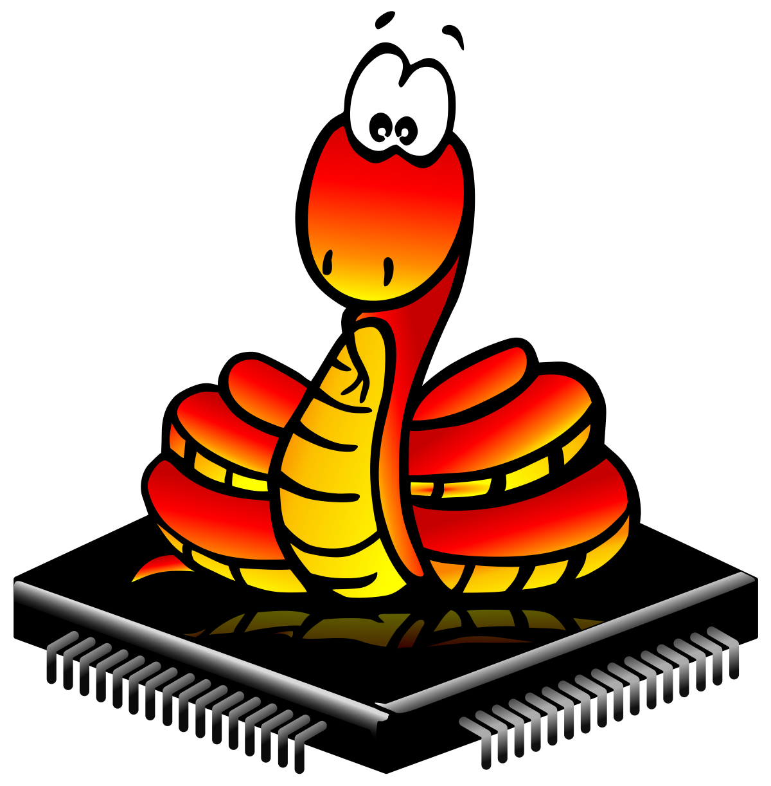

# CoderDojo Twin Cities Micropython

This GitHub repository is for sharing teaching resources to teach Micropython 12-14 years old.

## Course Outline

1. [Introduction](00-intro.md) - Overview of Micropython and why we love it.
4. [Boards](02-boards.md) - Description of popular development boards that support Micropython (Pico and ESP32).  How to choose the right microcontroller for your project.
3. [Raspberry Pi Pico](01-pi-pico.md) - Details the Raspberry Pi Pico including features and pinouts.
4. [Thonny IDE](02c-thonny.md) - Thonny is an IDE that supports Micropython.  We review the parts of the User interface.
5. [Blink](03-blink.md) - Blink an LED.
6. [Servo](04-solutions.md) - Move a Servo.

[Glossary of Micropython Terms](glossary.md)

[Contact](contact.md)

[Micropython References](references.md) - links to other useful sites.

