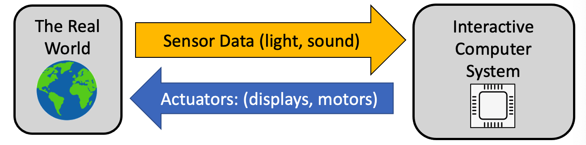
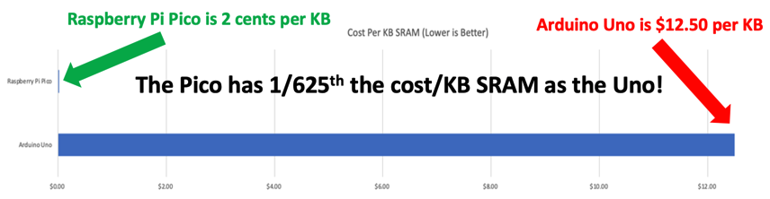

# What is Physical Computing?

Physical Computing is the process of using computers to read data from sensors about the world around us and then taking actions on this incoming data stream.  These actions are typically doing things like blinking and LED, moving a motor or updating a display.

## Physical Computing in Teaching Computational Thinking

Physical computing plays an important role in teaching the core concepts in Computational Thinking.  Often times students quickly lose interest when only abstract concepts are used.  Physical computing allows direct hands-on experiences that keeps students engaged and gives them immediate feedback.  Although our labs start slowly with simply blinking LEDs, they quick move to controlling motors and building robots.

The material in this website is designed to leverage everything we have learned to make our lessons be fun, engaging and allow students to come up with their own ideas for project-based learning.

## Why Physical Computing Has Become So Popular

In the past, the chips we used to teach physical computing (called microcontrollers) were slow, had huge memory limitations, and were expensive.  They were also hard to program and since we could not use the Python language that is popular in most classrooms today.

This all changed in [January of 2021](https://www.raspberrypi.com/news/raspberry-pi-silicon-pico-now-on-sale/) when the Raspberry Pi Foundation released a $4 microcontroller called the Pico that has 200 times the memory of the most popular microcontroller (The $25 [Arduino Uno](https://store-usa.arduino.cc/products/arduino-uno-rev3/)).  Now teachers could purchase an entire classroom full of microcontrollers that were powerful enough to even do [machine learning](https://www.arducam.com/raspberry-pi-pico-machine-learning/).

One way to measure the cost effectiveness of this system is to compare the cost per kilobyte of RAM.  The Arduino Uno was about $12.50 per kilobyte.  The new Raspberry Pi Pico, with 264K RAM cost only 2 cents per kilobyte!

There was also one other *HUGE* advantage of these microcontrollers.  They ran Python!  Python is the most popular language for students today.  There are millions of on-line websites that show kids how to learn Python like our own [CoderDojo Beginning Python](https://www.coderdojotc.org/python/trinket/00-introduction/) classes.  Teachers now had the big three factors:

1. Low cost ($4)
2. Powerful (264K RAM)
3. Runs Python - the most popular language for teaching

But there was a small problem.  Although there were millions of sample programs for the old under-powered Arduino microcontrollers, we needed high-quality lessons for our students to learn to use the new microcontrollers.  And these lessons need to be flexible so teachers around the world could build new courses out of this content without having to purchase expensive textbooks. That is why this website is so important.  We hope you see how excited we are to bring you this new content!

## Examples of Sensors

Here are some sample sensors that we use:

1. Buttons and switches
2. Light sensors (photoresistor)
3. Distance sensor (both ultrasonic and light)
4. Sound sensors
5. Motion and acceleration sensors
6. Gesture sensors
7. Magnetic field sensors (like a compass)
8. Heat sensors
9. Touch sensor
10. Voltage and current sensors
11. Orientation and tilt sensors
12. Water and moisture sensors
13. Chemistry sensors such as Ph level (acidity)
14. Smoke and gas sensors
15. Air quality sensors

## Examples of Actuators

Here are some of the Actuators we use:

1. LEDs
2. Motors (simple DC motors)
3. Servos
4. Displays (character displays, graphic displays)

## What are the Challenges in Physical Computing

In the real world, sensor data can be complex.  We often need to look for complex patterns in an incoming data stream.  For example, how can we detect complex motion such as gestures from a simple distance measurement?  Other questions that we have to consider include:

1. How often should we sample the data provided by a sensor?
2. How to we calibrate sensors to get accurate readings?
3. How do we convert sensor data into forms that are easy to use?
4. How can we look for patterns in data?  Can we detect specific sounds or speech?
5. How can use use machine learning to train a model to detect specific patterns such as a "wake word" in a smart speaker system?
9. If you have allergies, what types of sensors could tell you how bad the pollen counts are outside today?
10. How can we send data back to a central server?

## Questions for Discussion

1. What other sensors and actuators can you think of?
2. How would you determine how much battery power is left in your robot?
6. Can you give an example of a sensor in your house that is used to regulate temperature?
7. Can you name a sensor in your house that could save your life?
8. How many sensors do you think a typical car has?
11. What data could you gather and sell?
    
## References
1. [Wikipedia on Physical Computing in Education](https://en.wikipedia.org/wiki/Physical_computing#In_Education)
2. [Sample Sensor Kit on Amazon](https://www.amazon.com/kuman-K5-USFor-Raspberry-Projects-Tutorials/dp/B016D5L5KE)

## Answers to Discussion questions

* You would use a voltage sensor to see how much power is available in a battery.
* The name of a device that controls the temperature in your home is called a thermostat.  It tells your home furnace or air conditioner to go on or off.
* Smoke detectors and carbon monoxide detectors are examples of devices that save thousands of lives every year.  According the the [New York Department of Health](https://www.health.ny.gov/prevention/injury_prevention/children/toolkits/fire/smoke_alarms_effective_preventing_deaths.htm) presence of a working smoke alarm in a home reduces the risk of dying in a fire by about 50%.  Worldwide, over 10,000 lives are saved every year by smoke detectors. [Freakonomics](https://freakonomics.com/2012/02/how-many-lives-do-smoke-alarms-really-save/)
* A modern car has almost 100 sensors in it.  This includes motor sensors and sensors to detect if your doors are closed and your seatbelt is fastened.

## References

* [How a Small Charity is Upsetting the Trillion-Dollar Silicon Chip Industry](https://dmccreary.medium.com/how-a-small-charity-is-upsetting-the-trillion-dollar-silicon-chip-industry-ad8062e8c627)
* [Raspberry Pi Pico Robot in Micropython]
(https://dmccreary.medium.com/raspberry-pi-pico-robot-in-micropython-51f956486270)