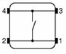
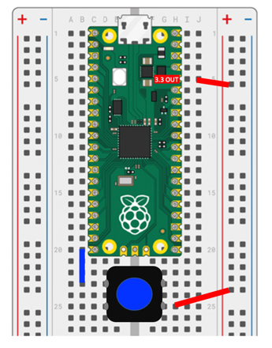

# Button

In this lesson we will hook a single momentary push button up to our Raspberry Pi Nano.  We will use it to toggle the built-in LED.  We will start out with simply polling the button 10 times a second to check it's state.  Then we will show how to use an interrupt handler function to monitor events from the button.


In the example above, we are connecting the button on the left to the lower-left corner pin of the Raspberry Pi Pico.  This is GPIO Pin 15 and is in row number 20 of our [breadboard](#02_breadboard).

## Momentary Switch Buttons


We use ["B3F" tactile switch buttons](getting-started/03-suggested-parts/#momentary-press-buttons) that can be mounted directly on our breadboards.  When the button is pressed, it connects a wire that joins two pins on one side to the two pins on the other side.  The buttons can be mounted directly over the trough in the center of the breadboard.  They typically cost under $2 for 10 buttons or about 20 cents per button.


Here are the internal connections within the switch.


This is the connection diagram that shows how the button is connected to the GPIO connector in the lower-left corner of the Raspberry Pi Pico.  This corresponds to GP15 or Pin #15 in our code.

## Sample Button Polling Code
Here is our fist example that uses a simple "watching" loop to check if the button value has change 10 times per second.  In this case, the built-in LED is connected to pin 25.

```py
from machine import Pin
import time

# GPIO is the internal built-in LED
led = Pin(25, Pin.OUT)
# input on the lower left of the Pico using a built-in pull-down resistor to keep the value from floating
button = Pin(15, Pin.IN, Pin.PULL_DOWN) 

while True:
    if button.value(): # if the value changes
	    led.toggle()
        time.sleep(0.1) # wait 1/10th of a second
```

## Interrupt Handler Version

Although the polling version is simple, it does take a lot of the CPU resources.  The button.value() is checked 10 times a second, even though the button might only be pressed once a day!

A more efficient version uses a strategy called an [interrupt handler](../advanced-labs/02-interrupt-handlers).  This is a function that is "registered" by micropython to handel external events such as a button press.

```py
# Use an interrupt function count the number of times a button has been pressed
from machine import Pin
import micropython
import time

# global value
button_pressed_count = 0

# Interrupt Service Routine for Button Pressed Events - with no debounce
def button1_pressed(change):
    global button_pressed_count
    button_pressed_count += 1

button1 = Pin(14, Pin.IN, Pin.PULL_DOWN)
button1.irq(handler=button1_pressed, trigger=Pin.IRQ_FALLING)

button_pressed_count_old = 0
while True:
    if button_pressed_count_old != button_pressed_count:
       print('Button 1 value:', button_pressed_count)
       button_pressed_count_old = button_pressed_count
```

## Interrupt Handler with a Debounce Feature

One of the problems with most switches is that they don't turn on and off perfectly each time.  As the connection is getting close to closing some electrons jump the gap and the switch appears to turn on for a few microseconds.  So to a computer, this looks like someone quickly pressing a button rapidly until it is firmly closed or completely open.  This intermediate stage between completely open and closed is called the "bounce" stage of a switch opening and closing.

To remove this problem and get a clean signal, we can use either a hardware solution (wiring a capacitor to remove the high frequency noise) or we can be clever and solve the problem with a few extra lines of code.

The secret is to setup a timer when the switch is first closed or opened.  We then ignore all the crazy stuff that happens for about 1/5th of a second (200 milliseconds).  By then we usually have a solid indication that the button is changing state and we can return the new value.

Here is a example of this "Debounce" code in MicroPython:

```py
import machine, utime

# Sample Rapsberry Pi Pico MicroPython button press example with a debounce delay value in the interrupt handler

button_presses = 0
last_time = 0 # the last time we pressed the button

# the lower right coner has a wire that goes through the button to the 3.3 rail
count_input = machine.Pin(14, machine.Pin.IN, machine.Pin.PULL_DOWN)

# this function gets called every time the button is pressed
def button_pressed_handler(pin):
    global button_presses, last_time
    new_time = utime.ticks_ms()
    # if it has been more that 1/5 of a second since the last event, we have a new event
    if (new_time - last_time) > 200: 
        button_presses +=1
        last_time = new_time

# now we register the handler function when the button is pressed
count_input.irq(trigger=machine.Pin.IRQ_FALLING, handler = button_pressed_handler)

# This is for only printing when a new button press count value happens
old_presses = 0
while True:
    # only print on change in the button_presses value
    if button_presses != old_presses:
        print(button_presses)
        old_presses = button_presses
```

## References

1. [Raspberry Pi Pico Getting Started Guide Lab 6](https://projects.raspberrypi.org/en/projects/getting-started-with-the-pico/6)
1. [YouTube Video](https://www.youtube.com/watch?v=nPMU10mfFbs)
2. [Sample eBay List of Switches with trough pins](https://www.ebay.com/itm/381924159238)
3. [Sample B3F Button on eBay](https://www.ebay.com/itm/402898405046) 10 pieces for $1.50