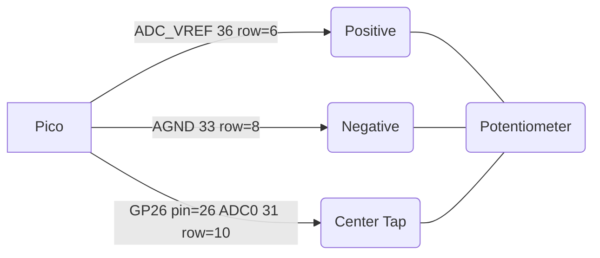

# MicroPython Potentiometer Lab

In this lab we will use a 10K ohm potentiometer to demonstrate how a turn of a knob can result in getting a continuous variable from a user into our code.

## About Analog to Digital Converters

Digital microcontrollers are inherently noisy.  They have clocks that pull power from the power supply and cause voltage fluctuations when we compare a signal to these power lines.  This makes it difficult to get 

To get arro

## Circuit Diagram

## Sample Code

ADC_VREF is the ADC power supply (and reference) voltage, and is generated on Pico by filtering the 3.3V supply. This
pin can be used with an external reference if better ADC performance is required.
AGND is the ground reference for GPIO26-29, there is a separate analog ground plane running under these signals and
terminating at this pin.

Connect the positive to pin 35 ADC_REF (row 6 on the breadboard) and the negative to pin 33 AGND (row 8 on the breadboard).  The Pico has special noise reduction circuits to avoid power supply jitter on these reference pins.
