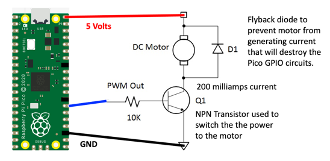

# Driving a Motor with the Pico

The Pico has 26 general purpose input and output pins.  However, each pin's power is designed to digitally communicate with other devices and has a limited current capacity of around 17 milliamps according to the [Raspberry Pi Pico Datasheet Table 5](https://github.com/raspberrypi/documentation/blob/master/hardware/computemodule/datasheets/rpi_DATA_CM_2p0.pdf).  17 milliamps is fine for lighting up an LED.  However, motors require much more power.  17 milliamps is not enough current to drive even small motors.  Even our small DC hobby motors we use with our robots require around 200 milliamps.

But don't worry!  We have two ways around this problem.

1. The first option is to use a simple transistor as a "switch" that will use our low-power digital signal to control its on-and-off settings.
2. The second option is to use a full motor driver chip such as an L293D chip.  This chip takes the same PWM signal we learned about in our [Fade In and Out Lab](04-fade-in-and-out.md).

## Basic Transistor Circuit

1. Transistor NPN 2222A
2. Diode: 1N1448
3. Motor: 3-6 volt hobby motor



## PWM Control

### PWM Frequency
Set the frequency to 50Hz (one cycle per 20ms) and the duty value to between 51 (51/1023 * 20ms = 1ms) and 102 (102/1023 * 20ms = 2ms)

## Sample Coder

```py
import machine

# set the 7th from the bottom on right as our motor pin
motor_pin = machine.Pin(21, machine.Pin.OUT)
# allocate a PWM object for controlling the motor speed
motor_pwm = machine.PWM(motor_pin)
motor_pwm.freq(50) # 50 hertz
motor_pwm.duty(51)
```

## References

1. [Sparkfun Motor Lab from SIK Kit](https://learn.sparkfun.com/tutorials/sik-experiment-guide-for-arduino---v32/experiment-12-driving-a-motor)
2. [Nick Zoic MicroPython Motor Control Tutorial](http://mpy-tut.zoic.org/tut/motors.html)

