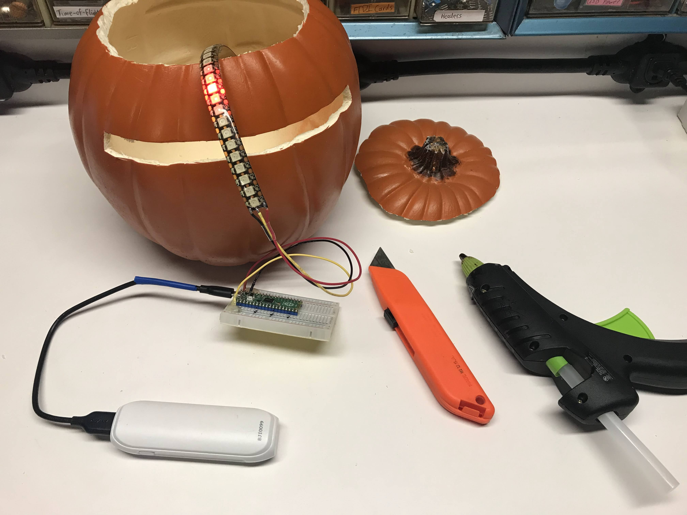
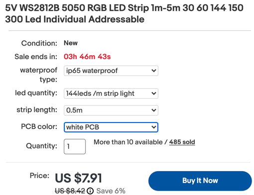

# Larson Scanner Pumpkin


The Larson Scanner is a light pattern special effect named after [Glen A. Larson](https://en.wikipedia.org/wiki/Glen_A._Larson).  Larson use this pattern to give his [Battlestar Galactica Cylon](https://en.wikipedia.org/wiki/Cylon_(Battlestar_Galactica)) and [KITT](https://en.wikipedia.org/wiki/KITT) robot eyes a sense of sentience.  See [Kinght Rider](https://en.wikipedia.org/wiki/Knight_Rider_(1982_TV_series)) for the backstory.

This project uses a 144 pixel/meter LED strip and a Raspberry Pi Pico to produce this effect.


I used a craft pumpkin from Michaels.  I cut a slit in it and used hot-glue to hold the LED strip in place.

## Parts List

1. 9" Craft Pumpkin from [Micheals](https://www.michaels.com/9-in-orange-craft-pumpkin-by-ashland/10638818.html) $10
1. Raspberry Pi Pico ($4)
2. Breadboard ($2)
3. 27 pixels of WS2811B NeoPixel Strip [144 pixels per meter preferred](https://www.ebay.com/itm/324452155664?hash=item4b8adb0110:g:-kUAAOSwwT9f9avu) ($8)
4. [3 AA battery pack](https://www.ebay.com/itm/234251696371?hash=item368a7d38f3%3Ag%3AZe8AAOSwTmtaqyvb) or a [USB battery pack](https://www.amazon.com/Compact-5000mAh-External-Portable-More-Black/dp/B09BJGVH17/ref=dp_fod_2?th=1)



## Sample Code

This code shows a five-pixel wide "eye" moving back-an-forth over a 27 pixel strip.

```py
from utime import sleep
# We are using https://github.com/blaz-r/pi_pico_neopixel
from neopixel import Neopixel

NUMBER_PIXELS = 27
STATE_MACHINE = 0
LED_PIN = 0

strip = Neopixel(NUMBER_PIXELS, STATE_MACHINE, LED_PIN, "GRB")

# Color RGB values
red = (255, 0, 0)
red_med = (32, 0, 0)
red_light = (8, 0, 0)
off = (0,0,0)

delay = .1
while True:
    for i in range(2, NUMBER_PIXELS-2):
        strip.set_pixel(i-2, red_light)
        strip.set_pixel(i-1, red_med)
        strip.set_pixel(i, red)
        strip.set_pixel(i+1, red_med)
        strip.set_pixel(i+2, red_light)
        if i > 0: strip.set_pixel(i-3, off)
        strip.show()
        sleep(delay)
    for i in range(NUMBER_PIXELS-4, 1, -1):
        if i < NUMBER_PIXELS-2: strip.set_pixel(i+3, off)
        strip.set_pixel(i-2, red_light)
        strip.set_pixel(i-1, red_med)
        strip.set_pixel(i, red)
        strip.set_pixel(i+1, red_med)
        strip.set_pixel(i+2, red_light)
        strip.show()
        sleep(delay)
```