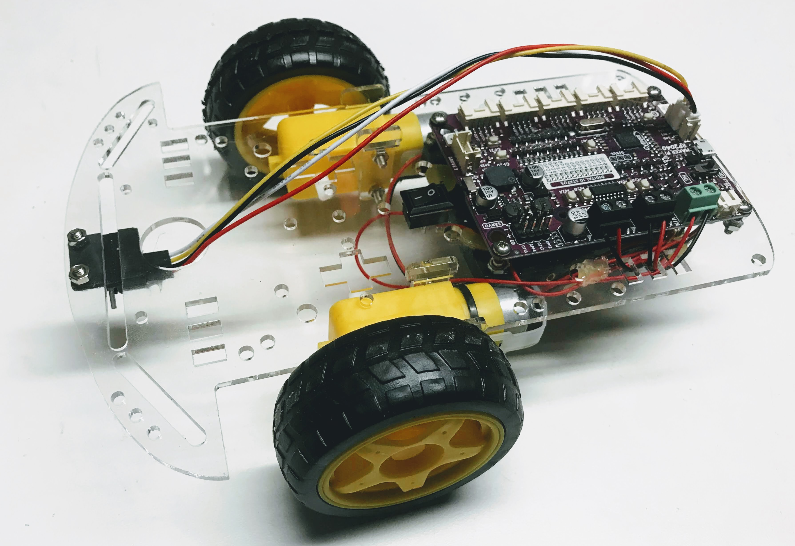
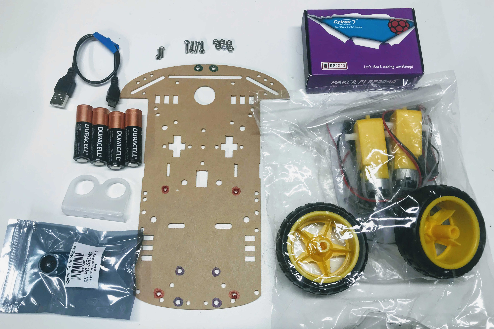

# Cytron Maker Pi RP2040 Collision Avoidance Robot

We have been working on designing a run robot that can be used to teach computational thinking since 2014.  We have gone through many generations, and now we think we have a fantastic design that is powerful, flexible, extendible and inexpensive.

## Base Cytron Maker Pi RP2040 Robot Kit

This $20 robot kit allows you to create a collision avoidance robot using about $20 of parts or $40 if you use the larger OLED display.

The robot can be built ia a few hours using a screwdriver and soldering four wires onto the motors.

## Sample Parts List

1. Cytron Maker Pi RP2040 board (includes Grove connectors, screwdriver and feet)
2. Chassis main board (acrylic)
3. Ultrasonic ping distance sensor
4. Ping sensor mount
5. 2x M3 6 mm screws and nuts
6. 4x M3 10 mm screes and nuts
7. Micro USB cable
8. 4x AA batteries

## Demo with OLED Display

<iframe width="560" height="315" src="https://www.youtube.com/embed/MncEnIN5NEY" title="YouTube video player" frameborder="0" allow="accelerometer; autoplay; clipboard-write; encrypted-media; gyroscope; picture-in-picture" allowfullscreen></iframe>

1. Cytron Maker Pi RP2040 robotics board ($10)
2. SmartCar kit ($9)
3. Time-of-flight sensor (4)
4. Optional OLED SPI 2.24" SSD1606 display ($18)

