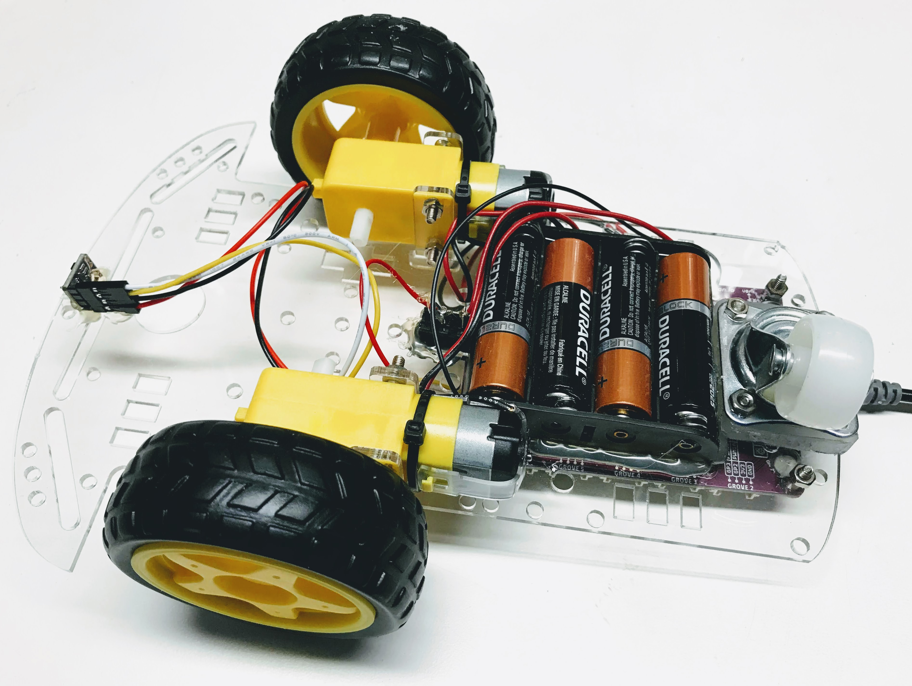

# Assembling Your Maker Pi RP2040 Robot

This kit is a $25 robot kit that we will use in our CoderDojo robotics classes.  This kit includes:

1. A SmartCar Chassis
    1. Two 3 to 6-volt DC geared hobby motors and wheels
    2. Plexiglass (acrylic) main board
    3. Screws and nuts
    4. 4 AA battery pack
    5. Power switch
2. Cytron Maker Pi RP2040 kit
    1. Maker Pi RP2040 board
    2. 4x Grove to female header cables
    3. Screwdriver
    4. Silicone rubber feet (pack of 4)
3. Time of Flight distance sensor
    1. 3D printed mount
    2. 2 M2 6mm screws and nuts

You will need to provide 4 AA batteries and a Micro USB connector that works with your PC or Mac.

## Assemble the SmartCar Chassis

1. Solder red and black motor wires to the motors.  I use the convention of connecting the red wires to the right connector when you view the motor from the back.

2. There are many videos online how to assemble to motors to the chassis.  The trick is orienting the motors correctly and making sure the bolts don't get in the way of the wheels.
3. We prefer connecting the battery pack to the bottom of the chassis.  This leaves more room on the top for adding buttons and displays.
4. Connect the Maker Pi RP2040 board to the top with the USB connector facing the rear.
5. Connect the motors to the headers using the screwdriver.  Don't worry about getting the connections all correct.  They can be adjusted in your software.
   
6. Connect the black battery wire to the "-" on the black header
7. Connect the battery red through the switch and to the "+" on the black header.  You technically don't need the switch since the board has it's own power switch.
