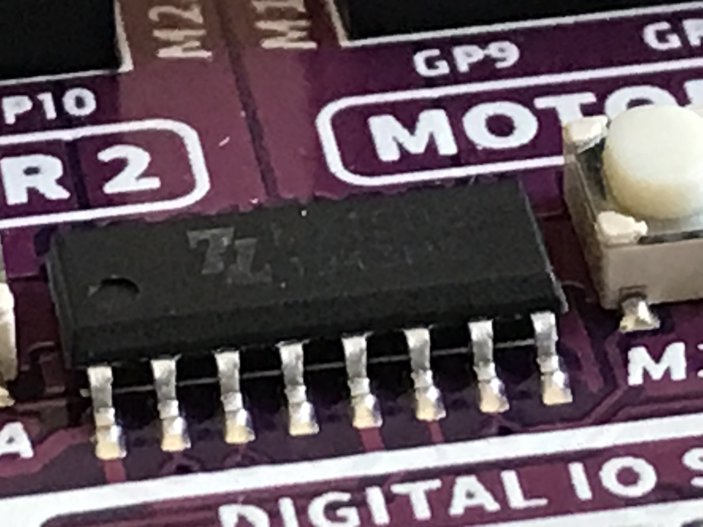

# Motor Drive Connection Test

## Built-In Motor Driver

The Maker Pi RP2040 board contains a MX1508 dual channel H-bridge chip and easy-to-connect screw headers for power and motor connections.  This is fantastic for teaching robotics since students can driver two motors without ever having to use a soldering iron.

!!! Note that the is designed to work with small DC-hobby motors and there is no documentation on exactly what motor driver chip is used or its precise current and power limitations.

The documentation only indicates that the maximum current is 1A continuous power and 1.5A for up to 5 seconds.  The input voltage is only rated at 6 volts, which find for our standard 4 AA battery packs.

If this motor driver chip is similar to the ubiquitous [L293x motor controllers](https://www.ti.com/document-viewer/L293D/datasheet/specifications#ESD_Rating_1), and the current should be 1A per motor.

I suspect that if you glued a small [heat sink](https://en.wikipedia.org/wiki/Heat_sink) like a [16 pin DIP fin](https://my.element14.com/fischer-elektronik/ick-14-16-b/heat-sink-dip-glue-on-50-c-w/dp/4620896) to the unknown motor driver IC on the main board you could drive slightly larger motors.


Close-up of the motor driver chip.  I can't quite make out the numbers on the chip, but the logo is not "TI".
## Testing The Connections

In our standard robot, the M1 is the right wheel as you are looking from the top-back of the robot.  The M2 wheel is the left wheel.  I connect the red to the right of the two connectors and it is also the right terminal of the motors as you are looking from the rear.
 
Look at the buttons near the motor connectors.  Press the M1A button and verify that the right wheel
is moving forward.  Press the M1B and the motor should turn in reverse.  Similarly the M2B button should turn the left wheel forward and the M2A should turn the left wheel in reverse.  If you don't wire these connections the same way I did it is not a worry.  It is easy to change the code.

## Motor Pin Definitions

Now that we know what buttons control what motors and directions they turn, we are ready to define the pins that are associated with each robot movement.  We have four pin assignments: both forward and reverse for both the right and left motors.

```py
RIGHT_FORWARD_PIN = 8
RIGHT_REVERSE_PIN = 9
LEFT_FORWARD_PIN = 11
LEFT_REVERSE_PIN = 10
```

## Testing Your Pin Definitions

The following program is called our motor connection test.  It will turn each motor direction for three seconds and it will print out the motor and direction in the console.

```py
from machine import Pin, PWM
import time

POWER_LEVEL = 65025
# lower right pins with USB on top
RIGHT_FORWARD_PIN = 8
RIGHT_REVERSE_PIN = 9
LEFT_FORWARD_PIN = 11
LEFT_REVERSE_PIN = 10

right_forward = PWM(Pin(RIGHT_FORWARD_PIN))
right_reverse = PWM(Pin(RIGHT_REVERSE_PIN))
left_forward = PWM(Pin(LEFT_FORWARD_PIN))
left_reverse = PWM(Pin(LEFT_REVERSE_PIN))

def spin_wheel(pwm):
        pwm.duty_u16(POWER_LEVEL)
        time.sleep(3)
        pwm.duty_u16(0)
        time.sleep(2)

while True:
    print('right forward')
    spin_wheel(right_forward)

    print('right reverse')
    spin_wheel(right_reverse)

    print('left foward')
    spin_wheel(left_forward)

    print('left_reverse')
    spin_wheel(left_reverse)
```
