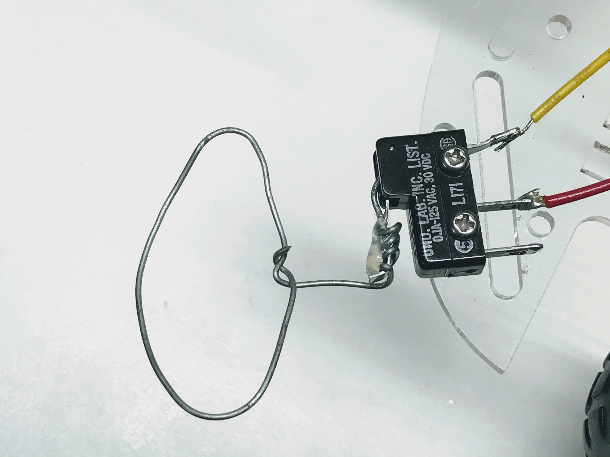
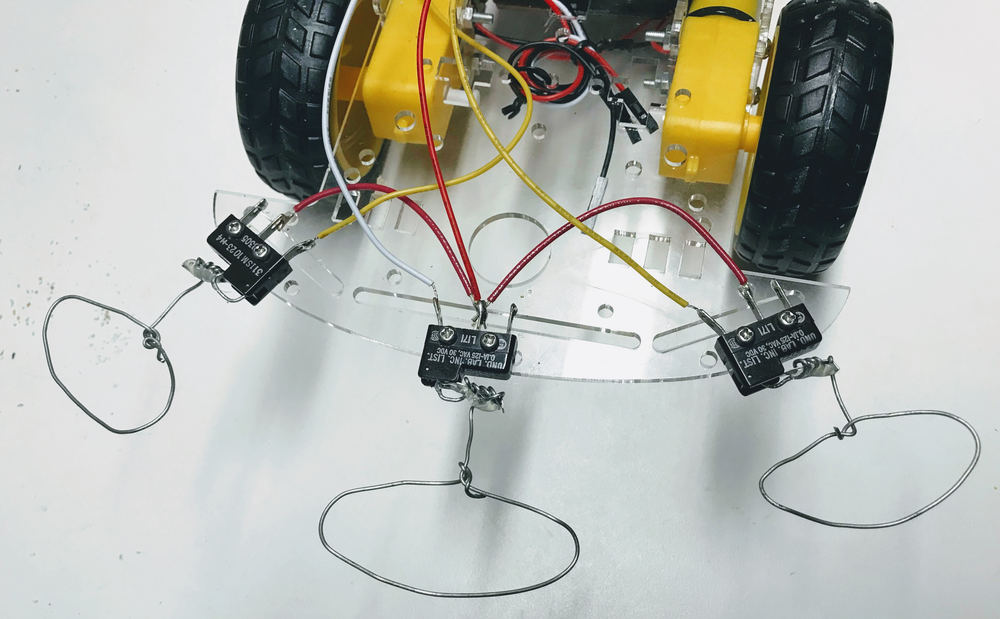
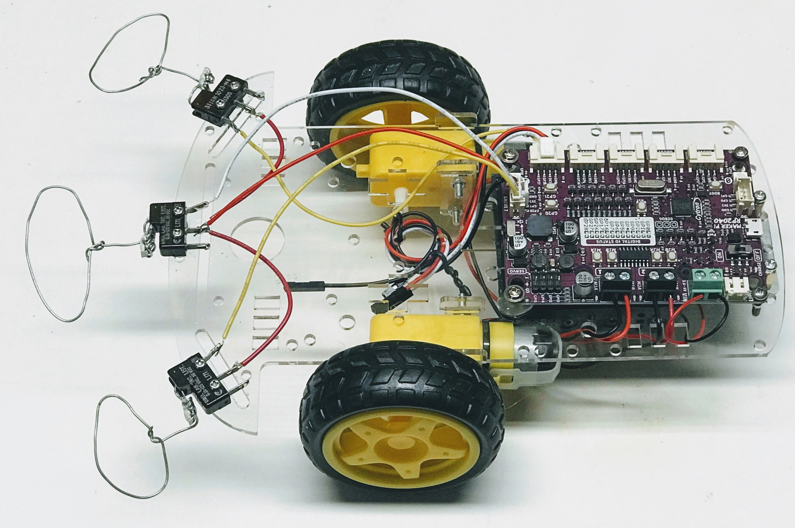

# MicroSwitch Robot using the Cytron Maker Pi RP2040

This robot was inspired by my friend, Michael York.

<iframe width="560" height="315" src="https://www.youtube.com/embed/Ui4kJgjIIuo" title="YouTube video player" frameborder="0" allow="accelerometer; autoplay; clipboard-write; encrypted-media; gyroscope; picture-in-picture" allowfullscreen></iframe>

Microswitches can be purchased for [under $1](https://www.amazon.com/Twidec-Straight-Switch-Action-KW11-3Z04/dp/B07P4CJ8TV/ref=sr_1_3).  They can be mounted on the front of our robot.  When the robot hits a wall in front of it the switch will open (or close) and the robot controller can make the robot go in reverse or turn.

In the example below, we attached a stiff wire to the lever of the microswitch.




In the example below, we connected three microswitches to the front of our robot.



If the left switch is activated, the robot should turn to the right.  If the right switch is activated, the robot should go to the left.

This image shows how we used two of the Grove connectors to read in the values of the switches.



## Testing Switches
The following code can be used to test your switches.  A line on the console prints out which of the three switches are activated using the pin ```value()``` function.

```py
from machine import Pin
from time import sleep

# GPIO is the internal built-in LED
led0 = Pin(0, Pin.OUT)
led1 = Pin(1, Pin.OUT)
led2 = Pin(2, Pin.OUT)

# input on the lower left of the Pico using a built-in pull-down resistor to keep the value from floating
middle_switch = Pin(7, Pin.IN, Pin.PULL_DOWN) 
right_switch = Pin(28, Pin.IN, Pin.PULL_DOWN)
left_switch = Pin(27, Pin.IN, Pin.PULL_DOWN)

while True:
    if middle_switch.value(): # if the value changes
        led0.on()
        print('middle')
    else: led0.off()

    if right_switch.value(): # if the value changes
        led1.on()
        print('right')
    else: led1.off()
    
    if left_switch.value(): # if the value changes
        led2.on()
        print('left')
    else: led2.off()
    sleep(.1)
```

## Sample Collision Avoidance Robot Code

```py
from machine import Pin, PWM
from time import sleep

# GPIO is the internal built-in LED
led0 = Pin(0, Pin.OUT)
led1 = Pin(1, Pin.OUT)
led2 = Pin(2, Pin.OUT)

# input on the lower left of the Pico using a built-in pull-down resistor to keep the value from floating
middle_switch = Pin(7, Pin.IN, Pin.PULL_DOWN) 
right_switch = Pin(28, Pin.IN, Pin.PULL_DOWN)
left_switch = Pin(27, Pin.IN, Pin.PULL_DOWN)

# Go slow to avoid bending wires
POWER_LEVEL = 25000 # max is 65000

# These values depend on motor wiring
RIGHT_FORWARD_PIN = 10
RIGHT_REVERSE_PIN = 11
LEFT_FORWARD_PIN = 9
LEFT_REVERSE_PIN = 8

right_forward = PWM(Pin(RIGHT_FORWARD_PIN))
right_reverse = PWM(Pin(RIGHT_REVERSE_PIN))
left_forward = PWM(Pin(LEFT_FORWARD_PIN))
left_reverse = PWM(Pin(LEFT_REVERSE_PIN))

def turn_motor_on(pwm):
   pwm.duty_u16(POWER_LEVEL)

def turn_motor_off(pwm):
   pwm.duty_u16(0)

def forward():
    turn_motor_on(right_forward)
    turn_motor_on(left_forward)
    turn_motor_off(right_reverse)
    turn_motor_off(left_reverse)

def reverse():
    turn_motor_on(right_reverse)
    turn_motor_on(left_reverse)
    turn_motor_off(right_forward)
    turn_motor_off(left_forward)

def turn_right():
    turn_motor_on(right_forward)
    turn_motor_on(left_reverse)
    turn_motor_off(right_reverse)
    turn_motor_off(left_forward)

def turn_left():
    turn_motor_on(right_reverse)
    turn_motor_on(left_forward)
    turn_motor_off(right_forward)
    turn_motor_off(left_reverse)

def stop():
    turn_motor_off(right_forward)
    turn_motor_off(right_reverse)
    turn_motor_off(left_forward)
    turn_motor_off(left_reverse)

def main():
    while True:
        if middle_switch.value(): # if the value changes
            print('middle')
            led0.on()
            reverse()
            sleep(1)
            turn_right()
            sleep(.75)
            forward()
        else:
            led0.off()
            forward()

        if right_switch.value(): # if the value changes
            print('right')
            led1.on()
            reverse()
            sleep(.75)
            turn_left()
            sleep(.5)
            forward()
        else:
            led1.off()
            forward()
        
        if left_switch.value(): # if the value changes
            led2.on()
            print('left')
            reverse()
            sleep(.75)
            turn_right()
            sleep(.5)
            forward()
        else:
            led2.off()
            forward()

print('middle', middle_switch.value())
print('left', left_switch.value())
print('right', right_switch.value())

try:
    main()
except KeyboardInterrupt:
    print('Got ctrl-c')
finally:
    # Optional cleanup code
    print('turning off sound')
    # sound_off()
    print('turning off motors')
    stop()

```