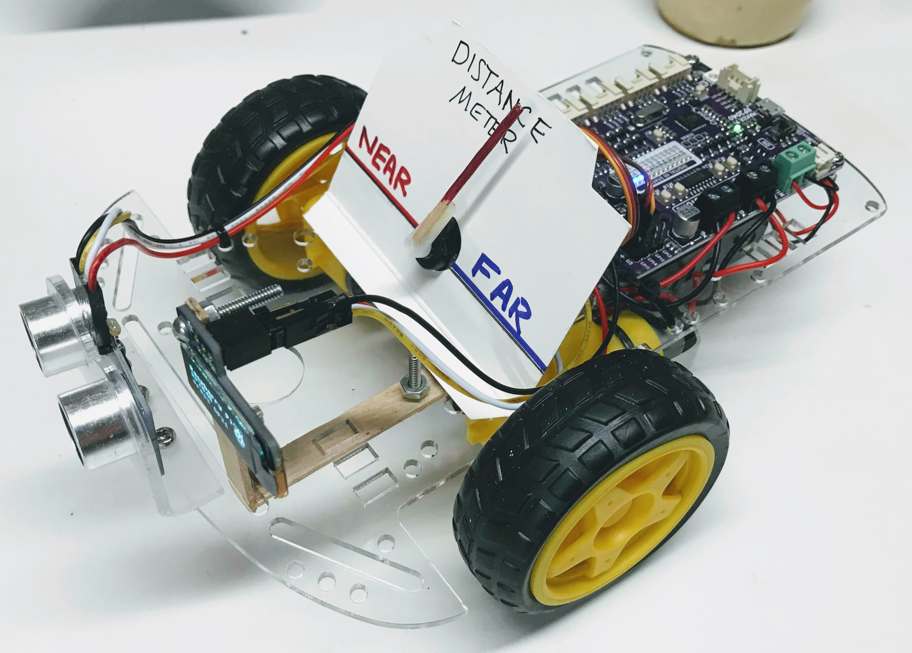

# Cytron Maker Pi RP2040 Ping Servo Meter Bot

This robot works very similar to our standard CoderDojo Collision Avoidance Robot.  However it adds a 180 degree servo to show the distance to the object in front of it.  It also uses a OLED display to present instructions and display the distance to the object.

This program was contributed by [Joe Glenn](https://www.linkedin.com/in/jeglenn/) for the Minneapolis Bakken Museum Droid December event in December 2021.



## Test Servo

This program tests the servo by sweeping the angle from 0 to 180 and back.

```py
# servo sweep test
# Brown: GND
# Orange/Red : VCC
# Yellow: Signal
#
# Time for high level (Radio Shack Micro-servo @ 5V)
# 0.5 ms :   0 degree
# 1.0 ms :  45 degree
# 1.5 ms :  90 degree
# 2.0 ms : 135 degree
# 2.5 ms : 180 degree

from machine import Pin, PWM
from time import sleep

SERVO_PIN = 15
servoPin = PWM(Pin(SERVO_PIN))
servoPin.freq(50)

def servo(degrees):
    if degrees > 180: degrees=180
    if degrees < 0: degrees=0
    maxDuty=8000 # duty*100
    minDuty=2000 # duty*100
    #maxDuty=2000 # test
    #minDuty=8000 # test
    newDuty=minDuty+(maxDuty-minDuty)*(degrees/180)
    servoPin.duty_u16(int(newDuty))
        
while True:

  for degree in range(0,180,1):
    servo(degree)
    sleep(0.01)
    print("increasing -- "+str(degree))
    
  for degree in range(180, 0, -1):
    servo(degree)
    sleep(0.01)
    print("decreasing -- "+str(degree))
```

## Main Python Code

```py
# Demo for Maker Pi RP2040 board using Ping sensor, servo and i2c display

from machine import Pin, PWM, Timer
import utime
import urandom
from ssd1306 import SSD1306_I2C
from neopixel import Neopixel
from machine import Pin, I2C
from ssd1306 import SSD1306_I2C
import framebuf
import math
import utime
#
# Ping Sensor
# Use the Grove 4 Connector and put trigger on white and echo on yellow
#
PING_TRIGGER_PIN = 7 # GP7
PING_ECHO_PIN = 28 # GP28

#
# i2c OLED 128x32
#
OLED_SDA_PIN = 26 # GP26
OLED_SCL_PIN = 27 # GP27

#
# Servo
# GND: Brown
# VCC: Orange/Red
# GP15 Yellow: Signal
#
# Time for high level (Radio Shack Micro-servo @ 5V)
# 0.5 ms :   0 degree
# 1.0 ms :  45 degree
# 1.5 ms :  90 degree
# 2.0 ms : 135 degree
# 2.5 ms : 180 degree
SERVO_PIN = 15

# IQR Pins
FASTER_PIN = 20
SLOWER_PIN = 21

# built-in Buzzer
BUZZER_PIN = 22

# Adjust these parameters to tune the collision avoidance behavior

POWER_LEL = 35000
TURN_DISTANCE = 20 # distance we decide to turn - try 20
REVERSE_TIME = .4 # how long we backup
TURN_TIME = .4 # how long we turn

# startup mode is 0 - motors off and LEDs flashing
# mode 1 is slow
# mode 2 is medium
# mode 3 is fast
mode = 0

# Init HC-SR04P pins
trigger = Pin(PING_TRIGGER_PIN, Pin.OUT) # send trigger out to sensor
echo = Pin(PING_ECHO_PIN, Pin.IN) # get the delay interval back

faster_pin = machine.Pin(FASTER_PIN, machine.Pin.IN, machine.Pin.PULL_DOWN)
slower_pin = machine.Pin(SLOWER_PIN, machine.Pin.IN, machine.Pin.PULL_DOWN)

last_time = 0 # the last time we pressed the button

#
# DISPLAY STUFF
#
# Display Image & text on I2C driven ssd1306 OLED display 


WIDTH  = 128 # oled display width
HEIGHT = 32  # oled display height

# Explicit Method
sda=machine.Pin(OLED_SDA_PIN)
scl=machine.Pin(OLED_SCL_PIN)
i2c=machine.I2C(1,sda=sda, scl=scl, freq=40000) # 400k is too fast and has issues
print( 'i2c={:02X}'.format( i2c.scan()[0] ) )
#print(help(i2c))
#print(help(i2c.init))
#print(help(i2c.scan))
#print(help(i2c.start))
#print(help(i2c.stop))
#print(help(i2c.readinto))
#print(help(i2c.write))
#print(help(i2c.readfrom))
#print(help(i2c.readfrom_into))
#print(help(i2c.writeto))
#print(help(i2c.writevto))
#print(help(i2c.readfrom_mem))
#print(help(i2c.readfrom_mem_into))
#print(help(i2c.writeto_mem))
#exit

oled = SSD1306_I2C(128, 32, i2c)

# Raspberry Pi logo as 32x32 bytearray
buffer = bytearray(b"\x00\x00\x00\x00\x00\x00\x00\x00\x00\x00\x00\x00\x00|?\x00\x01\x86@\x80\x01\x01\x80\x80\x01\x11\x88\x80\x01\x05\xa0\x80\x00\x83\xc1\x00\x00C\xe3\x00\x00~\xfc\x00\x00L'\x00\x00\x9c\x11\x00\x00\xbf\xfd\x00\x00\xe1\x87\x00\x01\xc1\x83\x80\x02A\x82@\x02A\x82@\x02\xc1\xc2@\x02\xf6>\xc0\x01\xfc=\x80\x01\x18\x18\x80\x01\x88\x10\x80\x00\x8c!\x00\x00\x87\xf1\x00\x00\x7f\xf6\x00\x008\x1c\x00\x00\x0c \x00\x00\x03\xc0\x00\x00\x00\x00\x00\x00\x00\x00\x00\x00\x00\x00\x00")

# Load the raspberry pi logo into the framebuffer (the image is 32x32)
fb = framebuf.FrameBuffer(buffer, 32, 32, framebuf.MONO_HLSB)

def blk():
    oled.fill(0)
    oled.show()
    
def horiz(l,t,r,c):  # left, right , top
    n = r-l+1        # Horizontal line
    for i in range(n):
        oled.pixel(l + i, t, c)

def vert(l,t,b,c):   # left, top, bottom
    n = b-t+1        # Vertical line
    for i in range(n):
        oled.pixel(l, t+i,c)

def box(l,t,r,b,c):  # left, top, right, bottom
    horiz(l,t,r,c)   # Hollow rectangle
    horiz(l,b,r,c)
    vert(l,t,b,c)
    vert(r,t,b,c)
    
def ring2(cx,cy,r,c):   # Centre (x,y), radius, colour
    for angle in range(0, 90, 2):  # 0 to 90 degrees in 2s
        y3=int(r*math.sin(math.radians(angle)))
        x3=int(r*math.cos(math.radians(angle)))
        oled.pixel(cx-x3,cy+y3,c)  # 4 quadrants
        oled.pixel(cx-x3,cy-y3,c)
        oled.pixel(cx+x3,cy+y3,c)
        oled.pixel(cx+x3,cy-y3,c)

#print(help(oled.text()))
#print(help())
#help('modules')
#help(oled)
#help(oled.text)
#help(framebuf.FrameBuffer)
#help(framebuf.FrameBuffer.help())

# Clear the oled display in case it has junk on it.
oled.fill(0) # Black

# Blit the image from the framebuffer to the oled display
oled.blit(fb, 96, 0)

# Basic stuff
oled.text("Raspberry Pi",5,5)
oled.text("RP2040",5,15)
oled.text("press GP21",5,25)
oled.pixel(10,60,1)

#ring2(50,43,20,1)  # Empty circle             
# Finally update the oled display so the image & text is displayed
oled.show()
utime.sleep(1)


#
# Back to the motor control stuff. (sorry... i'm soppy today)
# 
# This function gets called every time the button is pressed.  The parameter "pin" is not used.
def button_pressed_handler(pin):
    global mode, last_time
    new_time = utime.ticks_ms()
    # if it has been more that 1/5 of a second since the last event, we have a new event
    if (new_time - last_time) > 200:
        # this should be pin.id but it does not work
        if '21' in str(pin):
            mode +=1
        else:
            mode -=1
        # deal with ends
        if mode > 4: mode = 2
        if mode < 0: mode = 0
        last_time = new_time

# now we register the handler function when the button is pressed
faster_pin.irq(trigger=machine.Pin.IRQ_FALLING, handler = button_pressed_handler)
slower_pin.irq(trigger=machine.Pin.IRQ_FALLING, handler = button_pressed_handler)

# Piezo Buzzer is on GP22
buzzer=PWM(Pin(BUZZER_PIN))

MAX_POWER_LEVEL = 65025

MAX_DISTANCE = 100 # ignore anything above this

# Motor Pins are A: 8,9 and B: 10,11
RIGHT_FORWARD_PIN = 11 # this must be wired backword?
RIGHT_REVERSE_PIN = 10 
LEFT_FORWARD_PIN = 9
LEFT_REVERSE_PIN = 8

# our PWM objects
right_forward = PWM(Pin(RIGHT_FORWARD_PIN))
right_reverse = PWM(Pin(RIGHT_REVERSE_PIN))
left_forward = PWM(Pin(LEFT_FORWARD_PIN))
left_reverse = PWM(Pin(LEFT_REVERSE_PIN))

# returns distance in cm
def ping():
    #print('in ping')
    trigger.low()
    utime.sleep_us(2) # Wait 2 microseconds low
    trigger.high()
    utime.sleep_us(5) # Stay high for 5 miroseconds
    trigger.low()
    while echo.value() == 0:
        signaloff = utime.ticks_us()
    #print('echo is 1')
    while echo.value() == 1:
        signalon = utime.ticks_us()
    timepassed = signalon - signaloff
    distance = (timepassed * 0.0343) / 2
    print(distance)

    return int(distance)

def turn_motor_on(pwm):
   #pwm.duty_u16(65025)
   pwm.duty_u16(16000)

def turn_motor_off(pwm):
   pwm.duty_u16(0)

def forward():
    turn_motor_on(right_forward)
    turn_motor_on(left_forward)
    turn_motor_off(right_reverse)
    turn_motor_off(left_reverse)

def reverse():
    turn_motor_on(right_reverse)
    turn_motor_on(left_reverse)
    turn_motor_off(right_forward)
    turn_motor_off(left_forward)

def turn_right():
    turn_motor_on(right_forward)
    turn_motor_on(left_reverse)
    turn_motor_off(right_reverse)
    turn_motor_off(left_forward)

def turn_left():
    turn_motor_on(right_reverse)
    turn_motor_on(left_forward)
    turn_motor_off(right_forward)
    turn_motor_off(left_reverse)

def stop():
    turn_motor_off(right_forward)
    turn_motor_off(right_reverse)
    turn_motor_off(left_forward)
    turn_motor_off(left_reverse)

# The Maker Pi RP2040 has 13 fantastic blue GPIO status LEDs
blue_led_pins = [0, 1, 2, 3, 4, 5, 6, 7, 26, 27, 28]
blue_led_pins.remove(PING_TRIGGER_PIN)
blue_led_pins.remove(PING_ECHO_PIN)
blue_led_pins.remove(OLED_SDA_PIN)
blue_led_pins.remove(OLED_SCL_PIN)


# dist_scale =    [2, 4, 6, 8, 10, 13, 16, 20, 25, 35, 50, 75, 100]
dist_scale =    [2, 4, 6, 8, 10, 15, 20, 25, 50, 100, 150, 200, 300]

NUMBER_PIXELS = 2
STATE_MACHINE = 0
NEOPIXEL_PIN = 18

# The Neopixels on the Maker Pi RP2040 are the GRB variety, not RGB
strip = Neopixel(NUMBER_PIXELS, STATE_MACHINE, NEOPIXEL_PIN, "GRB")
strip.brightness(100)

number_leds = len(blue_led_pins)
led_ports = []
red = (255, 0, 0)
orange = (255, 60, 0) # Gamma corrected from G=128 to be less like yellow
yellow = (255, 150, 0)
green = (0, 255, 0)
blue = (0, 0, 255)
indigo = (75, 0, 130) # purple?
violet = (138, 43, 226) # mostly pink
cyan = (0, 255, 255)
lightgreen = (100, 255, 100)
white = (128, 128, 128) # not too bright
pink = (255, 128, 128)
color_names = ('red', 'orange', 'yellow', 'green', 'blue', 'indigo', 'violet', 'cyan', 'lightgreen', 'white')
num_colors = len(color_names)
colors = (red, orange, yellow, green, blue, indigo, violet, cyan, lightgreen, white, pink)

# create a list of the ports
for i in range(number_leds):
   led_ports.append(machine.Pin(blue_led_pins[i], machine.Pin.OUT))

LED_DELAY = .08
def run_lights():
    for i in range(0, number_leds):
        led_ports[i].high()
        strip.set_pixel(0, colors[i])
        strip.set_pixel(1, colors[i])
        strip.show()
        utime.sleep(LED_DELAY)
        led_ports[i].low()
    # blue down
    for i in range(number_leds - 1, 0, -1):
        led_ports[i].high()
        strip.set_pixel(0, colors[i])
        strip.set_pixel(1, colors[i])
        strip.show()
        utime.sleep(LED_DELAY)
        led_ports[i].low()

def led_show_dist(in_distance):
    global number_leds
    for led_index in range(0, number_leds):
        if in_distance > dist_scale[led_index]:
            led_ports[led_index].high()
        else:
            led_ports[led_index].low()

def play_no_signal():
    playnote(100, 0.1)
    sound_off()

def play_turn():
    playnote(500, .1)
    sound_off()

def setfreq(frequency):
    buzzer.freq(frequency)

def playnote(frequency, time):
    buzzer.duty_u16(1000)
    setfreq(frequency)
    utime.sleep(time)

def sound_off():
    buzzer.duty_u16(0)

def rest(time):
    buzzer.duty_u16(0)
    utime.sleep(time)

def play_startup():
    playnote(600, .2)
    rest(.05)
    playnote(600, .2)
    rest(.05)
    playnote(600, .2)
    rest(.1)
    playnote(800, .4)
    sound_off()

def servo(degrees):
    if degrees > 180: degrees=180
    if degrees < 0: degrees=0
    maxDuty=8000 # duty*100
    minDuty=2000 # duty*100
    #maxDuty=2000 # test
    #minDuty=8000 # test
    newDuty=minDuty+(maxDuty-minDuty)*(degrees/180)
    servoPin.duty_u16(int(newDuty))

servoPin = PWM(Pin(SERVO_PIN))
servoPin.freq(50)

valid_distance = 1

def main():
    global valid_distance
    print("running main()")

    play_startup()
    oled_count=0 # repeat every
    oled_count_max=0 # times through loop
    servo_count=0 
    servo_count_max=0 # when to update
    servo_degrees = 0
    servo(servo_degrees) # start in that pos
    
    # loop forever
    while True:
        if mode == 0:
            stop()
            run_lights()
        else:
            distance = ping()
            print('Distance:', distance)
            oled_count += 1
            if oled_count > oled_count_max:
                oled.fill(0) # Black
                oled.text("Distance:",5,5)
                oled.text("{:f}".format(distance),5,15)
                oled.show()
                oled_count = 0
            
            servo_count += 1
            if servo_count > servo_count_max:
                if distance > MAX_DISTANCE:
                    servo_degrees = 0
                else:
                    servo_degrees = 180-distance/MAX_DISTANCE*180
                servo(servo_degrees)
                servo_count = 0

            if distance > MAX_DISTANCE:
                # only print if we used to have a valid distance
                if valid_distance == 1:
                    print('no signal')      
                valid_distance = 0
            else:
                print(distance)
                #note=distance*10
                #playnote(note, .025)

                if distance < TURN_DISTANCE:
                    play_turn()
                    # back up for a bit
                    reverse()
                    utime.sleep(REVERSE_TIME)
                    # half right and half left turns
                    if urandom.random() < .5:
                        turn_right()
                    else:
                        turn_left()
                    utime.sleep(TURN_TIME)
                    forward()
                else:
                    print('forward')
                    forward()
                valid_distance = 1
                led_show_dist(distance)
            utime.sleep(0.05)

# clean up

# This allows us to stop the sound and motors when we do a Stop or Control-C which is a keyboard interrupt
try:
    main()
except KeyboardInterrupt:
    print('Got ctrl-c')
except Exception as e: print(e)
finally:
    # Optional cleanup code
    print('turning off sound')
    buzzer.duty_u16(0)
    print('shutting motors down')
    stop()
```