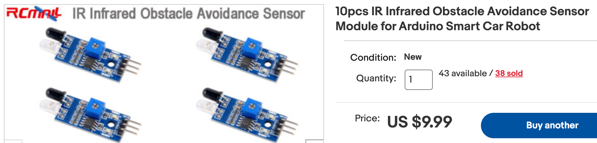
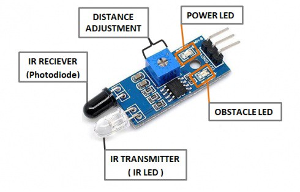

# Line Follower Robot

<iframe width="560" height="315" src="https://www.youtube.com/embed/cmBz65zH0GQ?rel=0" title="YouTube video player" frameborder="0" allow="accelerometer; autoplay; clipboard-write; encrypted-media; gyroscope; picture-in-picture; web-share" allowfullscreen></iframe>

Line following robot projects is a favorite project for our students.  They teach the students the concept of
feedback to keep a robot following a line on a track or on the floor.  They are not easy to get working
and require careful calibration of the sensor sensitivity and carefully adjusting the right and left motor
power to keep the robot on track.  Once the student gets the robot working it is a time for celebration!

The total cost of the kit is about $20.

## Parts List
|Part Name|Description|Price|Link|
|---------|-----------|-----|----|
|Cytron Board|Main board with RP2040 and motor driver. Kits come with Grove connectors and a screwdriver.|$12||
|SmartCar Chassis|SmartCar chassis with wheels and 4 AA battery pack||
|IR Sensors (2)|Low cost IR light sensors|$1||

## IR Sensors



We can purchase IR sensors on eBay for about $1 each in quantity 10.
The sensors send a digital 0/1 signal to the microcontroller depending on if they are over the line.
Our job is to write some MicroPython code to keep the robot following the line.
Each IR sensor has a small trim potentiometer that we must adjust for the correct sensitivity for each room. 



Each IR sensor has a small trim potentiometer that we must adjust for the correct sensitivity for each room.  Some
of our rooms have a white floor with a black line and some
of our rooms have a dark floor with a white line.  You may have to
adjust both the trim potentiometer and the logic of the code for different situations.

Use the Grove connectors to hook up the IR sensors.  I used the red (VCC), black (GDN) and white wires (Data) and
I just cut off the yellow wires to keep them out of the way.  I then connected the Grove connectors
to ports 2 and 3 of the Cytron board.

I connected the motors to the **MOTOR 1** and **MOTOR 2** headers with a screwdriver and I hooked
the battery wires up to the power header of the board.

```py
from machine import Pin
from utime import sleep

RIGHT_SENSOR_PIN = 2
LEFT_SENSOR_PIN = 4

right_sensor = Pin(RIGHT_SENSOR_PIN)
left_sensor = Pin(LEFT_SENSOR_PIN)

while True:
    r = right_sensor.value()
    l = left_sensor.value()
    print("r", r, "l=", l)
    if r == 0:
        print("right over white")
    if l == 0:
        print("left over white")
    sleep(.2)
```

## Full Source Code

```py
from machine import Pin, PWM
from time import sleep

# sensor setup
RIGHT_SENSOR_PIN = 2
LEFT_SENSOR_PIN = 4

right_sensor = Pin(RIGHT_SENSOR_PIN)
left_sensor = Pin(LEFT_SENSOR_PIN)

# speaker pin on the Cytron Maker Pi RP2040
SPEAKER_PIN = 22
# create a Pulse Width Modulation Object on this pin
speaker = PWM(Pin(SPEAKER_PIN))
# set the duty cycle
speaker.duty_u16(1000)

# Motor setup
RIGHT_FORWARD_PIN = 11
RIGHT_REVERSE_PIN =10
LEFT_FORWARD_PIN = 8
LEFT_REVERSE_PIN = 9

right_forward = PWM(Pin(RIGHT_FORWARD_PIN))
right_reverse = PWM(Pin(RIGHT_REVERSE_PIN))
left_forward = PWM(Pin(LEFT_FORWARD_PIN))
left_reverse = PWM(Pin(LEFT_REVERSE_PIN))

MAX_POWER_LEVEL = 65025
QUARTER_POWER = 65025 >> 2
SLOW_DRIVE_POWER = 16000
BOOST_LEVEL = 15000

# while True:
def spin_wheel(pwm):
    pwm.duty_u16(SLOW_DRIVE_POWER)
    sleep(2)
    pwm.duty_u16(0)
    sleep(1)

def forward():
    right_forward.duty_u16(SLOW_DRIVE_POWER)
    right_reverse.duty_u16(0)
    left_forward.duty_u16(SLOW_DRIVE_POWER)
    left_reverse.duty_u16(0)
    speaker.duty_u16(0)

def right():
    right_forward.duty_u16(SLOW_DRIVE_POWER - BOOST_LEVEL)
    right_reverse.duty_u16(0)
    left_forward.duty_u16(SLOW_DRIVE_POWER + BOOST_LEVEL)
    left_reverse.duty_u16(0)
    speaker.duty_u16(1000)
    speaker.freq(800)

def left():
    right_forward.duty_u16(SLOW_DRIVE_POWER + BOOST_LEVEL)
    right_reverse.duty_u16(0)
    left_forward.duty_u16(SLOW_DRIVE_POWER - BOOST_LEVEL)
    left_reverse.duty_u16(0)
    speaker.duty_u16(1000)
    speaker.freq(1000)

def stop():
    right_forward.duty_u16(0)
    right_reverse.duty_u16(0)
    left_forward.duty_u16(0)
    left_reverse.duty_u16(0)
    speaker.duty_u16(0)
    
def main():
    while True:
        r = right_sensor.value()
        l = left_sensor.value()
        if r == 0 and l == 1:
            print("right over white - turning left")
            right()
        if l == 0:
            print("left over white")
            left()
        else:
            forward()
            
# end of main()

try:
    main()
except KeyboardInterrupt:
    print('Got ctrl-c')
finally:
    # Cleanup code
    print('Cleaning up')
    print('Powering down all motors now.')
    stop()
```