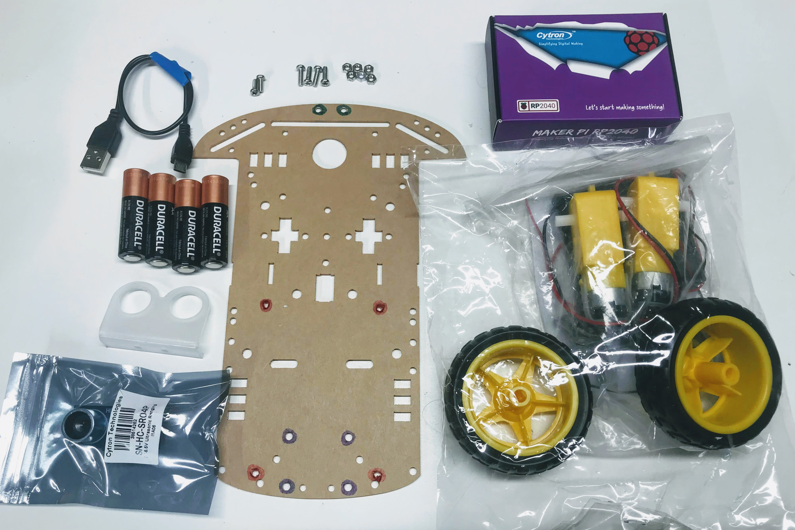

# Cytron Maker Pi RP2040 Collision Avoidance Robot

We have been working on designing a run robot that can be used to teach computational thinking since 2014.  We have gone through many generations, and now we think we have a fantastic design that is powerful, flexible, extendible and inexpensive.  We love this robot because:

1. The cost of parts is under $20.00 US
2. It is programmed with Python
3. It has plenty of power - with 264K RAM it has the ability to run complex programs
4. The design is flexible and it is easy to add displays and other sensors

## Base Cytron Maker Pi RP2040 Robot Kit

This version uses the time-of-flight sensor.

The robot can be built ia a few hours using a screwdriver and soldering four wires onto the motors.

## Sample Parts List

1. Cytron Maker Pi RP2040 board (includes Grove connectors, screwdriver and feet) [Cytron](https://www.cytron.io/p-maker-pi-rp2040-simplifying-robotics-with-raspberry-pi-rp2040) [DigiKey](https://www.digikey.com/en/products/detail/cytron-technologies-sdn-bhd/MAKER-PI-RP2040/14557836) [Amazon](https://www.amazon.com/Cytron-Simplying-Robotics-Beginner-RP2040/dp/B09HBQL141) [Adafruit](https://www.adafruit.com/product/5129) [YouTube Video](https://www.youtube.com/watch?v=8CXirBVwVoU)
2. 2 Wheel Drive Smart Car Kit:  Chassis Main board (acrylic), 2x DC Motors with wires soldered, 2x wheels, 4x AA Battery Case: [Cytron](https://www.cytron.io/p-2wd-smart-robot-car-chassis?search=Smart%20Car%20&description=1) [Amazon](https://www.amazon.com/Smart-Chassis-Motors-Encoder-Battery/dp/B01LXY7CM3/ref=sr_1_7) [eBay](https://www.ebay.com/itm/324919345465?hash=item4ba6b3c139:g:FSIAAOSwTAddc3c2)
3. Distance Sensor (Time-of-flight or Ultrasonic ping): [Cytron](https://www.cytron.io/p-vl53l0x-v2-laser-tof-distance-sensor-module?search=Time%20of%20flight%20sensor) [ebay](https://www.ebay.com/itm/353793425635?hash=item525fbb40e3:g:fUkAAOSwoexftRiN) [Amazon](https://www.amazon.com/VL53L0X-Ranging-Sensor-Breakout-Distance/dp/B09LVGDQD6/ref=sr_1_1?)
4. Ping sensor mount
5. 2x M3 6 mm screws and nuts
6. 4x M3 10 mm screes and nuts
7. Micro USB cable
8. 4x AA batteries

## Demo with OLED Display

<iframe width="560" height="315" src="https://www.youtube.com/embed/MncEnIN5NEY" title="YouTube video player" frameborder="0" allow="accelerometer; autoplay; clipboard-write; encrypted-media; gyroscope; picture-in-picture" allowfullscreen></iframe>

1. Cytron Maker Pi RP2040 robotics board ($10)
2. SmartCar kit ($9)
3. Time-of-flight sensor (4)
4. Optional OLED SPI 2.24" SSD1606 display ($18)

