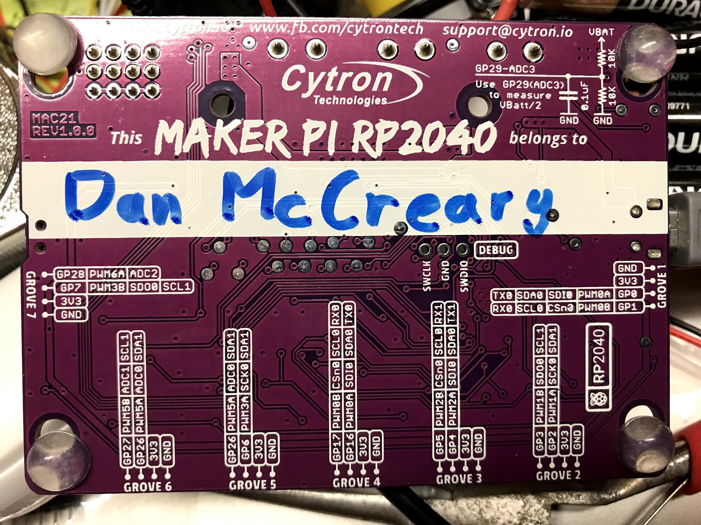
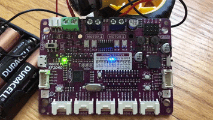
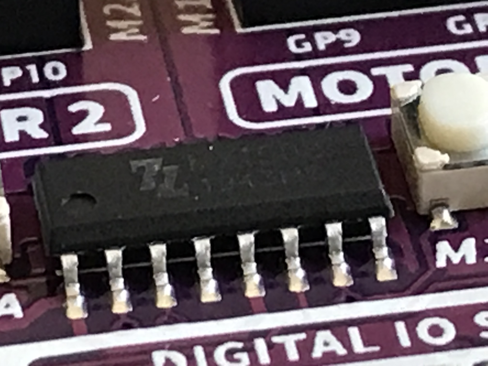

# Maker Pi RP2040

The Maker Pi PR2040 kit from [Cytron Technologies](https://www.cytron.io/) is a [$9.90 US kit](https://www.cytron.io/p-maker-pi-rp2040-simplifying-robotics-with-raspberry-pi-rp2040) that is designed to simplify learning robotics using the RP2040 chip. It became available in April of 2021, but demand has been very high and it is out-of-stock on many retailers sites.  We can understand this.  The Maker Pi PR2040 is the most powerful robotics board we have ever seen for under $10!


## Features
All our robots are built around a RP2040 and a motor driver with a few low-cost sensors and displays.  With the exception of the OLED display, this board packs in a huge number of features for a low cost of $9.90.

* Power status LED (green)
* On/off switch
* 13 blue LEDs to show status on GP pins 0,1,2,3,4,5,6,16,17,26,27 and 28
* 2 WS2812B RGB LEDs connected to GP18
* LiPo Battery Connector
* Micro USB Port (use for powering and programming)
* Reset button
* Boot button
* Momentary press buttons on ports GP20 and GP21
* 2 Motor drivers. Motor A is controlled by GP8 and GP10 and motor B is controlled by GP9 and GP11.
* 4 motor test buttons for testing motors A and B, forward and backward
* 4 red motor status LEDs buttons for displaying motors A and B, forward and backward
* 7 Grove Ports on GPs 1:0,1; 2:2,3; 3:4,5; 4:16,17; 5:6,26; 6:26,27 and 7:7,28
* 4 servo connectors on ports GP12, GP13, GP14 and GP15
* On/Off switch on GP22 which can be used to mute the sound
* Phillps head screwdriver that works on the header pins - really convenient for students!
* 4 [Grove Connectors](https://wiki.seeedstudio.com/Grove_System/)
* Rubber mounting feet
* Pins numbers clearly labeled both on top and bottom of the board
* Large area on bottom of the board for students to write their name

## Basis for a Low-Cost Robot Kit

When this kit is combined with a standard [2 Wheel Drive Smart Car Chassis](https://www.cytron.io/p-2wd-smart-robot-car-chassis) and a [distance sensor](https://www.coderdojotc.org/micropython/sensors/07-VL53L0X_GY/) it becomes a great low-cost way of getting started with Python and robots.

## Clearly Labeled Pin Numbers

One of the biggest disadvantages of the Raspberry Pi Pico is the fact that pin labels are NOT visible when it is mounted on a breadboard.  We have to take the Pico out of the breadboard to read the pin numbers on the bottom of the board.  A much better design would be to follow the best practices and put the labels on the top of the board where they are visible.  This is clearly done on the Maker Pi RP2040 board!


Note the pin labels, GND, 3.3V, GP0 and GP1 are clearly printed on the too of the board.



Note the circuit in the upper right corner displays how you can use the analog input port to read the battery level of the robot.

## Removing the Default CircuitPython

Cytron Technologies has a wonderful [YouTube videos](https://www.youtube.com/watch?v=mn1nqgEkufA) on how to program the Maker Pi RP2040 using MicroPython.  Unfortunately, this board does NOT come with our standard MicroPython loaded! :-O  It uses the non-standard Adafruit CircuitPython that is incompatible with most MicroPython programs being used today.  This is a sad state of affairs that confuses our students and makes it difficult to share code and libraries for MicroPython.  According to Google trends, over the last 12 months for worldwide searches, [MicroPython has almost five time the interest of CircuitPython](https://trends.google.com/trends/explore?q=micropython,circuitpython).  Preloading the board with CircuitPython sends a very confusing message to the marketplace.

## Flash Nuke
I want to make sure that my RP2040 was starting out with a clean image.  I downloaded the [flash_nuke.uf2](https://www.raspberrypi.org/documentation/pico/getting-started/static/6f6f31460c258138bd33cc96ddd76b91/flash_nuke.uf2) file to remove the default CircuitPython runtime and all the related files.

Note that the board **must** be fully powered down after this load for it to work.  I had 4 AA batteries connected to the VIN screw headers, so it was not resetting correctly and the reset was not working until I disconnected the batteries.

The latests MicroPython runtimes are [here](https://micropython.org/download/rp2-pico/)

## Easy Motor Testing Buttons

One of the things I love about this board is how incredibly easy it is for students to test their motors.  The board provides four very convenient motor test buttons right on the board.  By pressing each one you can make both motors go forward and backwards.  This is a great way for students to learn about how we can generate PWM signals to simulate these four buttons.  Whoever design this board clearly had their students in mind!

## 13 Blue LEDs Demo

I wanted to make sure that everyone knows how easy this board is to program with MicroPython once you have the runtime loaded.  Here is a demo using the 13 nice blue LEDs used to show the status of the pins.



```py
import machine
import time

# The Maker Pi RP2040 has 13 fantastic blue GPIO status LEDs
blue_led_pins = [0,1,2,3,4,5,6,7,16,17,26,27,28]
number_leds = len(blue_led_pins)
led_ports = []
delay = .05

# create a list of the ports
for i in range(number_leds):
   led_ports.append(machine.Pin(blue_led_pins[i], machine.Pin.OUT))

# loop forever
while True:
    # blue up
    for i in range(0, number_leds):
        led_ports[i].high()
        time.sleep(delay)
        led_ports[i].low()
    # blue down
    for i in range(number_leds - 1, 0, -1):
        led_ports[i].high()
        time.sleep(delay)
        led_ports[i].low()
```

This demo uses a list of all the 13 digital I/O ports.  For each port it sets the port to be a digital output.  In the main loop it then goes up and down the strip of LEDs, turning each one on for 1/20th of a second (.05 seconds).

## Unclear Motor Current Limitations

The Maker Pi RP2040 board contains a dual channel H-bridge chip and easy-to-connect screw headers for power and motor connections.  This is fantastic for teaching robotics since students can driver two motors without ever having to use a soldering iron.  However, it is only designed to work with small DC-hobby motors and there is no documentation on exactly what motor driver chip is used or its precise current and power limitations.  The documentation only indicates that the maximum current is 1A continuous power and 1.5A for up to 5 seconds.  But it is not clear if this is per motor or total.  The input voltage is only rated to an incredibly low 6 volts, which is very odd since almost all the motor driver chips can take much higher input voltages up to 36 volts.

If this motor driver chip is similar to the ubiquitous [L293x motor controllers](https://www.ti.com/document-viewer/L293D/datasheet/specifications#ESD_Rating_1), then the current should be 1A per motor.  I suspect it might not be the L293x since the input voltage of the L293x is 4.5 V to 36 V.

I suspect that if you glued a small [heat sink](https://en.wikipedia.org/wiki/Heat_sink) like a [16 pin DIP fin](https://my.element14.com/fischer-elektronik/ick-14-16-b/heat-sink-dip-glue-on-50-c-w/dp/4620896) to the unknown motor driver IC on the main board you could drive slightly larger motors.


Close-up of the motor driver chip.  I can't quite make out the numbers on the chip, but the logo is not "TI".

## References
* [Link on Box](https://link.cytron.io/maker-pi-rp2040-start)
* [GitHub Link](https://github.com/CytronTechnologies/MAKER-PI-RP2040)
* [Maker Pi RP2040 Product Page](https://www.cytron.io/p-maker-pi-rp2040-simplifying-robotics-with-raspberry-pi-rp2040)
* [Maker Pi RP2040 Datasheet on Google Docs](https://docs.google.com/document/d/1DJASwxgbattM37V4AIlJVR4pxukq0up25LppA8-z_AY/edit)
* [Amazon Listing](https://www.amazon.com/dp/B096DFH22X) - no availability as of Aug. 15th 2021
* [Adafruit](https://www.adafruit.com/product/5129) - out of stock as of Aug. 15th 2021
* [1300 mah battery](https://www.cytron.io/p-lipo-rechargeable-battery-3.7v-1300mah)
* [Ultrasonic Sensor Video on YouTube](https://www.youtube.com/watch?v=mn1nqgEkufA)