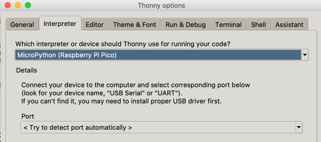

# Getting Started

## Purchasing

The retail list price is $9.99.  Thie Cytron Maker Pi RP2040 kit includes 3 Grove connectors, screwdriver and feet) [Cytron](https://www.cytron.io/p-maker-pi-rp2040-simplifying-robotics-with-raspberry-pi-rp2040)

Here are some online retailers that seel this kit:

* [DigiKey](https://www.digikey.com/en/products/detail/cytron-technologies-sdn-bhd/MAKER-PI-RP2040/14557836)
* [Amazon](https://www.amazon.com/Cytron-Simplying-Robotics-Beginner-RP2040/dp/B09HBQL141)
* [Adafruit](https://www.adafruit.com/product/5129)

There is also a [YouTube Video](https://www.youtube.com/watch?v=8CXirBVwVoU) that demonstrates the features of the board.

## Install the MicroPython Runtime Library

The **Maker Pi RP2040** comes with an incompatible CircuitPython run-time.  Our first step is to re-initialize the board with the Raspberry Pi [flash_nuke.uf2](https://www.raspberrypi.org/documentation/pico/getting-started/static/6f6f31460c258138bd33cc96ddd76b91/flash_nuke.uf2) runtime.  We can then load the latest MicroPython libraries.  When we wrote these labs we were using MicroPython version 1.7 that was released in September of 2021.

To install MicroPython you mush **hold down** the **BOTSEL** button on the main board while you turn on the board using the on-board power switch.  This will make the board look like a USB drive.  You can then just drag the flash-nuke file onto the drive and the board will be initialized.  Make sure to power the board off and back on.

You can now repeat this process with the [Raspberry Pi MicroPython Runtime](https://micropython.org/download/rp2-pico/rp2-pico-latest.uf2).  Just remember to press and hold down the BOTSEL **before** you turn on the board and reboot after the image has been copied to the microcontroller.

If you have never used MicroPython, the Raspberry Pi Foundation has a nice [Getting Started Guide](https://www.raspberrypi.org/documentation/microcontrollers/micropython.html) that can be helpful.

## Get Familiar with your IDE (Thonny) and the Basic Programs

There are many Integrated Development Environments (IDEs) that work with the Raspberry Pi RP2040 chip.  The one you chose just should support MicroPython and be able to upload and run new programs.  Once you turn on the board you should be able to configure Thonny to use the Raspberry Pi MicroPython interface.  When you press the Stop/Reset button you should see the MicroPython REPL prompt.

#
## Test the Motor Connections

Use the [Motor Connection Lab](../maker-pi-rp2040-robot/07-motor-connection-lab.md)

## Getting Help

MicroPython on the RP2040 is the most powerful low-cost system on the market today.  With 264K of RAM, it will take a LOT of work to run out of memory.  But with all things new, there is a lock of good documentation, drivers and sample code.  To help you along, we suggest the following resources:

1. The [MicroPython Raspsberry Pi Forum](https://forum.micropython.org/viewforum.php?f=21&sid=73745cabd6bbdacfd3e78419d5064dfe).  Be sure use the search to check for prior questions.
2.

