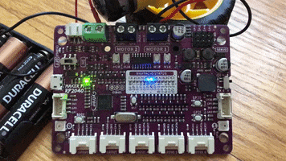

# Blue LED Lab

Once you have the MicroPython runtime installed and your IDE setup, this board is easy to program!

Let's take a look at the classic "Blink" program that turns a single LED on and off every second.

## Blink First Blue LED
The Maker Pi RP2040 has a row of 13 small blue LEDs that monitor the digital input/output of 13 of the GPIO signals.  If you set any of the output pins to be HIGH, the LED will be on.  If you set the pin to be LOW, the blue LED will be off.  These LEDs make it easy for you to view the state of your GPIO pins and can help debugging your programs.

Just remember that if you are using the pins for communication, you can't use the LEDs for other purposes.

Here is a small program that will blink the first blue LED:

```py
import machine
import time
# setup the first LED as an output signal
first_led = machine.Pin(0, machine.Pin.OUT)

while True:
    first_led.toggle()
    time.sleep(1)
```

Note that the first four lines are the "setup" of the program.  These lines will only run once when the program starts.  The code indented after the ```while True:``` line will continue to run until the device is reset or powered down.

## Running Lights on All LEDs

Here is a demo using the 13 nice blue LEDs used to show the status of the pins.



```py
import machine
import time

# The Maker Pi RP2040 has 13 fantastic blue GPIO status LEDs
blue_led_pins = [0,1,2,3,4,5,6,7,16,17,26,27,28]
number_leds = len(blue_led_pins)
led_ports = []
delay = .05

# create a list of the ports
for i in range(number_leds):
   led_ports.append(machine.Pin(blue_led_pins[i], machine.Pin.OUT))

# loop forever
while True:
    # blue up
    for i in range(0, number_leds):
        led_ports[i].high()
        time.sleep(delay)
        led_ports[i].low()
    # blue down
    for i in range(number_leds - 1, 0, -1):
        led_ports[i].high()
        time.sleep(delay)
        led_ports[i].low()
```

This demo uses a list of all the 13 digital I/O ports.  For each port it sets the port to be a digital output.  In the main loop it then goes up and down the strip of LEDs, turning each one on for 1/20th of a second (.05 seconds).
