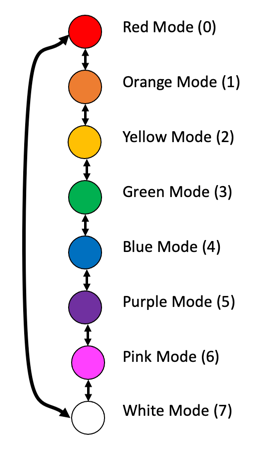

# Up Down Mode Lab

In this lab, we will combine the two buttons with the blue LEDs, the NeoPixels and the buzzer labs. The
We will make the LED, NeoPixels and sound all change for each button press.  You will be able to up
and down the color spectrum and the sound frequency.

We will start with the material from our button lab.  We will create two functions that will be triggered by the
two buttons.  One will increment a counter (add one) and the other will decrement the counter (subtract 1).  By pressing one of the two buttons you will cycle through the modes of the program.



The diagram has eight different modes.  The default mode is usually mode=0.  When you press the left button the mode will increase by one.  The NeoPixels will change from red to orange.  Pressing the left button will increase the mode by one going to the orange mode.  Pressing the right button will subtract one from the mode going from mode 1 (orange) back to model 0 (red).


Within our Interrupt Request Handler (IRQ) function we will also have to add two lines to deal with the wrap around logic like this:

```py
        # wrap around to first mode
        if mode >= mode_count: mode = 0
        if mode < 0: mode = mode_count - 1
```

## Full Program
```py
# Mode Up/Down Lab
# Change a mode using the buttons on the Maker Pi RP2040 board
# Changes the NeoPixel color and the blue GPIO status LEDs
import time
from machine import Pin, PWM
# We are using a MicroPython NeoPixel library from here: https://github.com/blaz-r/pi_pico_neopixel
from neopixel import Neopixel

BUZZER_PORT = 22
buzzer = PWM(Pin(BUZZER_PORT))

NUMBER_PIXELS = 2
STATE_MACHINE = 0
NEOPIXEL_PIN = 18

# The Neopixels on the Maker Pi RP2040 are the GRB variety, not RGB
strip = Neopixel(NUMBER_PIXELS, STATE_MACHINE, NEOPIXEL_PIN, "GRB")

# have up to 13 that we can use
blue_led_pins = [0,1,2,3,4,5,6,7,16,17,26,27,28]
number_leds = len(blue_led_pins)
led_ports = []
# create a list of the port pin object instances
for i in range(number_leds):
   led_ports.append(machine.Pin(blue_led_pins[i], machine.Pin.OUT))

# Color RGB values as tuples - needs some Gamma corrections
red = (255, 0, 0)
orange = (255, 60, 0) # Gamma corrected from G=128 to be less like yellow
yellow = (255, 150, 0)
green = (0, 255, 0)
blue = (0, 0, 255)
indigo = (75, 0, 130) # purple?
violet = (138, 43, 226) # mostly pink
cyan = (0, 255, 255)
lightgreen = (100, 255, 100)
white = (128, 128, 128) # not too bright
color_names = ('red', 'orange', 'yellow', 'green', 'blue', 'indigo', 'violet', 'cyan', 'lightgreen', 'white')
num_colors = len(color_names)
colors = (red, orange, yellow, green, blue, indigo, violet, cyan, lightgreen, white)

# set to be 1 to 100 for percent brightness
strip.brightness(100)

# Sample Raspberry Pi Pico MicroPython button press example with a debounce delay value of 200ms in the interrupt handler

mode = 0 # the default mode on powerup and reset
mode_count = len(color_names)
last_time = 0 # the last time we pressed the button

builtin_led = machine.Pin(25, Pin.OUT)
# Give our pins some logical names
next_mode_pin = machine.Pin(20, machine.Pin.IN, machine.Pin.PULL_DOWN)
previous_mode_pin = machine.Pin(21, machine.Pin.IN, machine.Pin.PULL_DOWN)

# This function gets called every time the button is pressed.  The parameter "pin" is not used.
def button_pressed_handler(pin):
    global mode, last_time
    new_time = time.ticks_ms()
    # if it has been more that 1/5 of a second since the last event, we have a new event
    if (new_time - last_time) > 200:
        # this should be pin.id but it does not work
        if '20' in str(pin):
            mode +=1
        else:
            mode -=1
        # wrap around to first mode
        if mode >= mode_count: mode = 0
        if mode < 0: mode = mode_count - 1
        last_time = new_time

def set_blue_led_mode(mode):
    global num_colors
    for i in range(0, num_colors):
        if i == mode:
            led_ports[i].high()
        else:
            led_ports[i].low()

# Register the handler function when either button is pressed
next_mode_pin.irq(trigger=machine.Pin.IRQ_FALLING, handler = button_pressed_handler)
previous_mode_pin.irq(trigger=machine.Pin.IRQ_FALLING, handler = button_pressed_handler)

#  Note the non-linear increases in frequency - note that some are louder
tone_freq = [100, 150, 210, 280, 350, 450, 580, 750, 850, 950, 1000]
def playtone(frequency):
    buzzer.duty_u16(1000)
    buzzer.freq(frequency)

def bequiet():
    buzzer.duty_u16(0)
    
# This is for only printing when a new button press count value happens
old_mode = -1

print('found ', mode_count, ' modes.')
while True:
    # only print on change in the button_presses value
    if mode != old_mode:
        print('new mode:', mode, color_names[mode], tone_freq[mode])
        # get the color mode
        color = colors[mode]
        strip.set_pixel(0, color)
        strip.set_pixel(1, color)
        strip.show()
        set_blue_led_mode(mode)
        playtone(tone_freq[mode])
        time.sleep(.2)
        bequiet()
        old_mode = mode
```